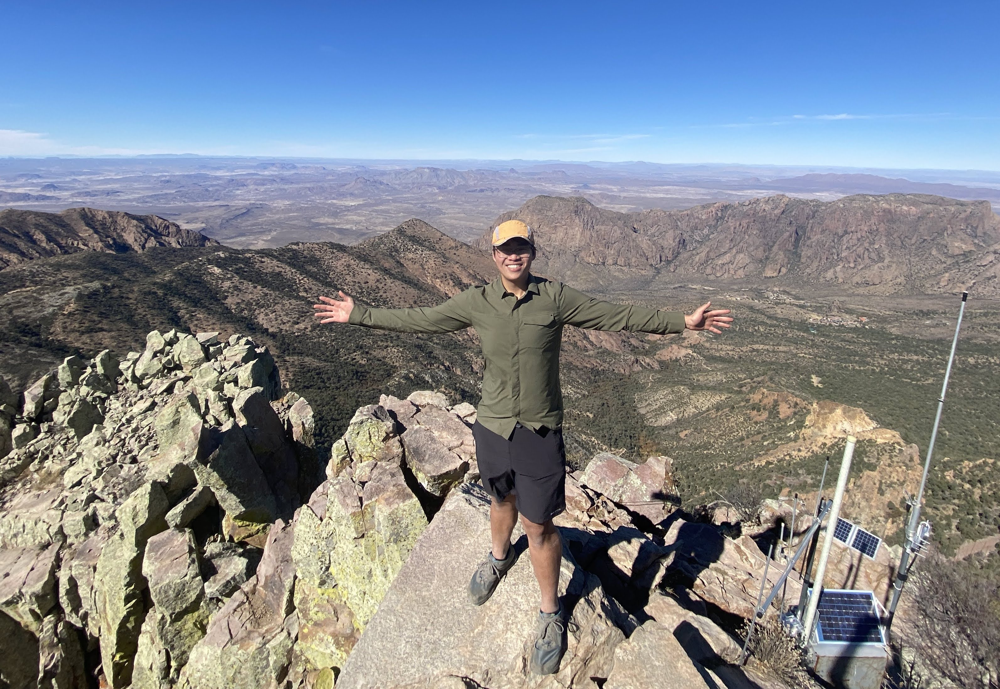

import BlogMap from "../components/blogMap";

Hi! My name is Jeff and I recently graduated from the [University of Texas at Austin](https://www.cs.utexas.edu/) in December 2021 with a BS in Computer Science.

I will start [thru-hiking the Appalachian Trail](/appalachian_trail) in March 2022. Afterwards, I'll be starting as a Software Development Engineer at Amazon in Denver.

I am particularly interested in full-stack web and app development, distributed systems, and the effects of technology on culture and society.

In my free time, I enjoy [running](https://www.strava.com/athletes/46494495), lifting, cooking, and listening to audiobooks and podcasts!

I plan on posting my experiences on the Appalachian Trail here. You can see all my updates on my [blog](/blog) and my progress on the map below!

<BlogMap />
