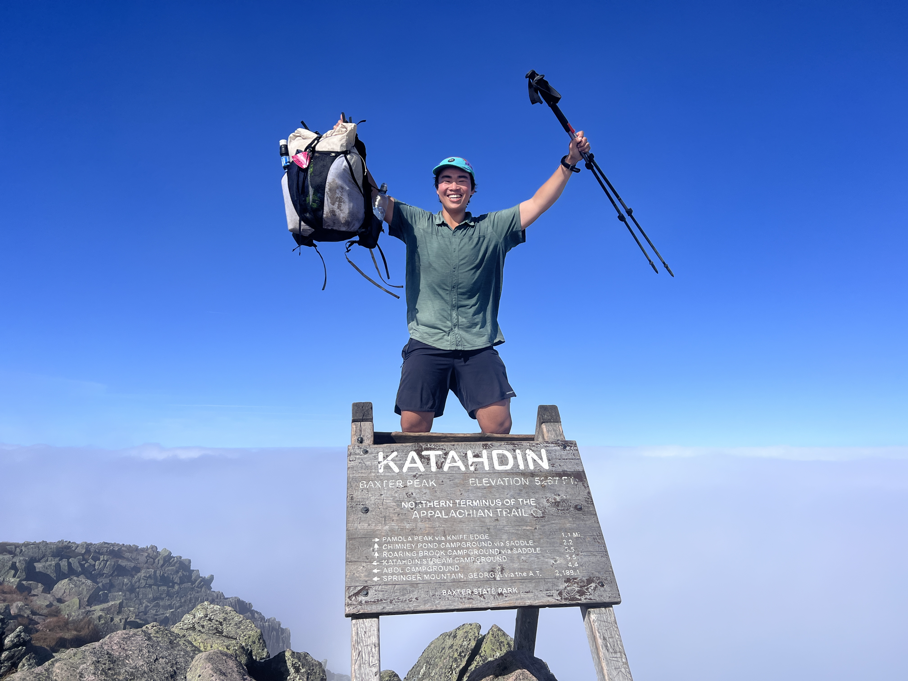

Hi! My name is Jeff and I graduated from the University of Texas at Austin in December 2021 with a BS in Computer Science. I’m currently a Software Development Engineer at Amazon Web Services in Denver.

Last year between college and starting work, I thru-hiked the [Appalachian Trail](/appalachian-trail)!

I am particularly interested in full-stack web and app development, distributed systems, and the effects of technology on culture and society.

In my free time, I enjoy running, lifting, cooking, and listening to audiobooks and podcasts!
