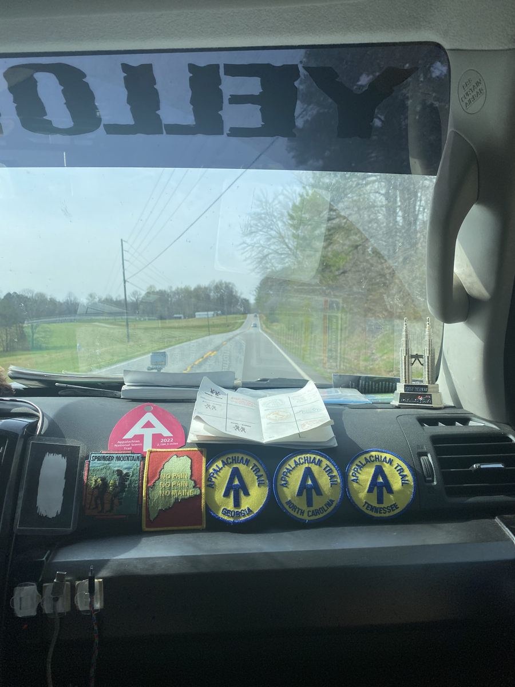
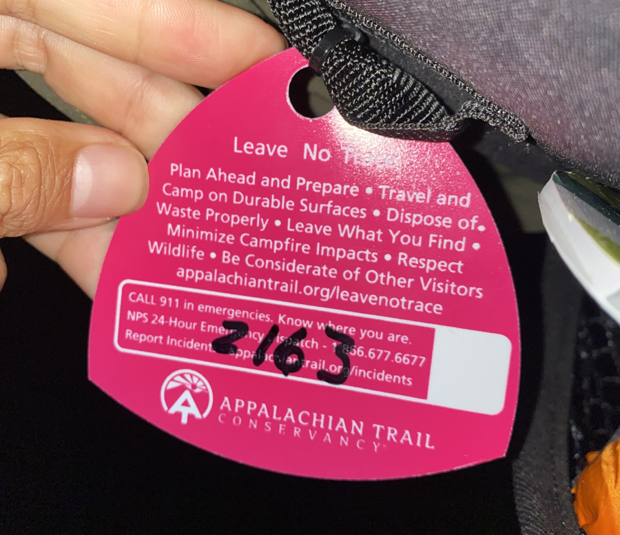
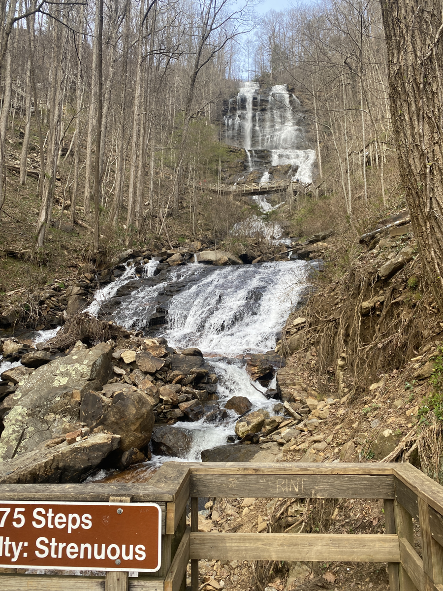
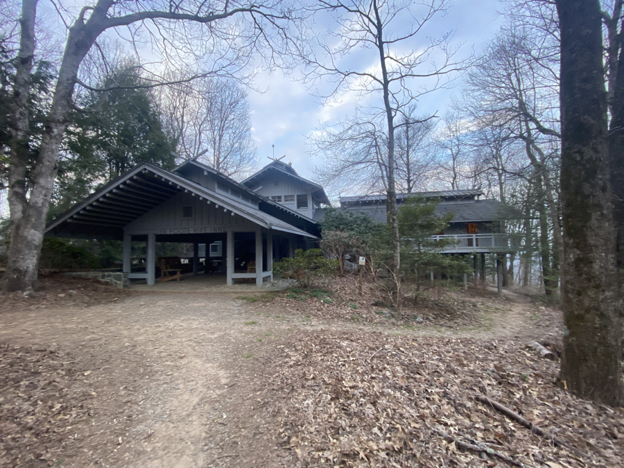
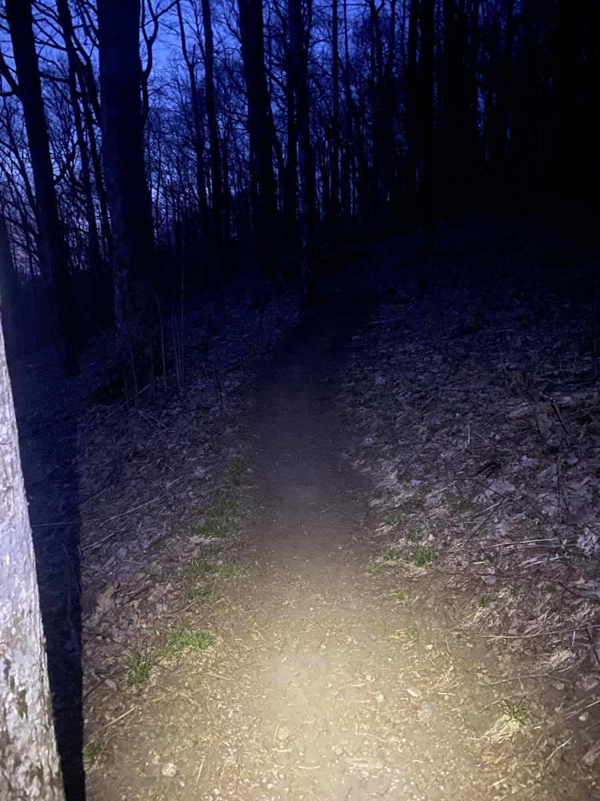
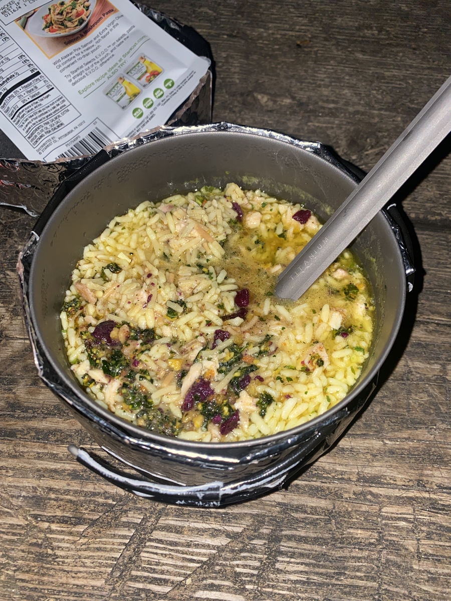

| Miles hiked | Elevation gain (ft.) | AT mile |
| ----------- | -------------- | -------- |
| 8.20 | 2,480 | -1.5 |

## Getting to the start

I woke up this morning and the first thought that hit me was "oh God you're actually doing this". I first learned about the Appalachian Trail sometime in November 2020, and planning a 2022 thru-hike felt so far into the future, like it would never actually happen. And now that day is actually here.

It feels a bit surreal still. I had a very similar feeling the days I left for drum corps. Knowing that it would be _months_ before I saw anything familiar again, and that every day would challenge me physically and mentally.

I spent a lot of time on my flight to Atlanta thinking about why I was doing this, and I still don't have a concrete reason yet. I'll give myself more time to think that over. I'll have more than enough time in my own head the next couple of months.

I didn't sleep all that well last night and I couldn't fall asleep on the airplane even though I felt tired. It's kinda crazy how I traveled almost 1,000 miles in a little over two hours, and that it will take me about three months to travel that same distance on foot.

I took the MARTA from the airport as far north as I could. I'm currently sitting in a Honey Baked Ham writing this and waiting on my shuttle driver, Ron, to pick me up. I should get to Amicalola Falls around 4 or so.

My current plan is to hike the approach trail this afternoon and to get to Black Gap shelter. It's about 7 miles with 2,500 ft of elevation gain. I'll be about 1 mile from Springer Mountain, the actual southern terminus of the Appalachian Trail, which I'll hit tomorrow. I'll let y'all know how that goes.

## Black Gap shelter

It's around 10 and I'm laying in my quilt inside Black Gap shelter. Ron got held up by traffic and picked me up around 3:30. Ron is awesome. He gave me and the other passengers in the shuttle, an older couple from Florida, so much great advice for our first stretch of the trail. I hope I'm able to actually remember everything he told us, because it was a _lot_. 

<figcaption>Ron drives a Toyota 4 Runner with an interior tricked out with AT memorabilia.</figcaption>

We arrived at Amicalola Falls around 5. I was able to register as a thru-hiker and was given a tag to put on my pack. I'm hiker #2163!

Then I went over and got my picture taken at the famous arch (as seen above). After that I finally embarked on my thru-hike!

The first thing on the approach trail is hiking the infamous stairs of Amicalola Falls. There's about 600 steps that are known for brutally kicking the asses of new thru-hikers. Boosted by my excitement, I attacked the stairs with too much vigor. By the time I got to the top my back was covered in sweat, but I climbed it!

Next was to get to Black Gap shelter, around 7 miles away. Ron told me earlier about another trail, the Hike Inn trail, that branches from the approach trail and converges back a few miles later. This trail is slightly longer distance wise, but has easier elevation gains/losses. Since I was running out of daylight, I decided to take that trail. The trail runs by its namesake, the Hike Inn:

The trail going up to Black Gap shelter wasn't too bad, but it was a lot more elevation gain than I was used to. The sun started to set when I was about 3 miles from the shelter, so I ended up doing my first night hiking.

I got to Black Gap shelter around 9. There were some tents around the shelter, but for some odd reason no one was in the shelter itself. It was dark and I didn't feel like pitching my tent so I figured why not and set up my stuff in the shelter. I then cooked my first dinner, a Knorr rice side with salmon, ghee, and dried vegetables.

That's pretty much it for the day. I did all my remaining chores like brushing my teeth and putting away my food in the bear box, then snuggled into my quilt. I should get to Springer Mountain tomorrow morning and actually get on the Appalachian Trail!