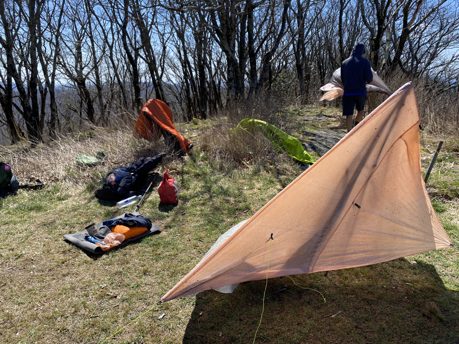
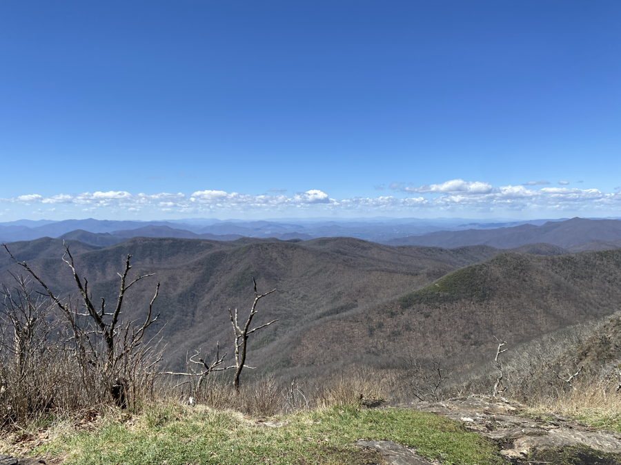
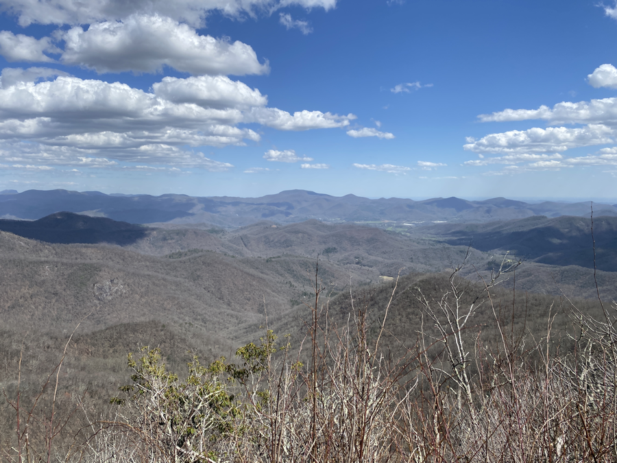

| Miles hiked | Elevation gain (ft.) | AT mile |
| ----------- | -------------- | -------- |
| 16.07 | 2,869 | 97.2 |

So that "light rain" in the forecast was a complete lie.

I woke up around 11pm to the sound of thunderclap with heavy rain. I sleepily looked around my tent and noticed that everything was wet. Jolted awake, I quickly went into save-what-I-can mode. I dumped the water out of my tent and grabbed my small towel and started wiping and wringing out as much water on the floor my tent as I could.

I had made a critical user error of shoving items to the side of my tent. This caused water to seep down into my tent instead of falling off the side of it. My sleeping pad and clothes were completely soaked. The rain was so heavy that it splashed off the ground, flew under my rain fly, and went into my tent. Luckily, the inside of my quilt stayed dry enough to keep me warm throughout the rest of the night.

The next morning, it was cold and still lightly raining. I ate my cold breakfast and shoved my soggy sleep gear into my backpack. Thankfully, it would be sunny today so I could have a chance to dry out my gear.

The trail today wasn't too bad physically. The uphills were nice and gradual, and the sun came out and blessed me with its warmth. I made it to the top of Standing Indian Mountain, which had a nice bald at the top. I took a nice hour or so to eat and dry my gear in the sun.

The bald also had some amazing views:

The rest of the day was fairly nice. Mostly flat with some downhill. It almost felt like I was hiking in Texas again! There was a small detour to an alcove with another panoramic view of the mountains:

I made it to Betty Creek Gap where another group of hikers I've been leap frogging with was camped out. I set up my tent then sat around the fire to cook dinner and chat. 

We were all planning on getting to Franklin, the next trail town, tomorrow. The weather forecast looked like it would get cold Friday and Saturday. We were also just about 2 miles away from the famous 100 mile watchtower, another first major milestone on the AT.

It hit 8 PM, sunset, and like clockwork we all went to our tents for the night. 

At least it's not going to rain tonight.
