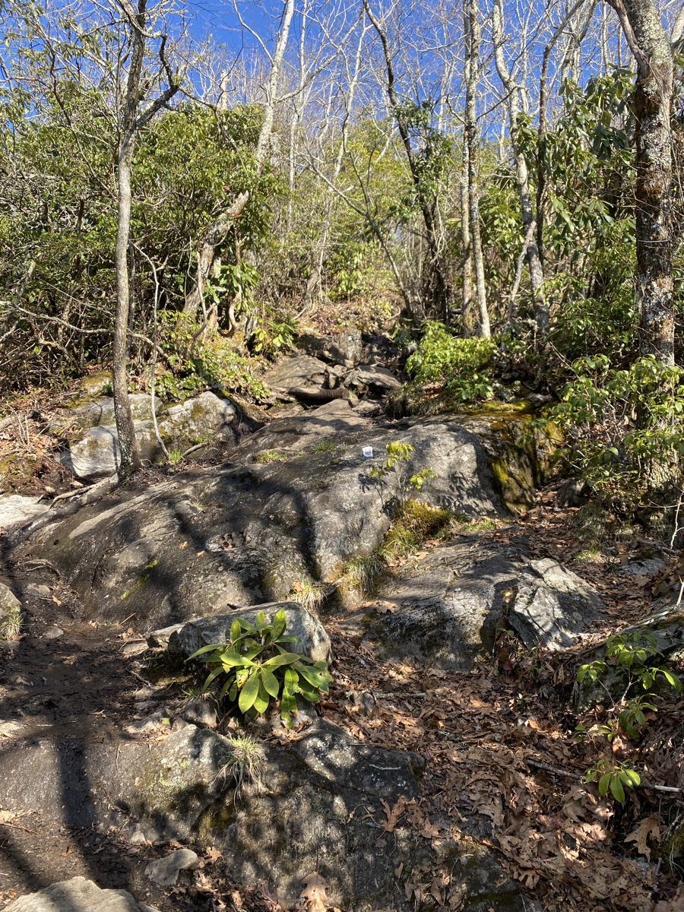
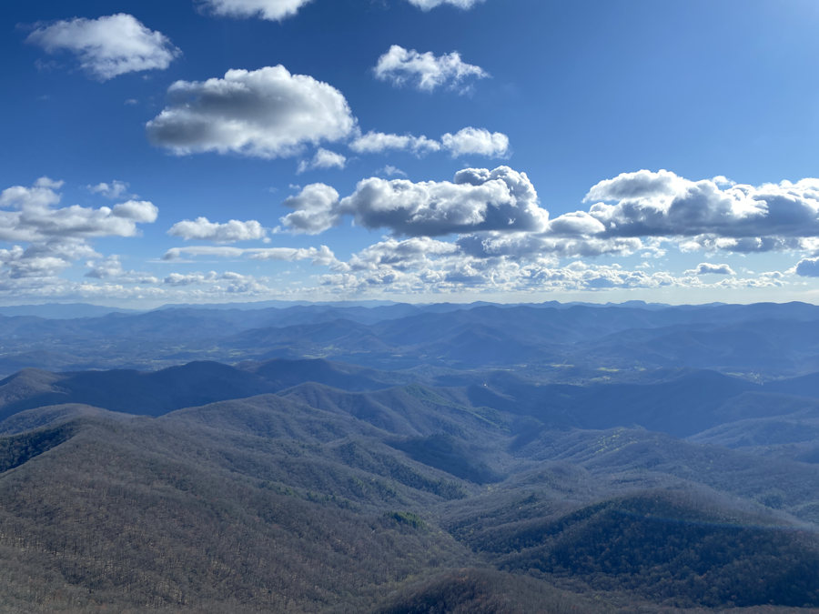
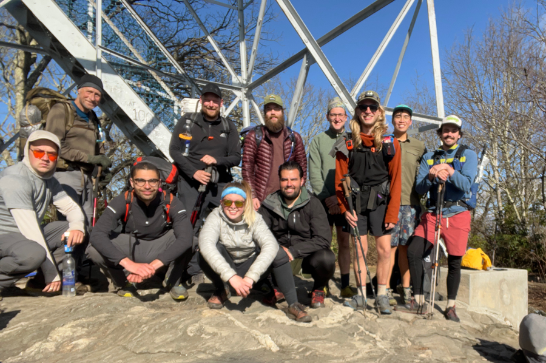
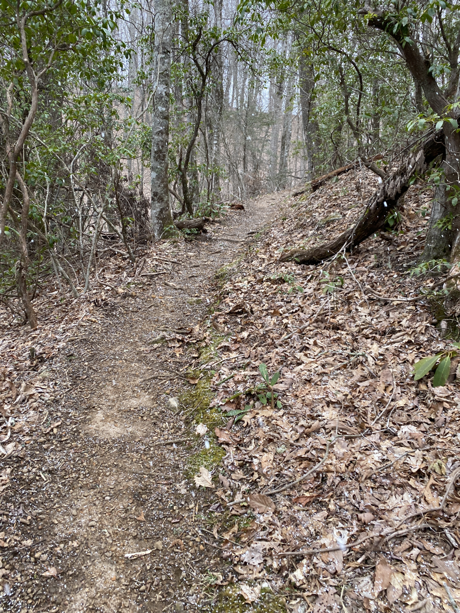
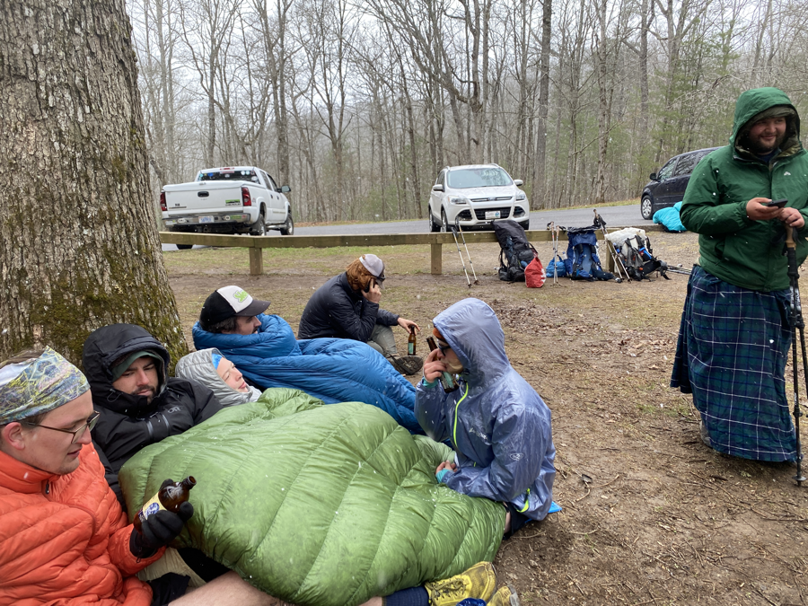
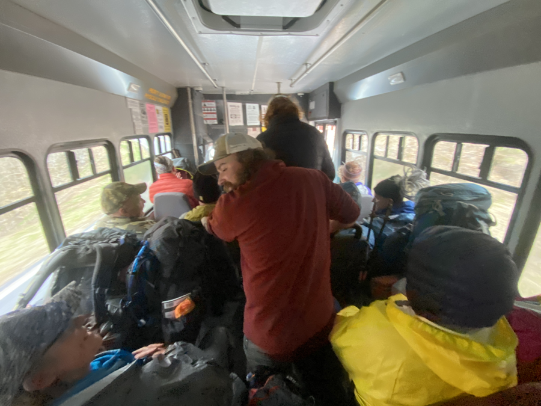
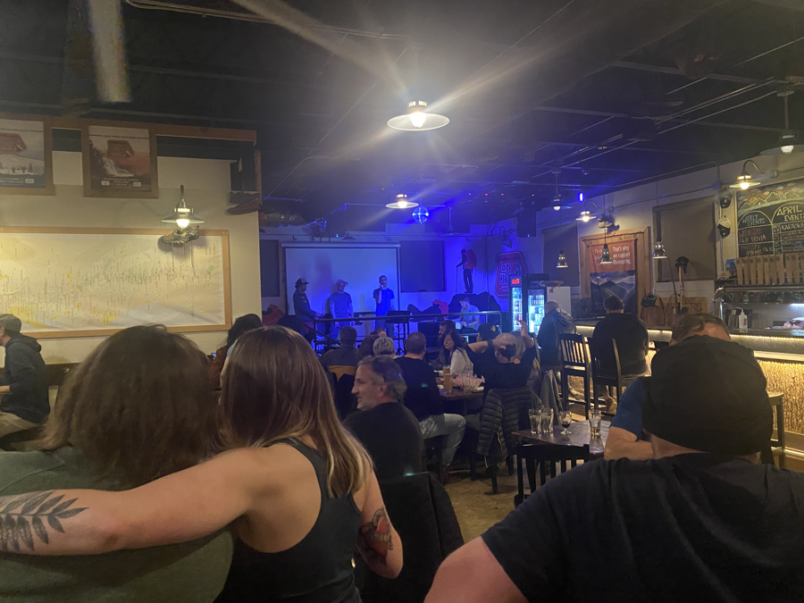

| Miles hiked | Elevation gain (ft.) | AT mile |
| ----------- | -------------- | -------- |
| 8.23 | 1,583 | 105.8 |

Geez, a bunch happened today. It felt like there were multiple chapters to the day.

## Hitting 100 miles

I wear a sleep mask at night. It blocks out annoying light from headlamps and the moon, and it feels cozy over my face. The one downside is I don't have the sun to wake me up.

I woke up around 7:40 to the sounds of people leaving camp. I peeked outside and saw that I was one of the few remaining with their tents still up. There was a shuttle that is supposed to pick us up from Rock Gap at 12:45, about 8 miles away, so I had to get going for the day. I quickly took down my tent, packed my stuff, and got on the trail eating a Clif bar.

The hike to Albert Mountain, the site of the 100 mile watchtower, was pretty pleasant. That was until about 0.3 miles to the top, where the trail became nearly vertical:

I found myself having to put my trekking poles away and use my hands to help me get up. It was a steep and brutal climb to get to the top, but once I got there I was rewarded with the 100 mile mark and a great view.

Almost everyone from last night reached the top around the same time, and we took a group photo to commemorate our milestone:

We then started heading towards Rock Gap, where our shuttle to Franklin would be.

## Snow and getting to Franklin

As we started descending Albert Mountain, it started lightly snowing all of the sudden! I first thought it was rain, but realized it wasn't as it was falling way too slow. Honestly, it was much preferable to cold rain.

I reached Rock Gap around 11:30. Normally I wouldn't have minded waiting an hour for the shuttle to arrive, but it was still snowing. Others arrived behind me. We got our quilts out of our bags and huddled together around a tree to keep warm.

Our shuttle finally came at 12:45. There were a lot of hikers that wanted to get into Franklin today because of the weather. The shuttle was already pretty full when it pulled up, and I was afraid we couldn't all fit and I would have to call another shuttle and wait to get into town. We shoved ourselves into the bus like sardines, and barely fit everyone in:

I stood in the back with a couple of others for the 25 minute ride into Franklin. We got dropped off at our hotel, but since it was only 1, we had a couple of hours before we could get into our room. We left our packs at the hotel and got on a local transit shuttle to the nearby Asian buffet.

## Asian buffet and hanging on for life

I've been thinking about this Asian buffet since the buffet in Hiawassee, which was lacking in variety. The shuttle dropped us off in the plaza of the buffet, and we made our way inside. 

The Asian King Buffet was a pretty standard Asian-American buffet with all of the things you would expect from it. If I wasn't thru-hiking, it probably would have been subpar, but I was starving at this point. I loaded my first plate with as much chicken and beef as I could and went to town. 

The employees at the restaurant were Chinese, so I was able to practice my broken Chinese with them for a bit. I think they are the first other Asians I have seen or talked to since I started hiking the AT.

<figcaption>Plate #6</figcaption>

I continued to eat plate after plate. I'm pretty sure I got at least one of everything in the buffet. I finished off my meal with a plate of honeydew and cantaloupe. In total I ate seven plates of food. Well worth the $11 the place charged for lunch.

I soon found myself regretting eating that much food. We walked on over to the neighboring Walmart, and I felt just how stuffed my stomach was. I was close to the verge of throwing up, but by the sheer force of will I kept myself from doing so.

The shuttle came by again and we got on. We took it to Outdoor 76, an outdoor store that was specifically made for thru-hikers coming into Franklin. They were also hosting a cookout tonight with free burgers and hot dogs for hikers. Although at this point, with the way my stomach was stuffed with the Asian buffet food, I wasn't really in the mood for. 

We stayed at Outdoor 76 until the cookout, where everyone else had some food while I was still trying to keep my composure. It got pretty packed inside, so I went outside, walked around, and called my mom. My stomach finally processed the food and I felt not so terrible. Everyone else was heading to the Lazy Hiker, a nearby bar, so I tagged along.

## Karaoke at the Lazy Hiker

The Lazy Hiker is a cozy, hiker-themed bar. It was karaoke night there. My stomach called down enough and I had a delicious cherry tart cider. 

As everyone else got progressively more drunk we started singing karaoke. I went up with Pickles and Dionysus and we sang a cover of Bohemian Rhapsody. Objectively, it was pretty God awful. I learned just how hard of a song Bohemian Rhapsody is to sing and just how insanely talented Freddie Mercury was. But it was karaoke night at a bar so everyone thought our off-key singing was hilarious.

We continued doing our horrible covers of songs. There were some locals that actually had some nice singing to offset our terrible singing. Eventually they shut down the karaoke for the night. We left the bar and walked through some light snow in the empty streets of Franklin back to our hotel. It was 11pm when we finally got to the hotel and into our room. 

Exhausted, I quickly took a shower and passed out on the bed. Since the weather was going to get pretty cold tomorrow and our bodies were pretty beat up from hiking day after day, we decided to take a zero tomorrow in Franklin.