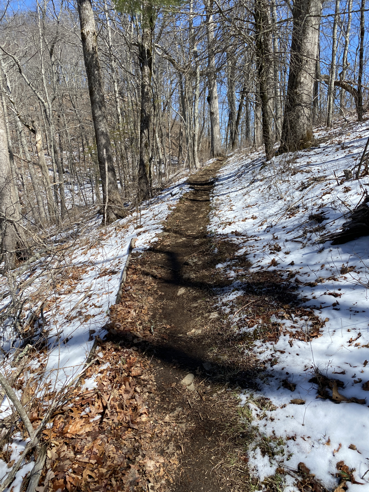
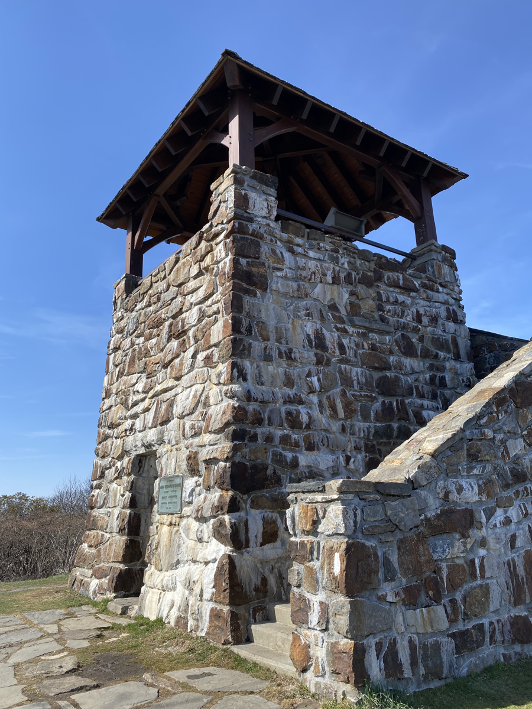

| Miles hiked | Elevation gain (ft.) | AT mile |
| ----------- | -------------- | -------- |
| 14.40 | 3,781 | 120.4 |

This morning was pretty chill. I woke up around 8 and had two hours before our shuttle came. I went down to the lobby and had the same breakfast of waffles and microwave burritos (that's all this hotel has available for some reason). Then went back to the room and got everything ready for the day.

Our shuttle driver dropped us back off at Rock Gap, and we started hiking north on the AT again. It felt good to be back on the trail. There's a mental clarity that I only get when I'm hiking in nature. In my day-to-day "normal" life, I find myself in a near constant haze of tiredness. But when I'm hiking, my mind feels sharp and I have so much more energy.

The snow from the past two days has started to melt. Some parts of the trail looked like a winter wonderland. This also meant that the trail was muddy from the melting snow. And boy was there a lot of muddy trail.

After a while your shoes are so wet and muddy that you don't care how much more wet and muddy they'll get, so you just confidently step into the mud. The rest of the day's hike was fairly easy , asides from the slippery mud. I got some trail magic at Winding Stair Gap, a can of Mountain Dew. The sugar and caffeine propelled me up the hills.

I reached Wayah Bald, which had an old stone watchtower at the top. It had a panoramic view of the mountains, and in the distance you could actually see Clingman's Dome in Smoky National Park, the highest point on the AT and where I would be in about a week.

The shelter was about a mile or so after the watchtower. It was packed with other hikers. I spent a solid 10 minutes searching for a somewhat flat enough piece of land to pitch my tent at. I finally settled on one, but when I pitched my tent the entire thing was tilted 15 degrees downhill. Good enough for me to sleep tonight.

I sat at a campfire by the shelter and cooked my dinner. Jack, Dionysus, and Pickles were also there. Dionysus packed out another bottle of wine from Franklin and made quick friends with everyone in the shelter by sharing wine with them. I was pretty beat for the day so I went to my tent at sunset.

Tomorrow I'm planning on getting to the shelter a mile before the Nantahala Outdoor Center (NOC), then stopping by the NOC the day after. Just a few days after that I'll be in the Smokies!