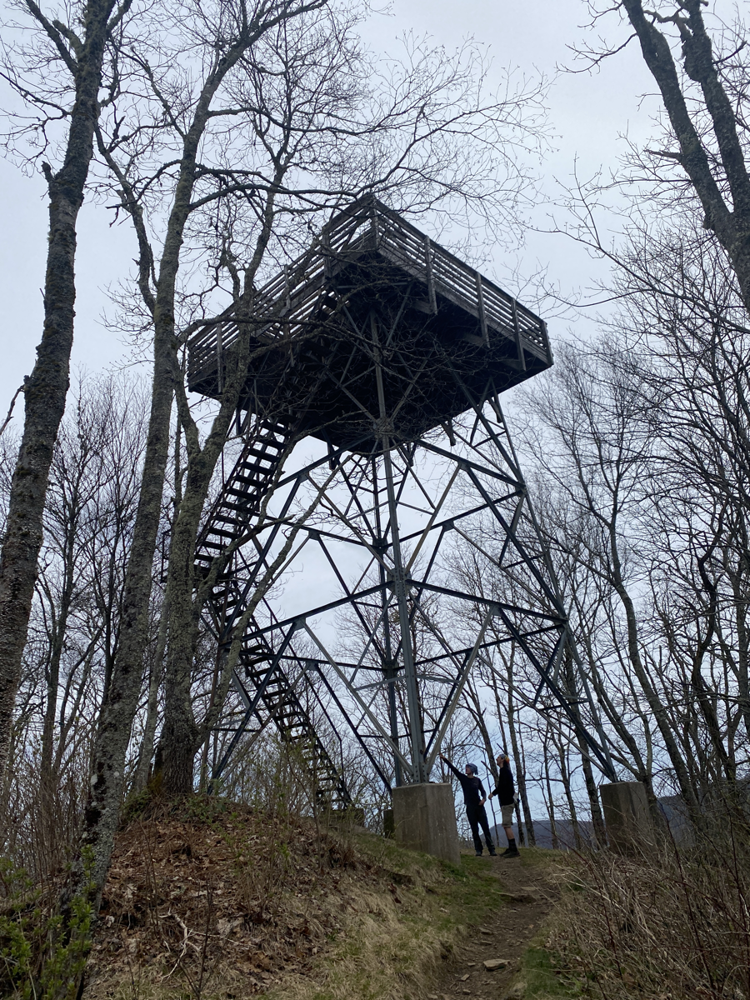
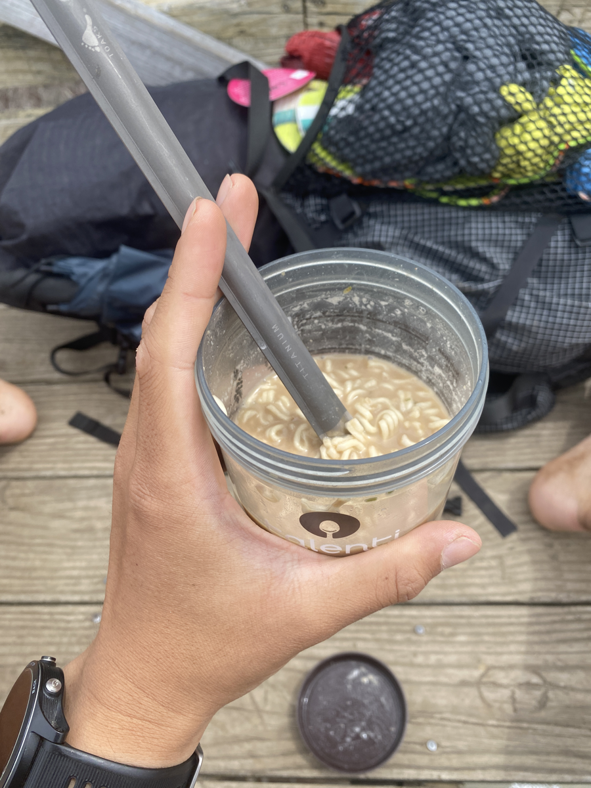
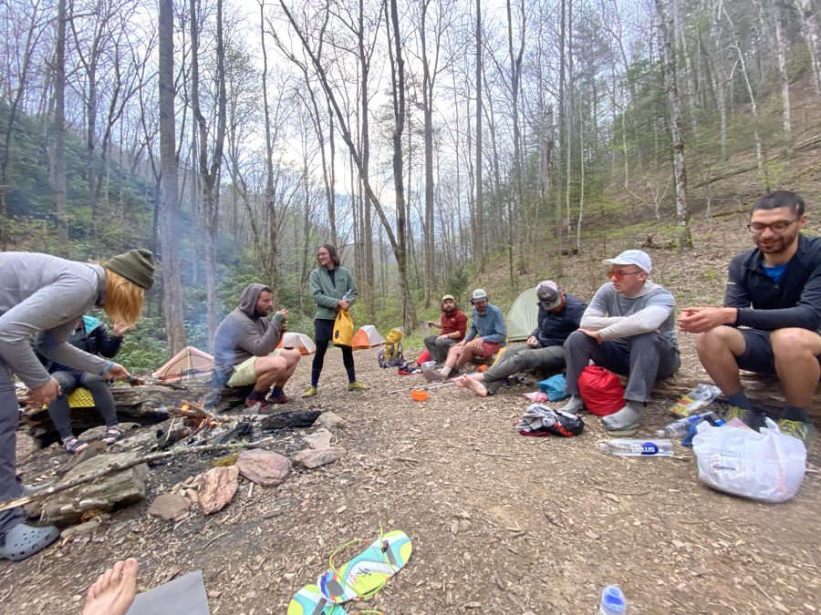

| Miles hiked | Elevation gain (ft.) | AT mile |
| ----------- | -------------- | -------- |
| 15.40 | 2,710 | 135.9 |

Today looked easy on paper, but it was a whole lot harder than expected.

My sleep mask kept me asleep til 8. I got up and tried to pack up all of my gear and eat breakfast as fast as I could. I've gotten my whole morning routine down to about an hour. I wonder how fast I can make it by the end of all this.

I got on the trail around 9. I've been trying to slow my pace down slightly, and to focus on making my steps as light as possible. People who hike a lot of miles in a day don't really hike faster, they just hike longer. I wanted to work on my form to minimize the strain on my body. I'm a bit too used to the impact of running, so it will take a bit for my body to get used to the more delicate pace of hiking.

I found myself at the base of Wesser Bald. I wanted to eat my cold soaked ramen at the top of Wesser Bald, so right now would be a good time to pour water into my cold soak jar. However, I only had a bottle of water with Gatorade power mixed in, and the nearest water source was after the bald. I decided to try and make cold soaked Gatorade ramen. For science of course.

I reached the top of Wesser Bald, which has an old wooden watchtower. I made my way to the top for a lunch break. I took out my cold soak jar and tried the Gatorade ramen.

It was absolutely terrible. It's the first food I've had on trail that I've had to force myself to finish. I don't know if I can drink Glacier Cherry flavored Gatorade ever again.

After Wesser Bald, it was all downhill to Rufus Morgan Shelter. I thought it would be a nice rest of the day. I was dead wrong. It was a gnarly descent with a whole bunch of blowdown trees covering the trail. It felt like I was in an obstacle course. By the time I reached the shelter I was absolutely best for the day. 

The shelter area was nice though. We got a fire started and I was able to lay down and prop my feet up. We were short on firewood, so Jack went searching and came back with an entire recently downed tree. Everyone found that hilarious and we finally decided on a trail name: Lumberjack.

Hiker midnight (9pm) came around and we all retreated to our tents for the night. Tomorrow we'll stop by the NOC, where I'll have a resupply box waiting for me, then make the big 3,000+ feet climb to get out.