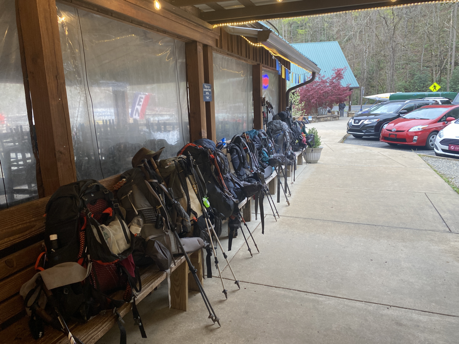
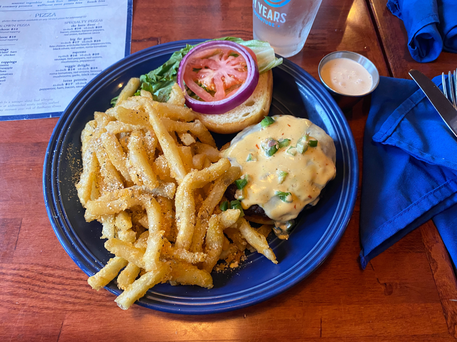
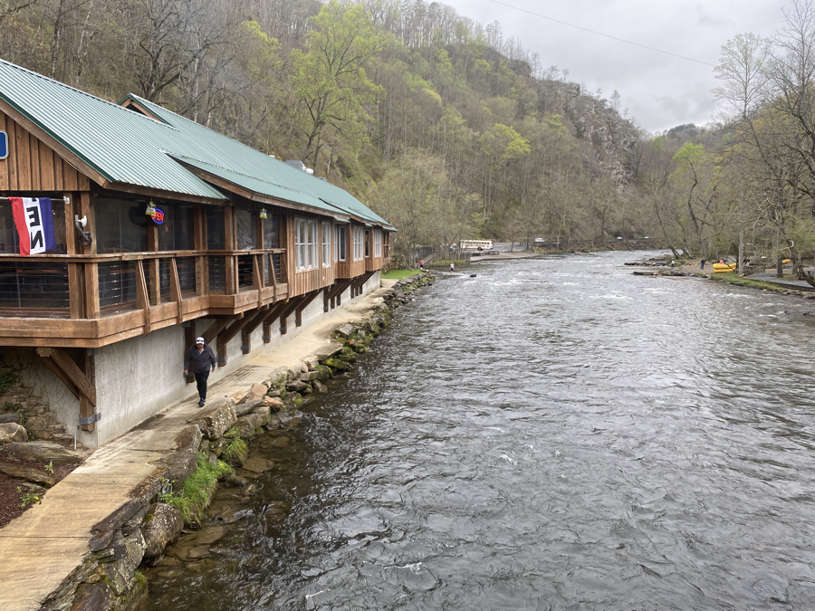
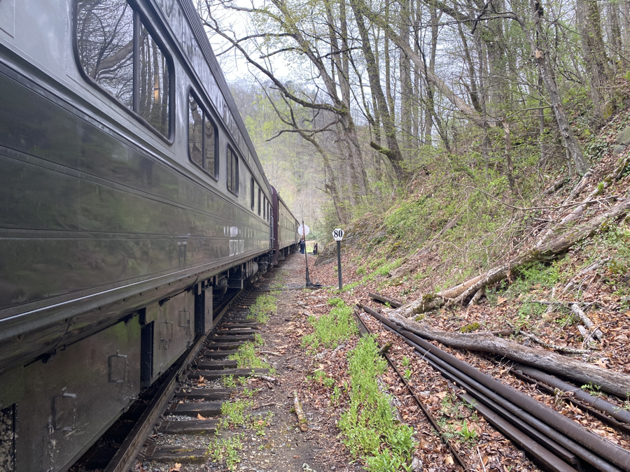
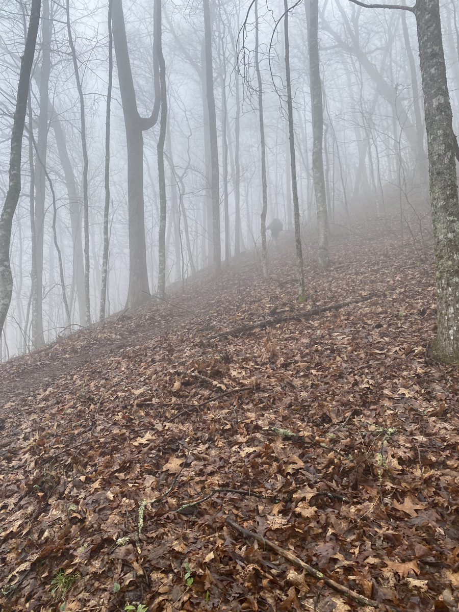

| Miles hiked | Elevation gain (ft.) | AT mile |
| ----------- | -------------- | -------- |
| 7.70 | 3,294 | 143.8 |

I woke up around 8 today and stayed in my tent for an hour. The restaurant at the Nantahala Outdoor Center didn't open til 11 and was only a mile away. I had plenty of time to do nothing. It had rained a bit the night before which made me want to get out of my tent even less.

I finally got my stuff packed for the day and headed on the trail. I planned out my food consumption perfectly, so I had absolutely no extra food or water weight on the short trek down to the NOC. My pack was around 15 lbs and I was zooming down the trail.

I reached the NOC around 10 and walked in to get my resupply box. The general store here is notorious for its sparse options and high prices, which is why it was one of the places I sent my own stuff to. In the box was all the food I packed two weeks ago (probably too much), some dried vegetables and snacks that my mom threw on top, and a letter from my mom. I got to work organizing and shoving everything into my food bag.

I also needed to register for a pass for the Smokies, which I would enter in about 5 days. The NOC kindly printed out the pass for me and I shoved the $20 piece of paper deep in my pack.

<figcaption>All the hiker packs outside the restaurant </figcaption>

Afterwards, it was finally 11 and we headed over to the restaurant. I ordered a 1/2 lb burger with some really good parmesan fries and we split a pizza.

I admittedly ate a bit too much and packed out the leftover fries that everyone else didn't want. I futilely tried to sit around and process what I ate. A train rolled in with the day's tourists, and the place got _packed_, so I decided it was time to go.

The AT runs directly through the NOC. I crossed the bridge spanning the river and was met with the aforementioned train blocking my way to the trail. I made a detour to the back of the train then found my way back onto the AT.

The climb out of the NOC is brutal. It goes straight uphill for 6 miles. It might have been not so bad on a normal day, but my stomach had far too much food and my pack was heavy from the resupply. I found myself pushing harder than usual to keep on going. The weather got foggy and a bit rainy, but wasn't terrible for the most part.

I finally found myself at Sassafras Gap Shelter. The shelter was full and the tent sites were not very good. Grapefruit said he saw a nice stealth spot a short ways back. We followed him and decided to pitch our tents there. It was on top of a hill, so the wind was going to be pretty gnarly at night. We were able to squeeze  eight tents in that spot.

After that we did the usual evening routine of cooking dinner and talking before heading off to our tents when the sun went down. Tomorrow I plan on going about 15 miles to Cable Gap Shelter, and should be hitting Fontana Dam the day after.

