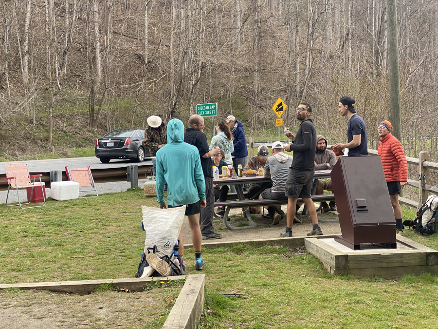

| Miles hiked | Elevation gain (ft.) | AT mile |
| ----------- | -------------- | -------- |
| 15.04 | 3,524 | 159.2 |

It was real windy last night.

I woke up multiple times throughout the night to the sound of my tent flapping against the wind. I was afraid the entire thing would fall over. Thankfully the DCF still stood at the end of the night.

I woke up, packed my stuff up, and got moving on the trail. I heard yesterday that there would be trail magic with bratwursts and sauerkraut at Stecoah Gap, around 7 miles away. That got me nice and motivated.

The day started with a nice uphill section up to Cheoah Bald. It feels like I need at least 30 minutes for my body to get in the groove of hiking for the day. My lungs always operate at 50% capacity or something first thing in the morning.

I reached Cheoah Bald and was greeted with some strong winds and a great view.

It was mostly downhill afterwards, and I made great time to the trail magic. I reached it and was greeted with a nice, juicy bratwurst and Coke.

Having learned my lesson from yesterday. I put some restraint in how many bratwursts to eat. I had three of them and some other snacks, thanked the trail magic hosts, got my pack on, and headed back on trail.

While my stomach was still full, I didn't have an awful time going up the hill from the gap. The rest of the day was fairly easy terrain-wise. No crazy uphills or anything like that. 

I did find my feet to be pretty sore the last few miles. I attribute this mainly to the fact that my body is just to used to being on my feet for so long.

I reached Cable Gap Shelter for the night and set up camp. I walked over to the shelter and propped my feet up as I cooked dinner. I met two section hikers, Pigeon and Wayward, who had previously hiked the AT. I talked with them and some other hikers before the sun set and I headed off to my tent for the night.

It was supposed to rain a bit tonight. Lightly traumatized from that night where my gear got soaked, I made sure that everything was in order in my tent before going to sleep.

Tomorrow will be a nearo (near zero) into Fontana Dam. I'll get my resupply box, do laundry, then head over to the famous "Fontana Hilton" shelter, which has toilets, electricity, and showers.