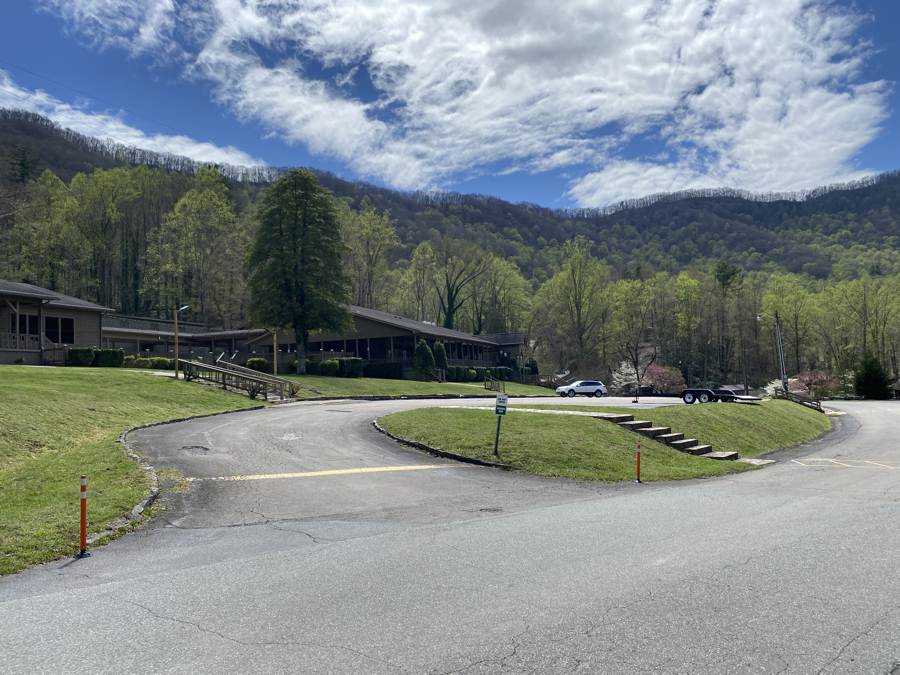

| Miles hiked | Elevation gain (ft.) | AT mile |
| ----------- | -------------- | -------- |
| 6.61 | 1,453 | 165.7 |

When I woke up today, almost everyone was gone from camp. I guess they all wanted an early start into Fontana Dam. I ate my breakfast and got my stuff packed up for the day. It had rained the night before and my backpack and tent were covered in a sheen of dirt particles, which made packing up a bit more of a nuisance.

Lumberjack and I departed from camp around the same time and we made some nice conversation heading into Fontana Dam, a short 5 mile hike. 

The day was initially warm and humid, and I found myself sweating and wishing for some wind. Mother Nature must have heard my call and immediately started dumping some rain and wind on me. I decided to hike faster to keep my body warm in the weather. I had been fairly blessed so far on the AT in regards to weather, so I can't really complain.

We made it to the Fontana Dam marina around 11. There was a shuttle shortly coming to our spot. I had a resupply box I needed to pick up at the lodge and I wanted to get my laundry done, so I headed on the shuttle to Fontana Village.

On the shuttle I met Alex (I'm pretty sure that's his name, trail names are so much easier to remember) a thru-hiker from the UK. Intel, another hiker I met before, was also there. We made some nice conversation and got dropped off at the lodge.

Fontana Village is a resort nested in the mountains. It was a Thursday so it was thankfully pretty empty.

I picked up my resupply box and tried to organize all my food. I had _way_ too much food to fit in my bag.

Alex and Intel had rooms at the lodge for the night, but they weren't ready yet, so we headed down to the restaurant for lunch. Another hiker, Uncle Paul, also tagged along.

I ordered a barbecue burger (there's something about thru-hiking that makes me crave burgers). It tasted amazing as usual. When our server asked us if we wanted dessert, we collectively peer-pressured each other to get some. I ordered a brownie with ice cream on top.

After lunch, Intel's room was ready, and she was nice enough to let me take a shower there. I gave her some of my excess resupply food as a thanks and we headed over to get our laundry done. 

At the laundromat I saw Alex again. We sat around and chatted as I waited for the shuttle to pick me up and drop me off at the marina. He was a doctoral student in mathematical physics. I had a great time talking with him. He's planning on taking a zero in Fontana tomorrow, so I'll be ahead of him for the near future. I gave him my info and wished him the best as my shuttle came. I really hope we cross paths again in the future.

The shuttle dropped me off at the marina and I sat around for a bit to charge my batteries. Then I set of for the 1 mile to get to the shelter.

When I got to the shelter it was lively. There was a good amount of hikers there which I already knew and I met some new ones that were friends with Pidgeon and Wayward.

Everyone stayed up past sunset. There was a big fire going and the shelter area was nice. I eventually decided to call it a night at the late time of 9:15 and crawled into my quilt in the shelter.

Tomorrow I'm going into the Smokies. It'll be a big ascent, but I've heard how magnificent the Smokies are. It should take me around 5-6 days to get through. There's not much service in the park, so it might be a couple of days before you hear from me again.
