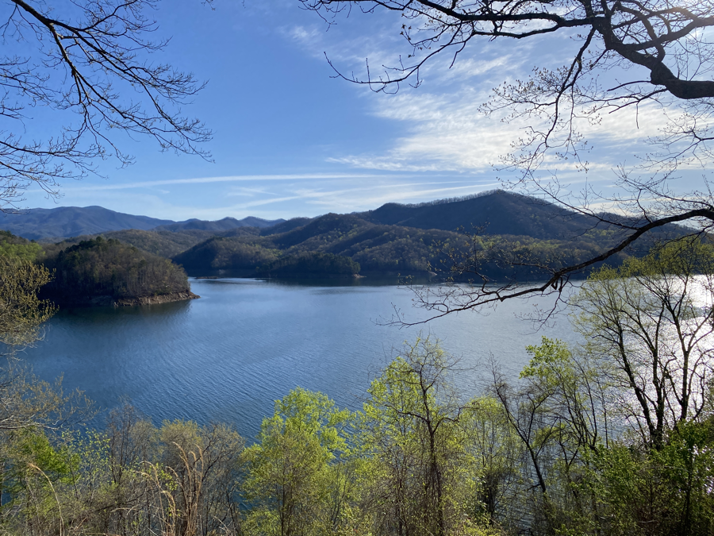
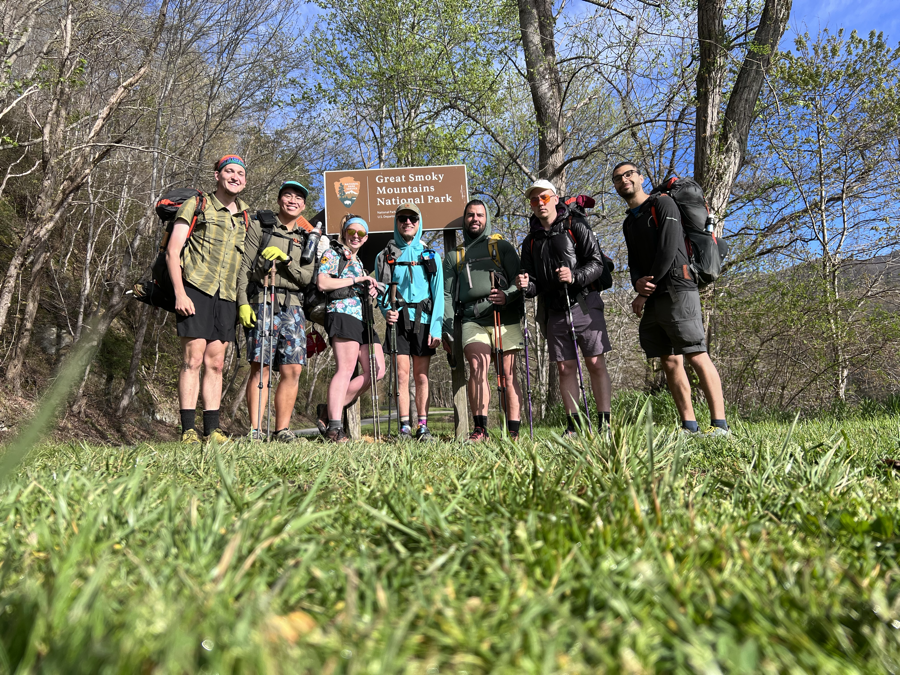
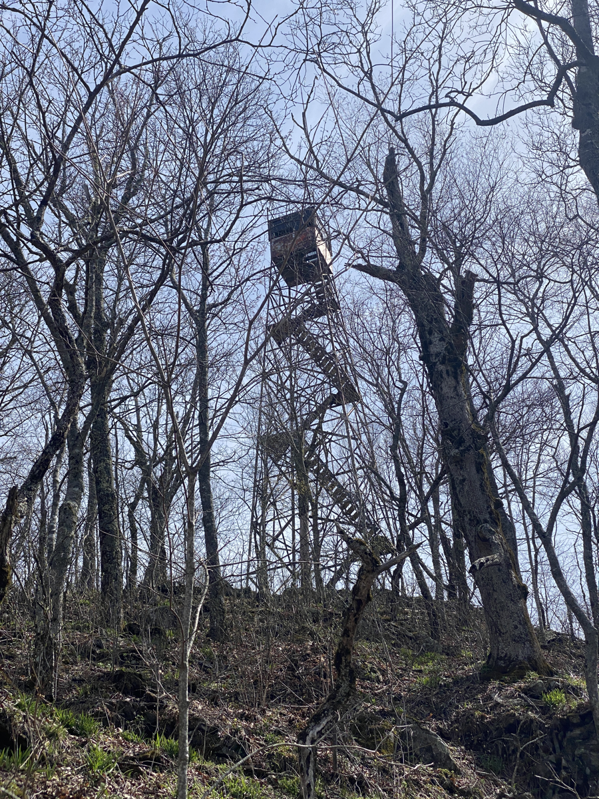
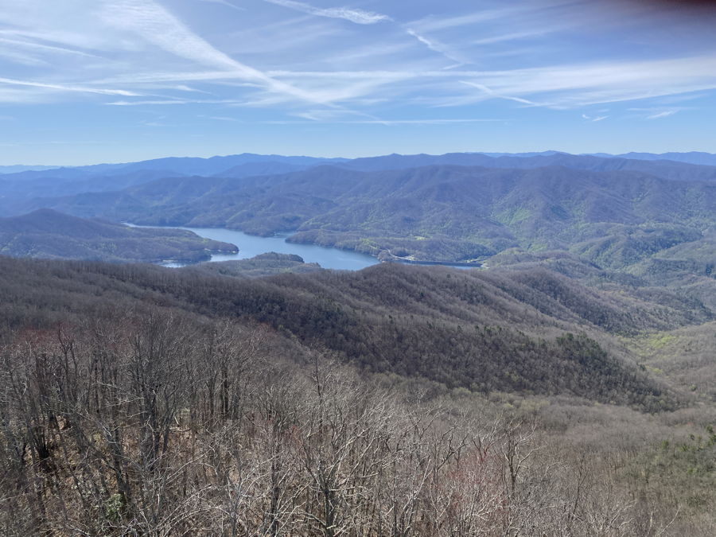
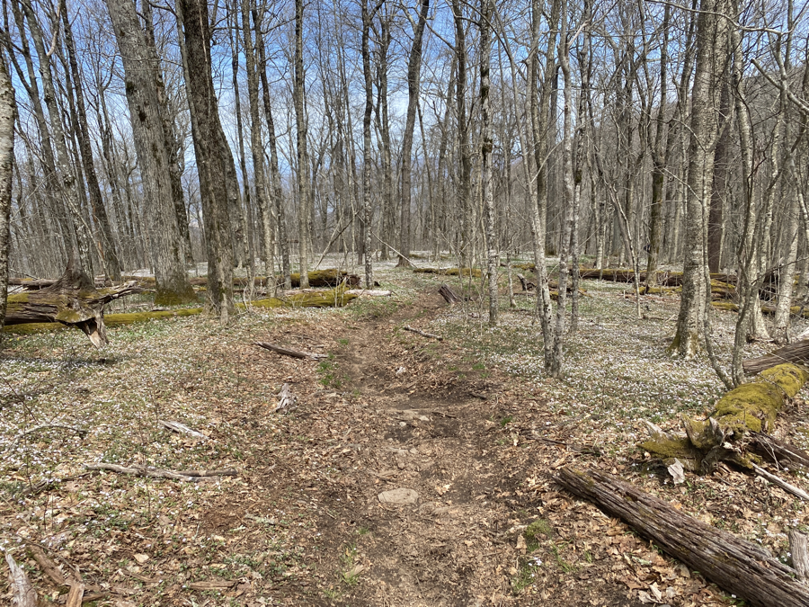
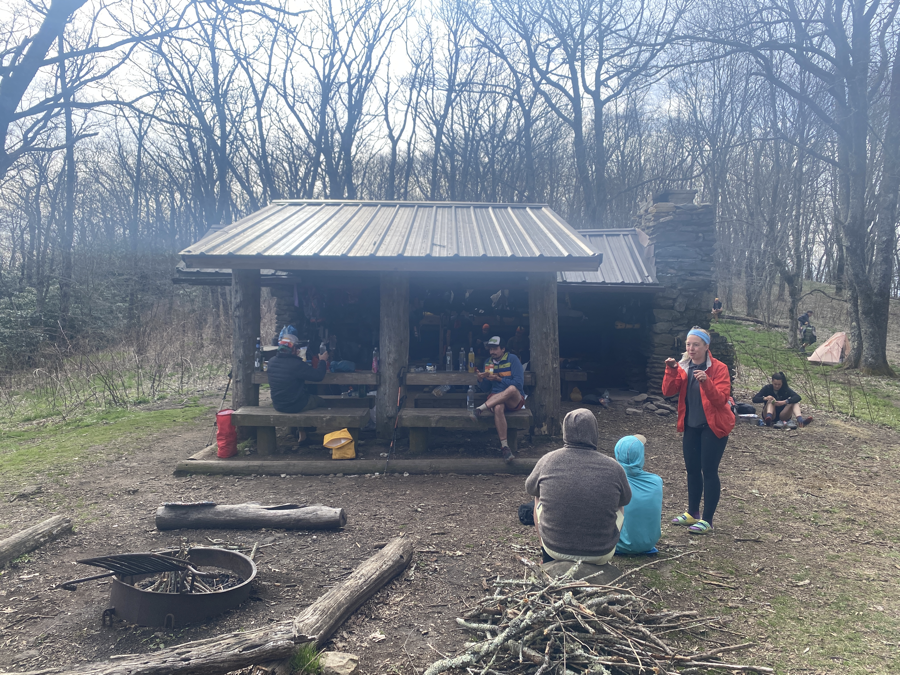
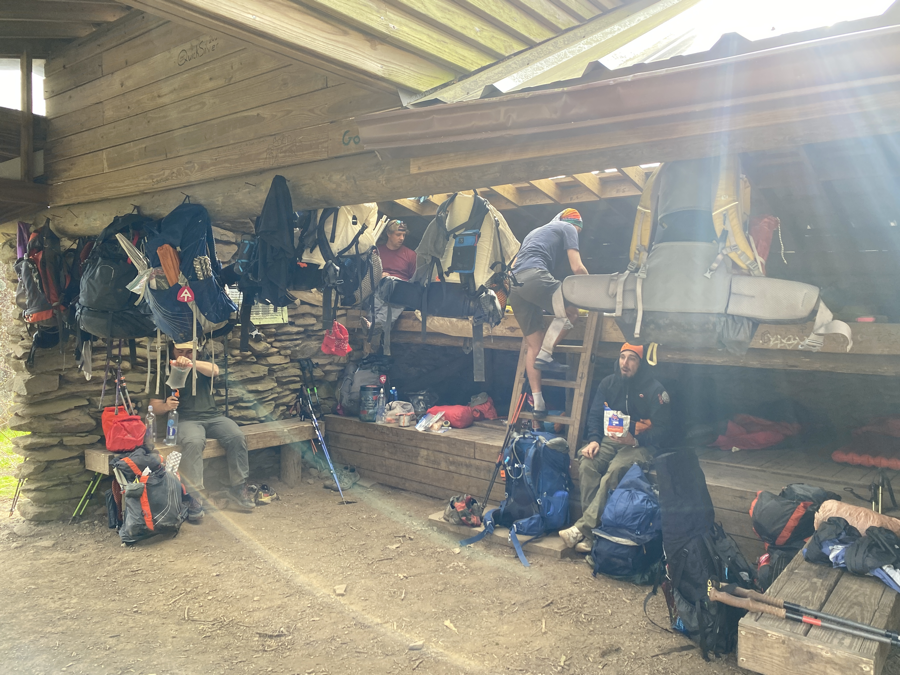

| Miles hiked | Elevation gain (ft.) | AT mile |
| ----------- | -------------- | -------- |
| 14.71 | 5033 | 180.8 |

_I totally forgot to mention this in the past few days, but I decided to change my trail name to Seven Plates (after the buffet experience in Franklin). I liked it more than Wiki, and others agreed with me on it._

I woke up to a beautiful sunrise along Fontana Lake. The air was a nice and crisp this morning. Today would be the first day into the Smokies.

I got my stuff packed and ate some bars for breakfast. One advantage of sleeping in a shelter is that you don't have to deal with taking down your tent in the morning.

The trail started out today with a one mile road walk over Fontana Dam and into the entrance of Smoky Mountain National Park.

We stopped and took a picture by the sign:

<figcaption> Left to right: Banquet, me, Tales, Grapefruit, Kris, Dionysus, Pickles</figcaption>

A little bit afterwards, there was a drop box for the permit that I printed back at the NOC. I tore off one half, slipped it inside, and hiked on.

The climb into the Smokies was challenging. It went uphill 3,000 feet for about 3 or 4 miles. To add salt to the wound, I had five days of food in my pack. 

After an hour or so of climbing uphill, I was greeted by a side trail that led to the Shuckstack lookout tower. The tower was in a state of slight disrepair. Some of the handrails were missing on the stairs and there were a couple of loose boards. I cautiously made my way up, preventing myself from looking down. At the top I was greeting to a great view of the Smokies.

After the big climb into the Smokies, the rest of the day was relatively easy. The AT in the Smokies are graded for horses (the park rangers ride them around sometimes), so it's not nearly as steep as other parts of the trail. 

<figcaption>Small white flowers blooming along the trail</figcaption>

I met another hiker, Will, who matched pace with me for a bit. I noticed his gear and we starting conversing over it. I learned that he's also a software engineer, from New York City. He quit his job at Capital One to hike the AT. He's also into nerding out over ultralight gear. I think there's something about engineers that draws them to obesssing over our pack weights, trying to get the lightest, most efficient items in our packs.

We hiked along until I reached my shelter for the day, Russell Field Shelter. Will planned to do eight more miles, so we said our goodbyes and he went along his way.

Smoky National Park has a weird system for the shelters. Thru-hikers are given a pass to hike through the Smokies, and can stay at whatever shelter they want, granted they stay on the AT. However, if a non-thru-hiker with a reservation comes to the shelter and it's full, then they can kick out thru-hikers to get a spot in the shelters. Before covid, it thru-hikers _had_ to stay in the shelters, and could only tent if the shelter is full. But since I guess covid is still a thing, we can pitch our tents regardless if the shelter is full or not. It was going to rain a hefty amount tonight, so we were all vying for a spot in the shelter. Thankfully, we were all able to squeeze in. 

That changed at 7:30pm when some weekend backpackers came in. It was three teenagers and a father. The father decided to order four of us out of the shelter, instead of asking politely. We obliged and were able to get four people on the dirt ground of the shelter, still protected from the rain.

The sun set soon after, and we all headed into the shelter to sleep for the night. Looking at the route for tomorrow, I was suprised to see that it had about the same elevation gain as today's. 

Not really much of a choice to slow down though, I only have enough food to cover 70 miles in 5 days.