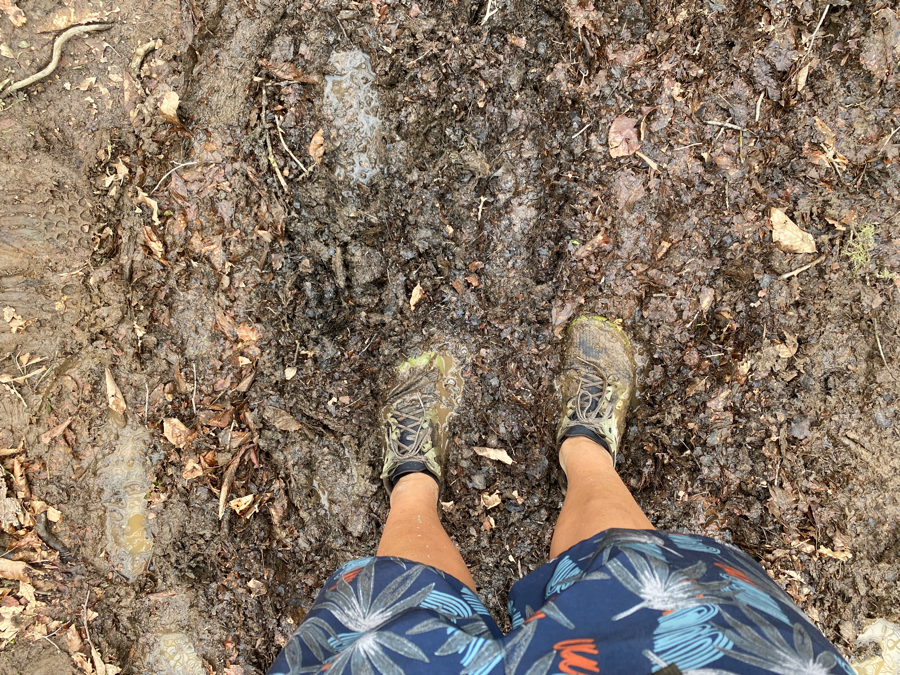
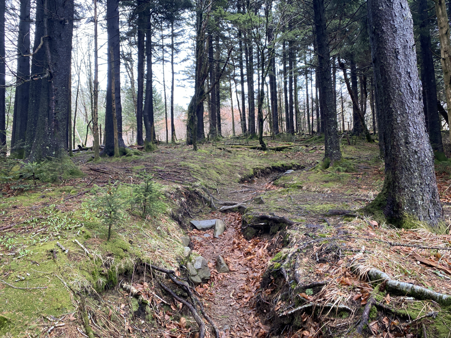

| Miles hiked | Elevation gain (ft.) | AT mile |
| ----------- | -------------- | -------- |
| 16.06 | 5,098 | 197.2 |

It rained a bunch overnight. It always feels good to be sleeping in a dry shelter, knowing that I won't have to deal with a wet tent in the morning.

I woke up to the sound of others getting up and packing their stuff around 7am. It's basically impossible to sleep through the sounds of others getting ready for the day. The hardest part of the morning is getting out of my warm, soft quilt and switching into my cold hiking clothes. Oftentimes I find myself staying under my quilt for 20 to 30 minutes, enjoying the warmth and procrastinating what I should do.

I finally changed my clothes and got my stuff ready for the day. I was running behind and was the last hiker out of the shelter.

The rain had transformed the compact dirt trail into a big pile of mud. Trying to keep your feet dry is a fool's errand. You're also supposed to stay in the middle of the trail, to prevent the trail from widening. This led me to diving my feet into ankle deep mud, completely soaking my shoes, socks, and feet.

A hiker appeared behind me and charged ahead. It was [Road Soda](https://www.instagram.com/fuckingreasy/), a hiker I met at the Fontana Hilton two nights ago. He hiked the AT last year and is planning on starting the PCT later this month. He was section hiking the Smokies as a last bit of training. He had a super ultralight setup, a pack no bigger than one you would wear to work or school. His entire setup was less than 10 pounds. With his super ultralight setup he was wearing shorts, a rain jacket (and nothing else), and a white cowboy hat. I had to do a double take to make sure that outfit was what I was seeing. He said hey and blazed past me.

The wet and muddy trail made the miles feel much longer than if it had been dry. I reached Derick Knob Shelter and took a lunch break there. Road Soda was there as well as Chewy, another section hiker about to start the PCT. I asked them a bunch of questions about their ultralight gear and was bestowed a super helpful piece of knowledge: that you can pack out Hot Pockets and eat them thawed on the trail. Chewy and Road Soda were stopping at Derick Knob for the day, and they were planning on getting off at Newfound Gap. This was probably the last time I'll see them. I said my goodbyes, wished them luck on the PCT, and continued on.

The afternoon portion of the hike was about the same as the morning: wet and muddy. I found a second wind a couple of miles in and made a good pace. About a mile before the shelter, I passed through a beautiful spruce-fir section of the trail. It felt like I was in a fantasy novel.

I made it to the shelter for the day: Double Spring Gap Shelter. I was pretty exhausted from trudging through the mud. Surprisingly, even though I was the last hiker to leave the shelter in the morning, I was the second to make it to this shelter. Danielle, a hiker that I met yesterday, was the first one. There were also two section hikers my age at the shelter, who I later talked to and learned that they both went to Cornell.

Everyone else started piling in a bit later. We cooked dinner and complained about the mud. Banquet was a bit too conservative with how much food he packed and did not have enough to make it the five days out of the Smokies. Luckily, some section hikers who were about to finish came by and unloaded all of their extra food on us. We gladly accepted everything they gave us and Banquet got more than enough food.

Tired from the day, we all headed to sleep just as the sun went down. Since our shelter was only three miles from Clingman's Dome, the highest point on the AT, we decided to wake up at 4 and hike up there for the sunrise tomorrow.