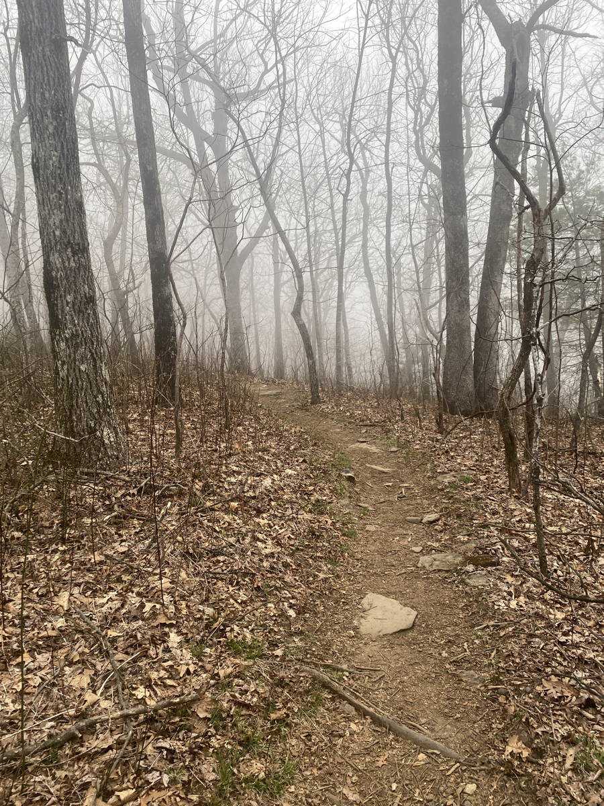

| Miles hiked | Elevation gain (ft.) | AT mile |
| ----------- | -------------- | -------- |
|  9.60 | 1,745 | 8 |

I felt something touching my head at 3am. I kept telling myself that I was just being paranoid, nothing was actually there right? Anyways, that kept me awake for a bit and I slowly drifted off to on-and-off sleep.

I woke up around 7:30 and there were a couple of people eating breakfast in the picnic table in front of the shelter. The first fellow thru-hikers I've seen on the trail! I didn't see a soul last night on the trail and didn't get to talk to anyone when I got to camp since it was late at night when I pulled in.

I had my breakfast of cold soaked oatmeal with trail mix dropped in and a Clif bar, and took turns introducing ourselves to each other. There was a guy from Arizona, a couple from Virginia, and a girl from Florida. They all planned to get to Hawk Mountain shelter that day, and we said our goodbyes as we finished our breakfasts.

As I was packing up my stuff in the shelter, I saw a small mouse scurry across the edge. I knew it! I wasn't just being paranoid. At least it didn't run over my face or into my quilt.

I left the shelter and started hiking the 1.5 miles to Springer Mountain, the actual start of the AT. It was foggy and there was a slight drizzle, but the cool wind felt nice. Typical Appalachian weather.

I unexpectedly stepped onto Springer. I just kinda found myself... there. It was just a small alcove in the trees at the top of a hill. A bit anticlimactic but at least I got to the start! I saw the first white blaze of many, along with the plaque bolted into the mountain. I found the logbook and wrote my name in it. The couple from Virginia was there and took a photo for me.

Then I started walking on the AT. It looked like it was going to rain pretty heavily overnight, so I wanted to get to Hawk Mountain shelter as fast as I could to try and get a spot inside. I really prefer not putting up my tent in the rain if I could afford it.

I met so many more people on trail today. It was a stark contrast from not seeing a soul to passing by someone every 10 minutes or so. I met a guy whose trail name is Horse and was hiking with his dog. I took a small detour from the main trail to see Long Creek Falls, and it was absolutely worth it.

I made good progress afterwards and found myself at the shelter around 1pm. Surprisingly, I was the first person to arrive that day. There was one other guy there from yesterday that decided to take a zero and stay another day at the shelter. 

With 7 hours to spare before sundown, I took my time getting all the stuff I needed to do before sitting down and talking to the other hikers as they arrived. It was a great time just sitting there and getting to know everyone. Most of them were around my age, with a couple of people around retirement age. They came from all over the place: Maine, Louisiana, Wisconsin, Alabama.

And that's basically all we did til sundown and now I'm in my quilt for the night with a roof over my head. Today felt pretty easy physically, I figure it's better to be on the conservative side in terms of how many miles I hike early into the hike. I don't really have anything to prove by doing 20 mile days, especially when doing so would increase my chance for overuse injuries. I'll give myself a few weeks to get used to this before ramping up my mileage. 

I might try and do 15 miles tomorrow to get to Lance Creek, the last camping spot before the restricted Blood Mountain area where you need a bear canister. I'll see how my body feels tomorrow and I won't push myself too hard. At least I'll be dry tonight!