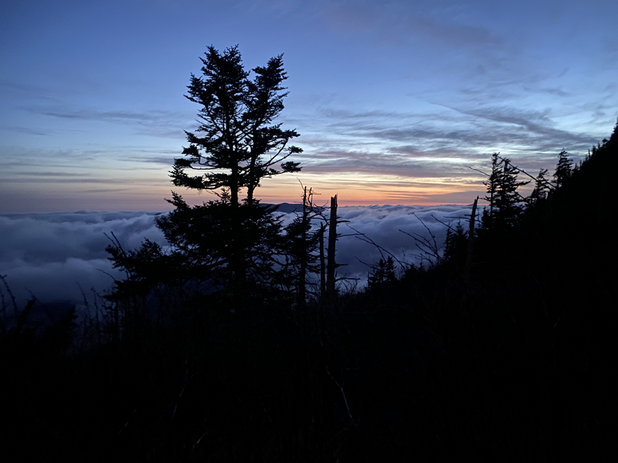
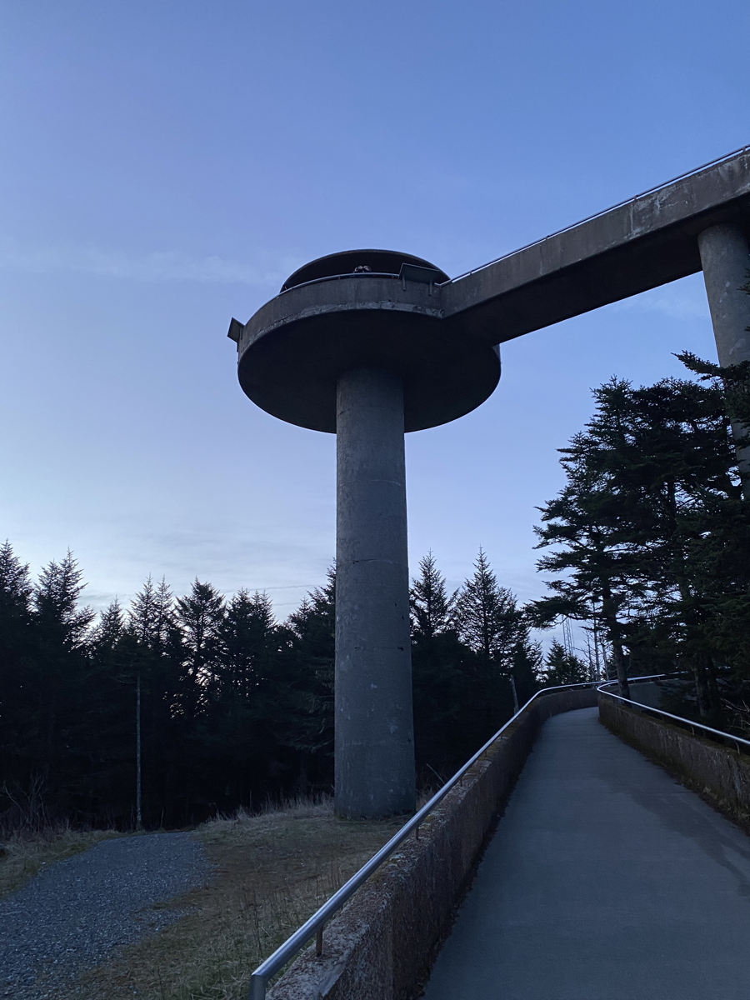
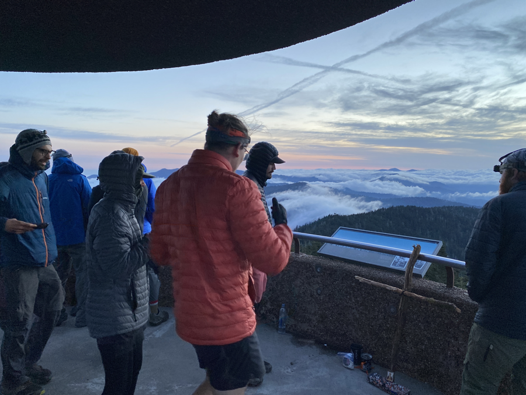
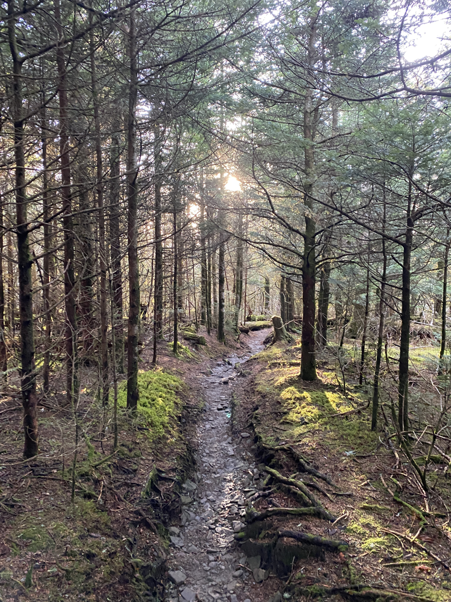
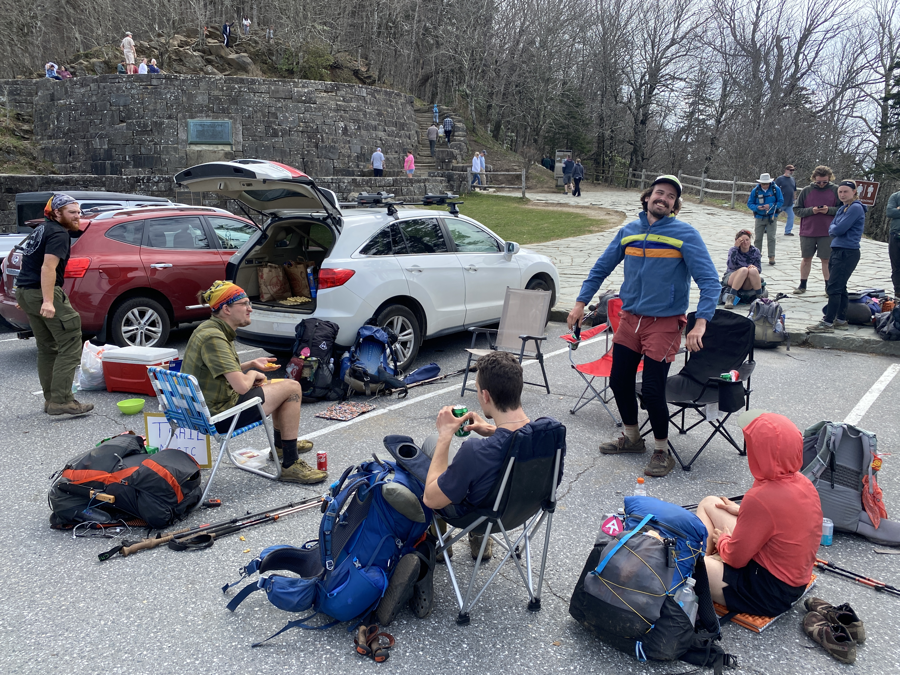
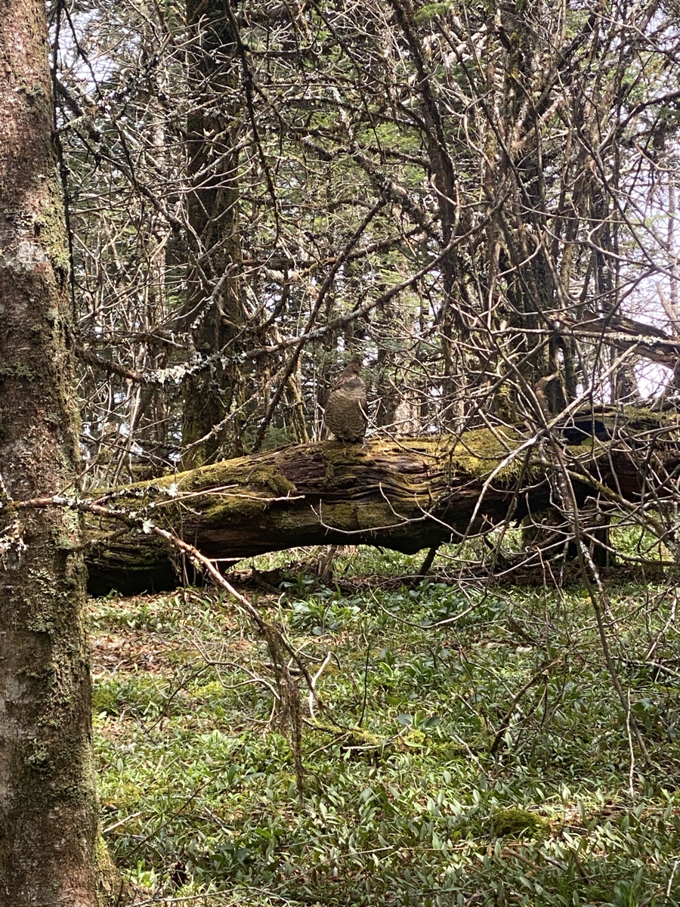
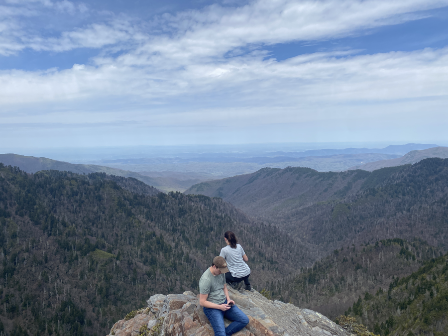

| Miles hiked | Elevation gain (ft.) | AT mile |
| ----------- | -------------- | -------- |
| 21.13 | 5,092 | 218.2 |

The sound of phone alarms jolted me awake at 4am. I slid my quilt over my face and tried to get more sleep, to no avail. It was cold and foggy outside, and I really didn't want to get out. I did some quick math and figured I could stay in my quilt for another 50 minutes and still make it to Clingman's Dome in time for sunrise, and that's exactly what I did.

I changed into my hiking clothes and popped out of my quilt at 4:50. Everyone else in the shelter was gone, except for Strings and the two section hikers. I quietly ate some food and packed up my stuff. I got onto the trail around 5:30 and was immediately greeted with a nice uphill climb. It was still dark and I used my headlamp to guide me up the rooty, rocky trail.

There's a strange peace with hiking before the sun comes up. It feels like the rest of the world is asleep and it's just me trekking through. The sky turned a beautiful indigo as the sun approached the horizon, and rays of orange peeked through. The fog started to clear out and I was presented with a breathtaking transformation of the sky above the clouds:

It took me about an hour to get to Clingman's Dome. It's a large concrete structure with a wheelchair acessable ramp that spirals around to reach the top of the tower. I made my way up the ramp and reached the observation deck. It was windy and cold, but there were breathtaking views of the clouds rolling over the mountains with a colorful sky in the background.

I stayed and appreciated the view for as long as I could bear to stand the cold and wind. I made my way down and continued on the AT. The area surrounding Clingman's Dome is the beautiful spruce-fir forest that I got a glimpse of yesterday:

The trail was mainly downhill, and I made good time to Newfound Gap, the main road and parking lot that day visitors of the Smokies go to. It was Sunday, Easter on top of that, so the parking lot was absolutely packed with tourists. I heard a whistle and had my attention brought to some trail magic that was set up in the parking lot.

The guy that was hosting the trail magic was named Stevie Wander. He thru-hiked back in 2014. I was presented with a spread of ham and cheese sandwiches, chips, soda, bars, and a bunch of fun-sized candies. Stevie told us a bunch of amazing and hilarious stories about his time on the AT. It made me even more excited for the things to come.

I took my time at the trail magic, enjoying the food and the stories. A couple of other hikers from my group came in, and we discussed on where we wanted to stop for the day. Lumberjack and I wanted to just go three more miles to the nearest shelter, but others wanted to push another ten, since the weather was so good today and we got so many miles in so early into the day. They peer pressured Lumberjack and I, and we caved in and decided to push onwards ten more miles, making today a 20+ mile day.

As I was leaving Newfound Gap, a sign was posted on the AT showing the distances to nearby trails. At the bottom was Mt. Katahdin, a mere 1972.0 miles away. I tried not to think about just how little of the AT I've done so far and kept on hiking.

Just after filling up my water, Danielle passed me. We matched paces and hiked together. We saw a large grouse and appreciated it in silence, then started conversing soon after. We made it to Charlie's Bunion, which Red had been hyping up for a while. It was a spectacular view.

<figcaption>Can you see the grouse?</figcaption>

<figcaption>Charlie's Bunion</figcaption>

We continued on and kept talking, which helped pass the time. Danielle eventually stopped to make a phone call so I continued onto the shelter for the day: Peck's Corner Shelter. The shelter was located of a 0.4 mile side trail, which felt much longer than that at the end of a 20 mile day. My body felt better than it had any right to, and I strolled into the shelter. It was 4:10 and I was the first person there. I think the long-ass side trail might have deterred other hikers from stopping there.

I ate a whole bunch of food and propped my feet up. Pickles, Dionysus, Banquet, Lumberjack, and Daniel came in a congo line. They all walked in a line for the 10 miles from Newfound Gap and said a bunch of Skyrim NPC lines to the day hikers, probably confusing the hell out of them.

The rain slowly started and I was again grateful for the fact that I was in a shelter. Absolutely exhausted from the early wake up and 20 miles, I got in my quilt early.

Strings, Grapefruit, Tales, and Kris didn't do the sunrise hike to Clingman's Dome, so they stopped at the shelter I was originally planning on staying at, the one three miles from Newfound Gap. The rest of us decided that tomorrow we would hike a short 5.7 miles to let them catch up to us.