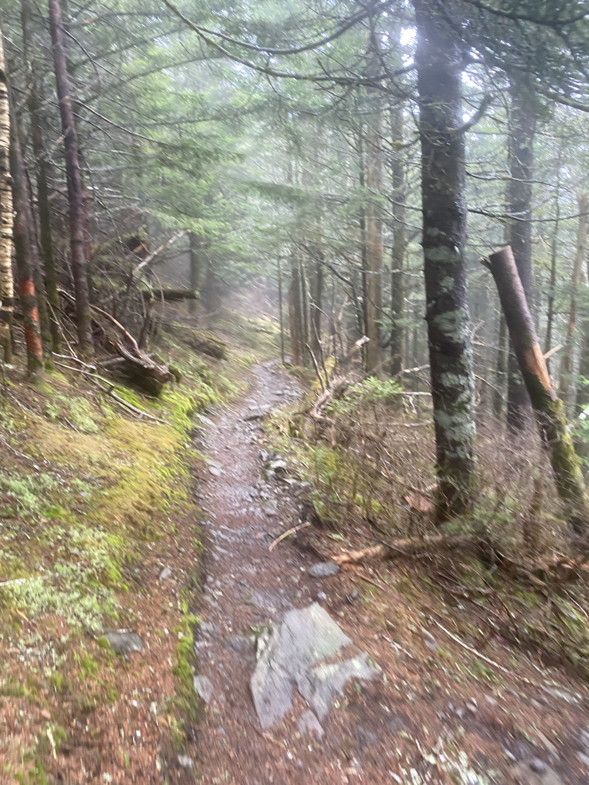

| Miles hiked | Elevation gain (ft.) | AT mile |
| ----------- | -------------- | -------- |
| 13.13 | 2,749 | 231.1 |

This was the hardest day on the trail so far. 

Since we thought that we were only doing 5.7 miles today. We all slept in and had a nice brunch at the shelter. Red had a bunch of extra ramen in noodles, which he kept all crushed up in a gallon Ziploc bag. He gave me some of the noodles and I cooked myself a warm breakfast and ate some snacks that I carried out from yesterday's trail magic.

I headed out from the shelter around 11am and made my way to the shelter. I zoomed ahead of others. It rained the night before and was still drizzling, so my feet got soaked and muddy. I didn't care as much since it was such a short day.

I reached Tri-Corner Knob Shelter around 1pm. I talked to a Russian-Ukranian couple who were thru-hiking, and they told me that the weather for tonight was going to drop into the 20s with some snow. Others came to the shelter and we made the decision to push another 7 miles to the next shelter, which was about 1000 ft. lower in elevation than the one we were at, in order to avoid the snow as much as possible.

I headed back on the trail and the temperature started dropping and the rain increased in intensity. I brought out my umbrella and held it in my left hand with a trekking pole in the right. About 3 miles in, I started getting some foot pain in my right foot, which got worse as the miles went on. I realized that it was probably because using one trekking pole was affecting my gait and stressing my right foot, so I put my umbrella away and took out my other trekking pole. At this point however, the pain still lingered and I had to push myself through it. The cold temperatures and wind made it's way through my body. I had to use every bit of willpower to get the final few miles to the shelter.

I finally made it to the shelter and it was packed. One women at the bottom row of the shelter refused to move her pad closer to the wall, claiming that she needed to get up multiple times at night. Thankfully, everyone on the top row was able to squeeze and get me a spot. I sat for a while and just tried to warm myself up. I then slowly got my dinner cooking and mustered the energy to eat it.

After drying off and changing to my sleep clothes, I slipped into my quilt and was embraced by the warmth. When we know it's going to freeze overnight, we all sleep with our water filters to prevent them from freezing. If they freeze, it can compromise the efficacy of the filters.

Because of the 20 mile day yesterday and pushing 7 more miles today, tomorrow would be an easier 10 mile day to get out of the Smokies and to Standing Bear Hostel. I let the warmth of my quilt overtake me and drift me off to sleep.