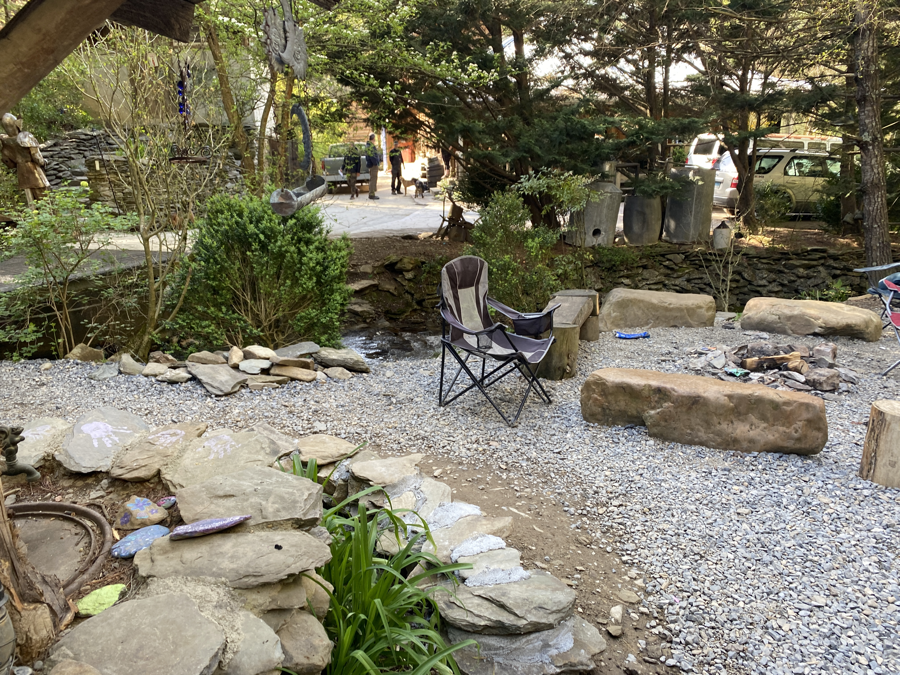

| Miles hiked | Elevation gain (ft.) | AT mile |
| ----------- | -------------- | -------- |
| 11.63 | 1,817 | 241.5 |

It was frigid last night, but the collective body heat of a bunch of hikers crammed into a shelter like sardines kept things warm in my quilt.

Our shoes and socks? Not so lucky. They were completely frozen when we woke up. Despite our efforts, there was no way we were getting our feet inside our rock-solid shoes.

<figcaption>All of the frozen socks</figcaption>

We got a pot of water boiling and poured it over our shoes in a line. This softened my shoes enough for me to shove my feet in, grimacing at the fact that my previously dry feet were now soaked. Daniel was not so fortunate, and decided that he would hike out of the Smokies in Red's Crocs.

I headed out from the shelter, still shivering slightly from the cold. The sub-freezing temperatures hardened the mud from last night, thankfully making it a more enjoyable hike, except for the patches of ice that I needed to watch out for.

The AT flip-flopped from north to south of the ridgeline. On the north side, it was windy and cold with no sun. On the south side, it was calm and the sun's rays sent me small pinpricks of warmth. It was a much easier hike than yesterday, largely because it wasn't raining and the trail wasn't muddy.

About 3 miles into the day, there was a 0.6 mile side trail to a watchtower at Mt. Cammerer. I saw two other packs at the fork, so I joined along by shedding my pack. I half walked and half ran down the trail, unencumbered by the weight of my pack. I reached the watchtower, which had an interesting-looking watch tower and a panoramic view of the landscape downhill.

In good spirits, I made good time on my way down. The weather warmed up and I shed my rain jacket and fleece. I made it down to Pigeon River, which had a beautiful, green forest surrounding it.

Right after Pidgeon River is I-40. This is the first major highway I've seen on the trail, and the AT goes right under it. I made my way along the short road walk under a bridge with a bunch of white blazes painted along its columns.

After crossing I-40, there was a short mile before I got to Standing Bear Hostel. Standing Bear is a famous hostel on the AT, and it sure is unique. I felt like I was stepping onto a hippie commune. The hostel is a plot of land with a stream running through it, and a variety of wooden structures plotted throughout. The showers are outdoors and the only toilet is a privy. There's no washing machine. Instead you need to handwash your clothes over a washboard. The bunkroom is a converted garage with an old-school furnace as its only source for heat. 

The resupply store is a converted tool shed were you pick out the food yourself and note everything you take on a slip of paper, which is tallied up at the end of your stay. Almost all of the food was expired, which led me to question where exactly they got their food from. My working theory is that they have a hookup at some grocery store who sells them food they're about to toss out at a fraction of their price. To be fair, most of the food was processed, dry goods like ramen or candy bars, which don't really expire and would probably be good after a nuclear holocaust.

I sat around and ate some microwave burritos from the resupply as everyone else came in. We all sat around a fire ring and celebrated getting through the Smokies. Strings, Grapefruit, Tales, and Kris, who we had been seperated from for two days, came in and we reunited. Standing Bear served a nice Thanksgiving-style dinner. I was tired before everyone else was and headed off to my bunk for the night.