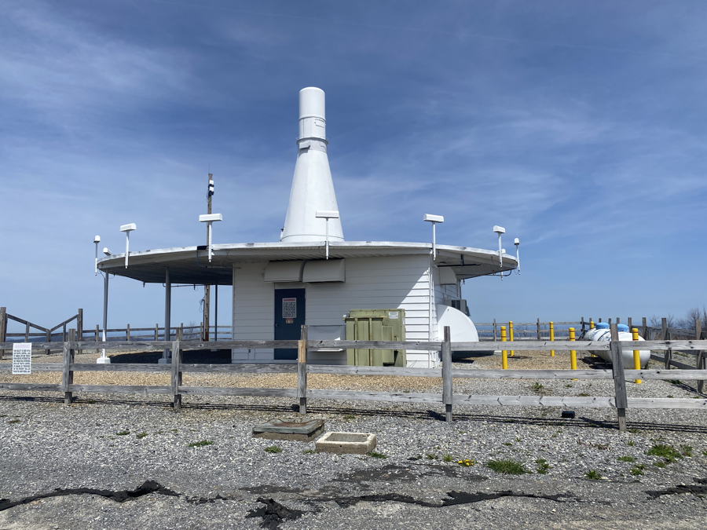
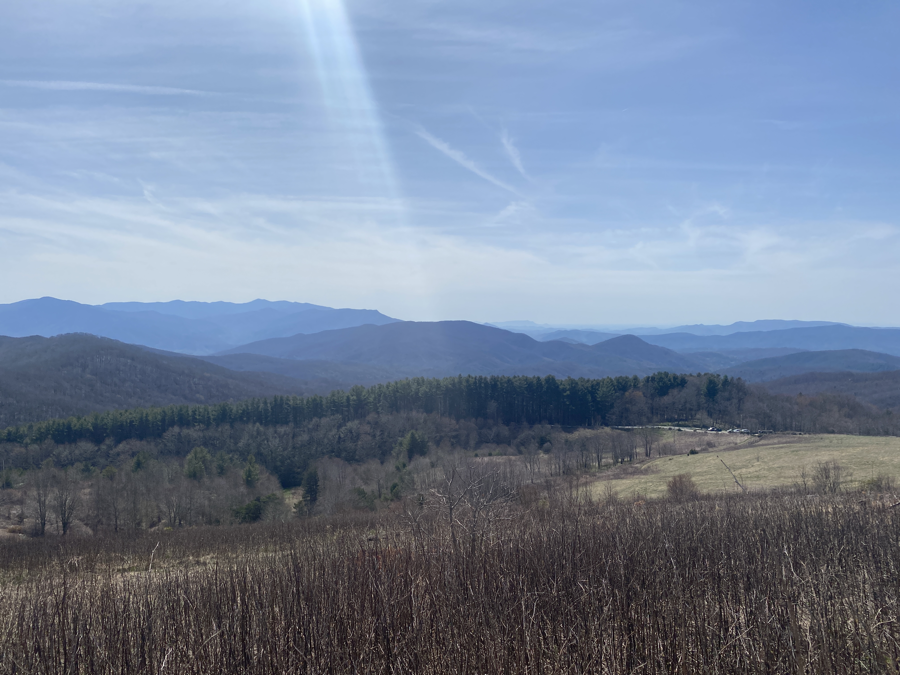
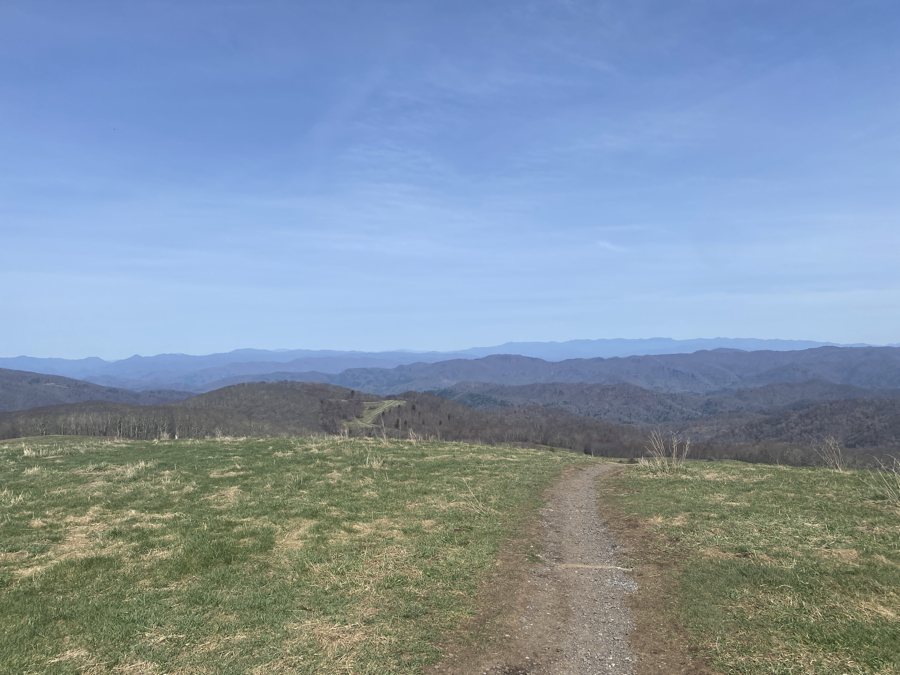
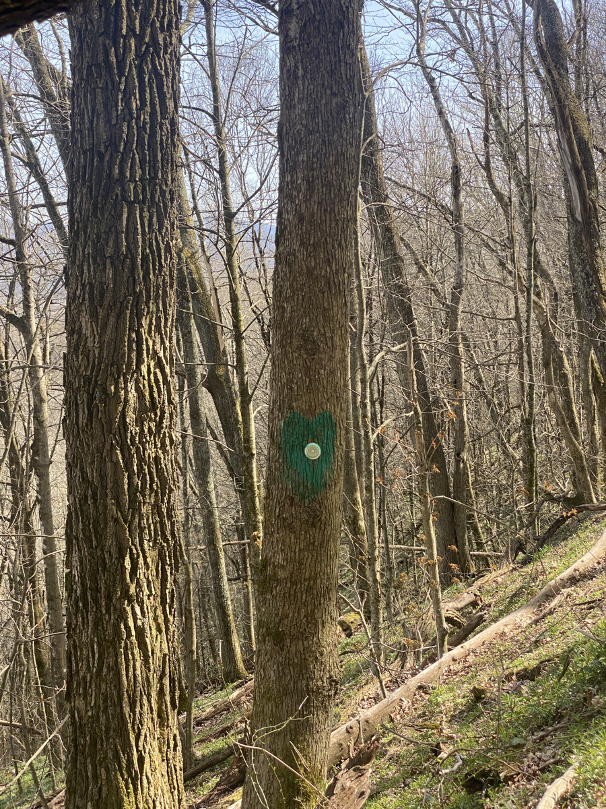
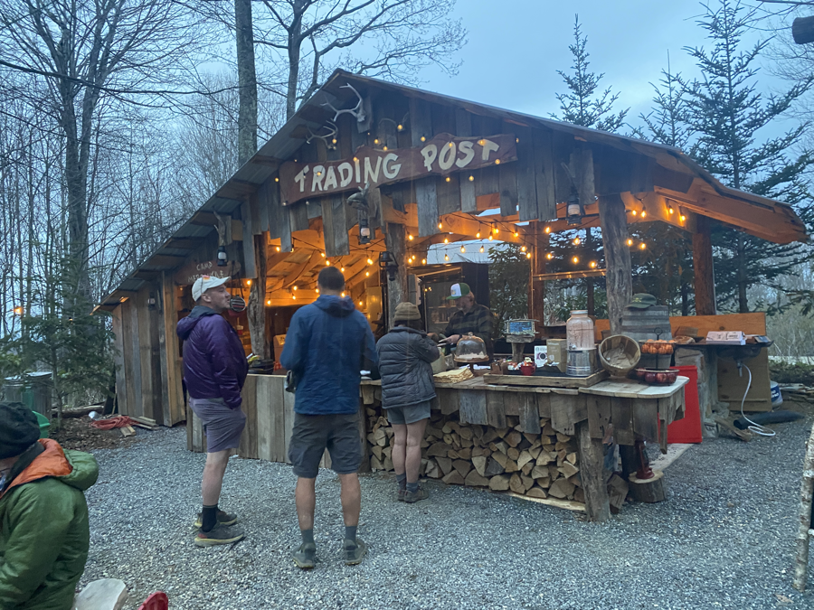
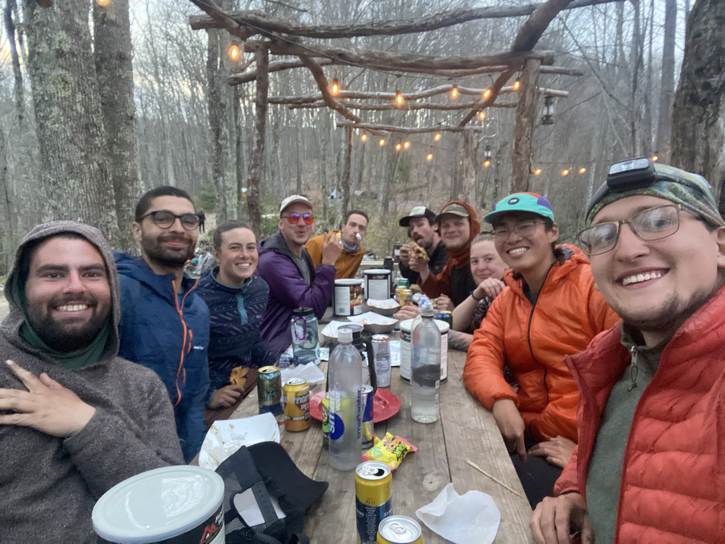

| Miles hiked | Elevation gain (ft.) | AT mile |
| ----------- | -------------- | -------- |
| 14.77 | 5,135 | 256.2 |

The cowbell letting people know that breakfast is served got me out of bed this morning. I walked over to the main house and got my breakfast chimichanga. As I ate breakfast with everyone else, we discussed whether or not we should take a zero at Standing Bear, or push on for the day. 

It was 4/20 today and Standing Bear was going to have a big party for it. We felt that it would probably be too much, so we planned on doing 15 miles to Green Heart Lodge, a newly opened hostel which reportedly has mind-blowing burgers.

We all took our time in the morning, and I left Standing Bear around 10:30. There was a long uphill climb immediately out of Standing Bear. The weather was good today, in stark contrast to how it was in the Smokies. At the top of the big uphill, I was greeted by an interesting looking communications facility.

The rest of the day was fairly pleasant. I reached the top of Max Patch Bald, where I was greeted with a 360 degree view of the Smoky Mountains and the mountains where I was headed to.

A mile after Max Patch, a sign proclaiming "Burgers and free beer!" pointed towards a side trail blazed with green hearts.

I quickly made my way down the 0.7 mile side trail. I reached the Green Heart Lodge, which had a nice outdoor seating area and kitchen. The owner, Midnight Rider, was manning the whole operation, including cooking the burgers. He had just opened the place two weeks ago, and word of his burgers has spread like wildfire. I ordered a Rider Burger (pictured above), which had grilled pineapple, jalapeños, and a sweet glaze. It was even better than everyone else said it was.

I had my burger, bought a few bars to get myself to Hot Springs tomorrow, and went back to setup my tent. Everyone else rolled in about two hours later (they left Standing Bear a while after I did). They all ordered burgers and I got a second one.

<figcaption>Left to right: Kris, Pickles, Smokey, Dionysus, Crocka, Lumberjack, Grapefruit, Tales, me, Banquet</figcaption>

I went to scour the hiker box, and found four large cans of Mountain House freeze dried meals tucked behind it. Each one must have had 10 servings of food, and normally cost at least $50. I checked the expiration date at the bottom: 2039. Sweet. I brought them back to the table and we decided to eat one of them tomorrow morning for breakfast and pack out the rest.

Afterwards we went back to the tent site and went into our tents. The burgers in our stomachs drifting us off to sleep.