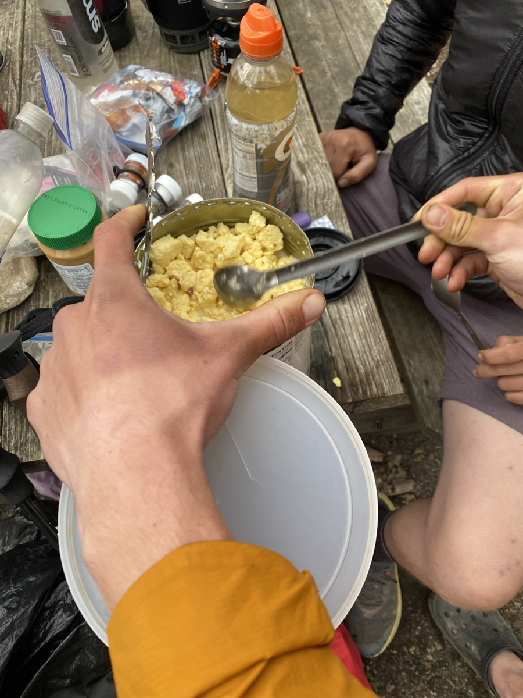
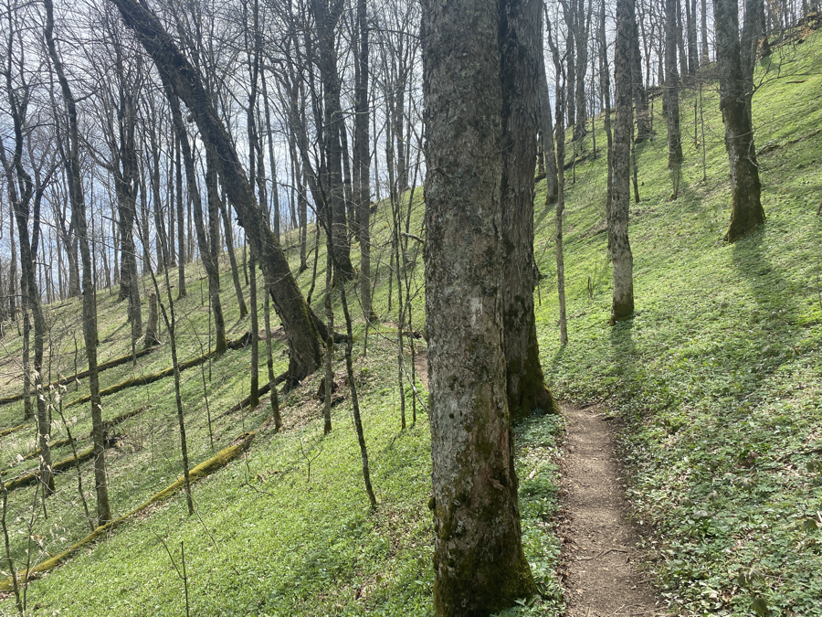
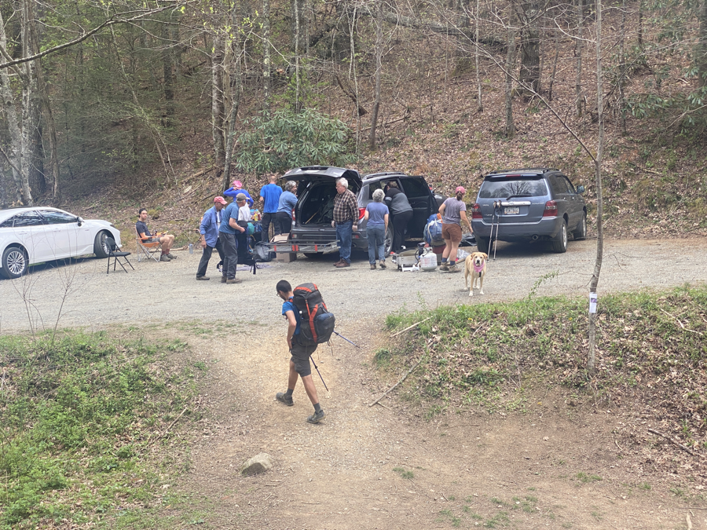
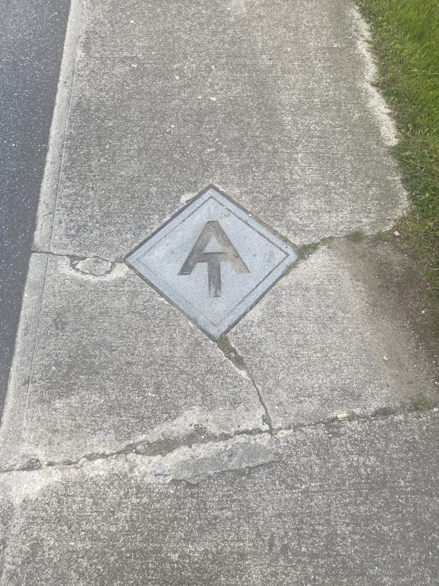
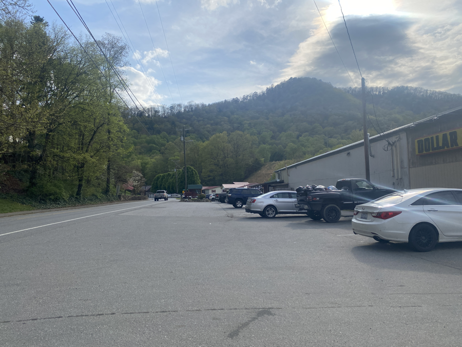
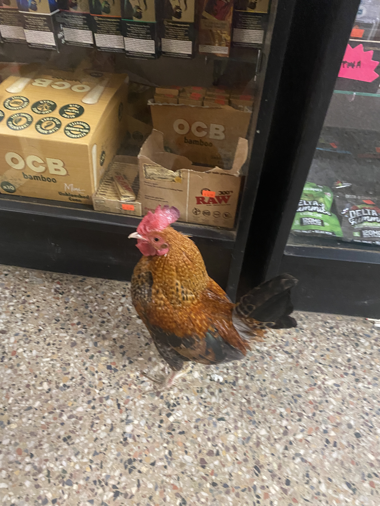

| Miles hiked | Elevation gain (ft.) | AT mile |
| ----------- | -------------- | -------- |
| 18.96 | 3,399 | 274.6 |

We started the day by boiling 48oz of water and dumping it into one of the Mountain House meal cans from yesterday. Within 10 minutes, we had a large container of eggs and bacon!

We agreed to do 18 miles today to get to  Hot Springs. It was a pretty long day mileage wise, but there wasn't too much elevation gain. The scenery along the trail today was great. A whole lot more green than there had been in earlier sections of the trail.

About 12 miles in, I was planning on eating some cold soaked mac and cheese in a parking lot for lunch (the mac and cheese was from Standing Bear and was 5 months expired). Thankfully, I was greeted by some trail magic, which had hot dogs and random variety of snacks.

I stayed at the trail magic for a while, talking with the hosts and some other hikers. I let the hot dogs process in my stomach, and then set back off on the trail. About 3 miles away from Hot Springs, Lumberjack caught up to me and we hiked together into Hot Springs.

Hot Springs is the first town on the AT where the trail runs directly through the town. The AT logo is embedded in the sidewalk down the main street of Hot Springs.

Lumberjack and I walked over to a market and both got a quart of chocolate milk. We then proceeded to drink them in under two minutes. The quart was 920 calories! Quite impressive.

We then walked back to the Laughing Heart Hostel and waited for everyone else to get there. Everyone else rolled in and we set up our tents in the hostel's grass field. We then headed down to the local brewery which also had a taqueria.

I had a few drinks at the brewery and had two tacos from the taqueria. The tacos were a bit disappointing coming from someone who grew up in Texas, but it was expected considering the fact that I was in rural North Carolina.

We stopped by a small store on the way back, which had a tiny rooster running around it.

Afterwards, we went back to tent city at the hostel. The others stayed up a bit to keep drinking and talking, but I was pretty beat and decided to call it a night there. We plan on taking a zero in Hot Springs tomorrow, so it's nice knowing that I can sleep in and take tomorrow morning easy.
