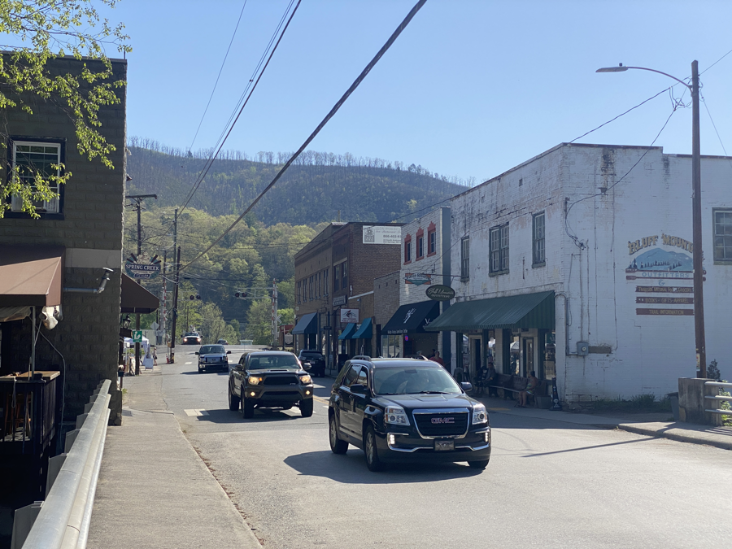
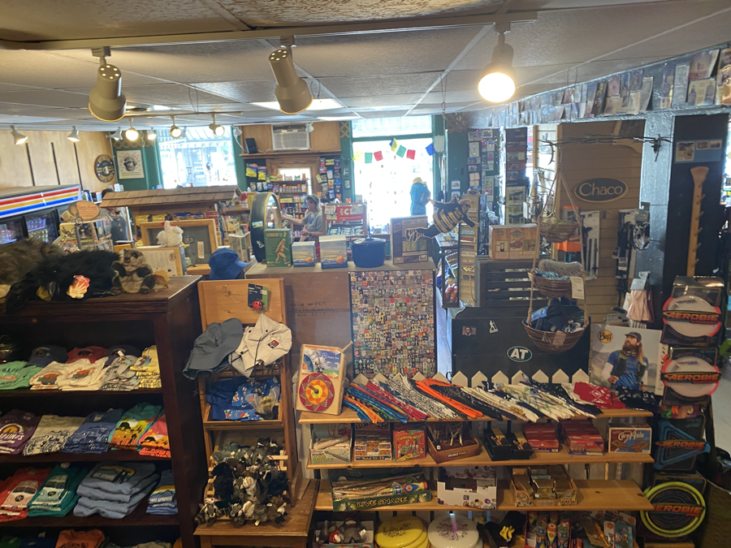
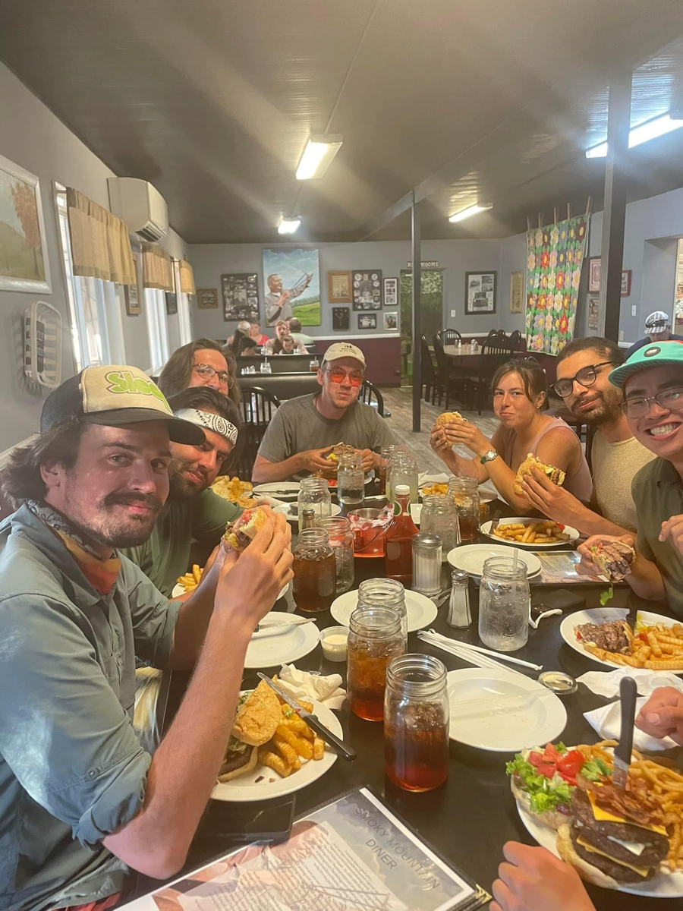

| Miles hiked | Elevation gain (ft.) | AT mile |
| ----------- | -------------- | -------- |
| 0 | 0 | 274.9 |

Today was a relaxed day in Hot Springs. It got hot early in the morning, which got me up and moving out of my tent. I took a shower at the hostel and did my laundry. 

Afterwards, I headed into the Dollar General in town to resupply. The pickings at the Dollar General were a bit slim, but I was able to get enough food to get me the five days to Erwin, the next town along the AT.

I walked further down the main street of Hot Springs and sat down at a table by the Visitor Center. I organized all the food I just bought. Getting rid of boxes and unnecessary packaging, and shoving it all in my food bag.

<figcaption>Downtown Hot Springs</figcaption>

I then walked over and checked out the local outfitter in town. One of the tips of my trekking poles had broken, and I was trying to get a replacement. Unfortunately, the store didn't have my brand's parts. 

I tried taking off my tips and ripped both poles apart. I took the corpse of my trekking poles and the rest of my gear to the library next door, planning on trying to fix it later in the day. I sat at a computer in the library for a while, typing up a few days worth of blog posts that I was behind on.

Afterwards, I headed over to the motel for the night and set my stuff down. I met up with everyone else and we headed over to the local diner. The local diner has a 24 oz burger. Six of us ordered it. 

We got our burgers, set a timer, and tried to see which of us could finish it the fastest. What limited my speed was the heat of the burger off the grill. I should have taken sips of water as I ate. I finished narrowly after Kris, who finished in 4 minutes and 34 seconds.

We headed back to the motel after dinner and relaxed in the room. After a while we decided to go to bed. I promptly fell asleep, surrounded by four walls and a door for the first time in a while.