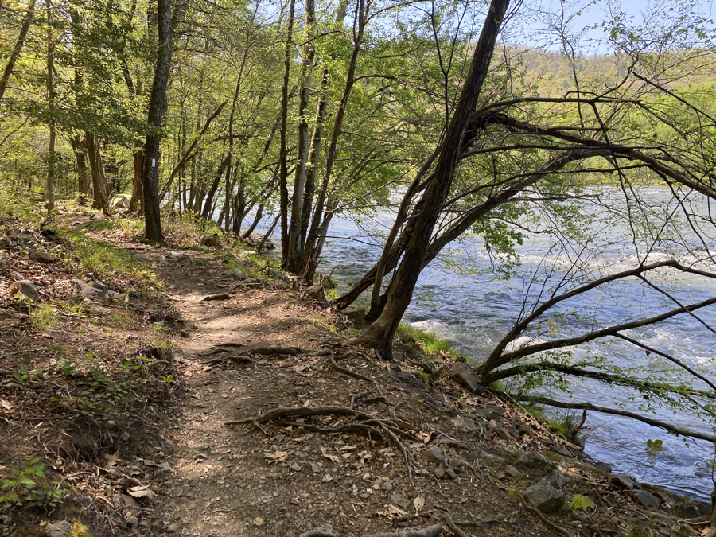
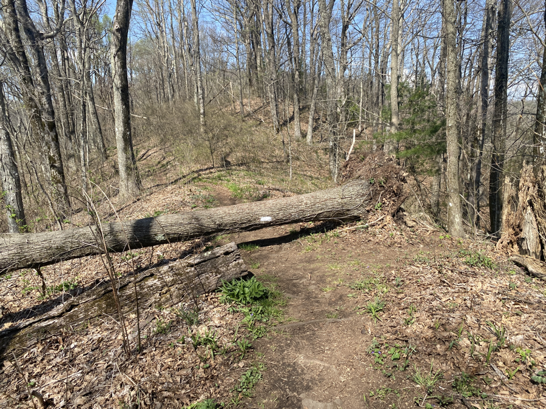
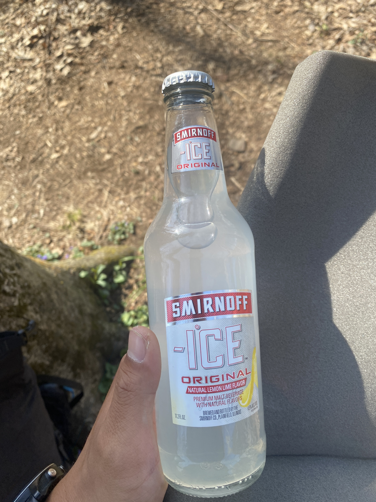
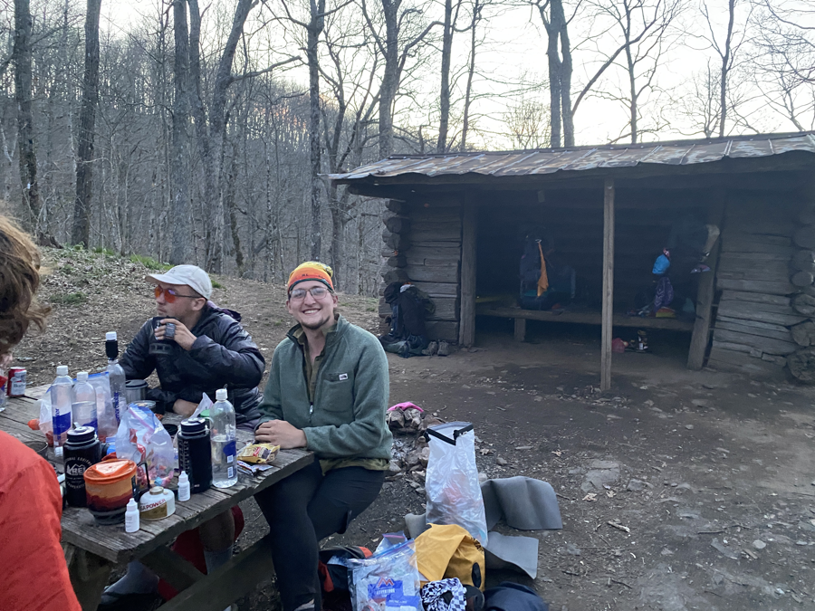
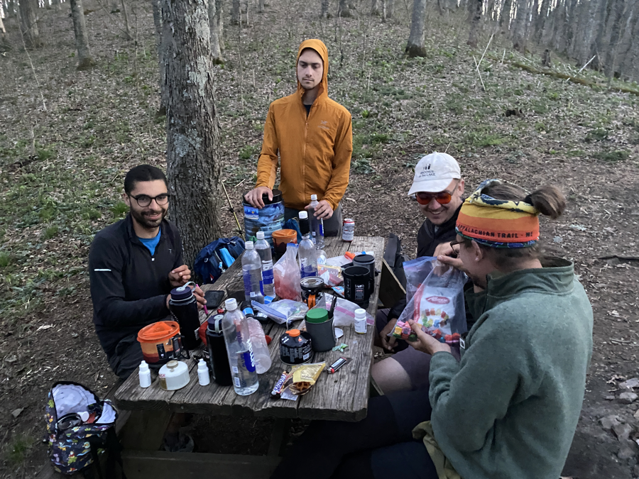

| Miles hiked | Elevation gain (ft.) | AT mile |
| ----------- | -------------- | -------- |
| 11.03 | 3,939 | 285.9 |

## Memorable moments from today 
- We didn't end up eating two of the Mountain House meal cans. I wrote "Carry me to Katahdin" on them and put them in a hiker box at Bluff Mountain Outfitters. Probability that they get carried to Katahdin: low. Probability that someone probably ate them: high.
- I sent back home my busted trekking poles, umbrella, and Kindle. This is the start of me paring down my gear and subsequently the weight I carry on my back. As they say: "Ounces equal pounds, and pounds equal pain".
- We had a leisurely morning in Hot Springs. We joked that we were going to do "12 miles after 12". This is an inverse of "12 miles before 12", which some hikers try to do.
- Leaving Hot Springs after 12 was a bit of a mistake. It was _toasty_ today and there was a big climb out. In addition, I was carrying five days of food that I needed to get to Erwin, the next trail town.
- When I got to the shelter for the night, I opened my pack and realized that I got [iced](https://en.wikipedia.org/wiki/Icing_(game)?wprov=sfti1). I carried that damn bottle for the entire day! No wonder my pack felt especially heavy. Turns out it was Kris that slipped it into my pack in Hot Springs. He tried to get me to open my pack there, but I didn't realize what was going on.
- I met [Aquaman](https://instagram.com/scottbenerofe?igshid=YmMyMTA2M2Y=), the first SOBO thru-hiker of the year. He started at Katahdin on December 5th of last year, and made his way down the AT during the winter. Absolute madman.

<figcaption>River getting out of Hot Springs</figcaption>

<figcaption>Fallen tree with white blaze on it</figcaption>

<figcaption>Smirnoff Ice that I inadvertently carried for 11 miles</figcaption>

<figcaption>Spring Mountain Shelter</figcaption>

<figcaption>Dinner spread</figcaption>
