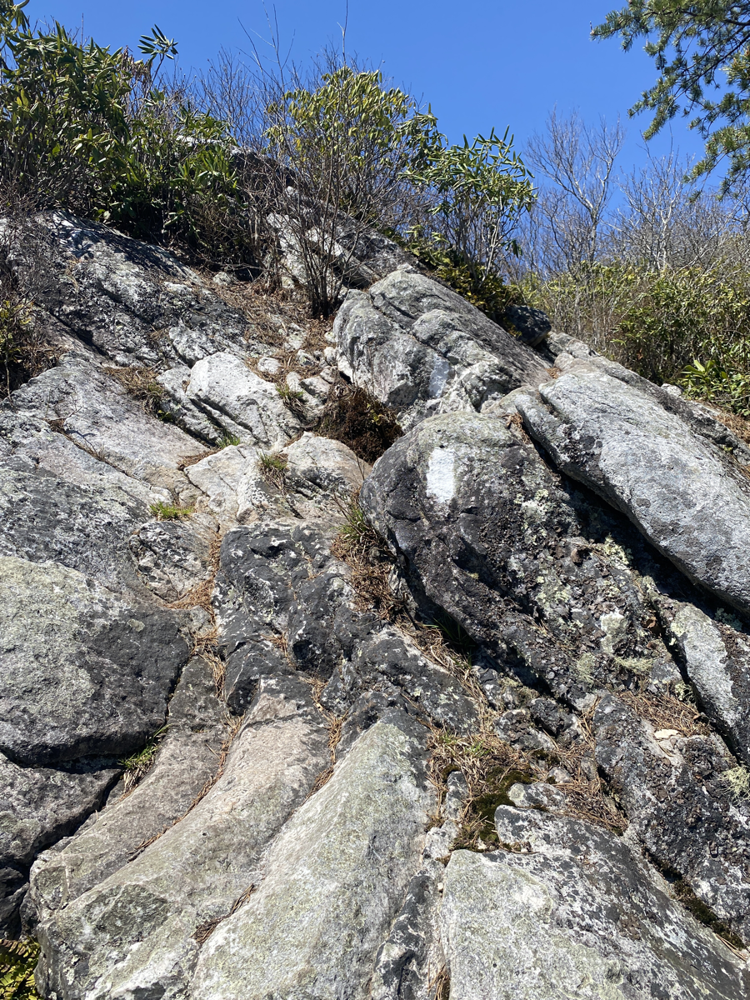
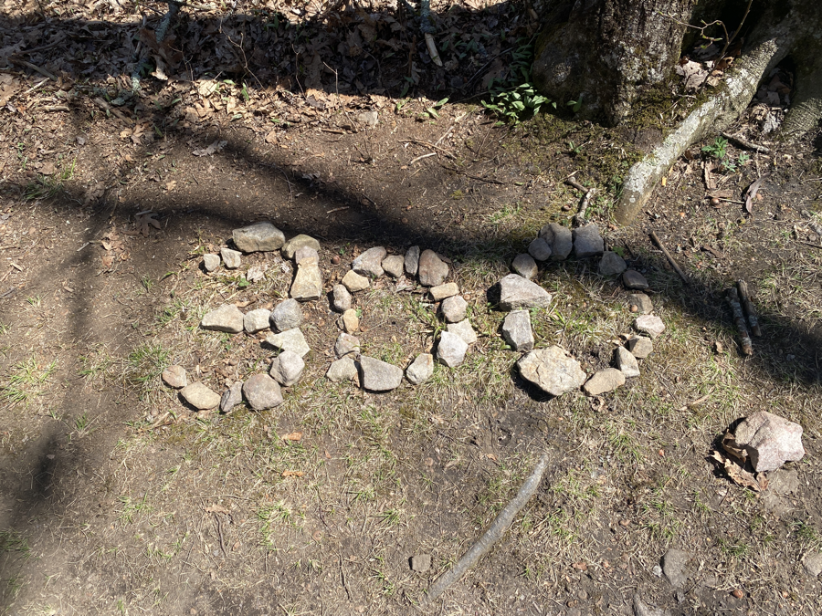
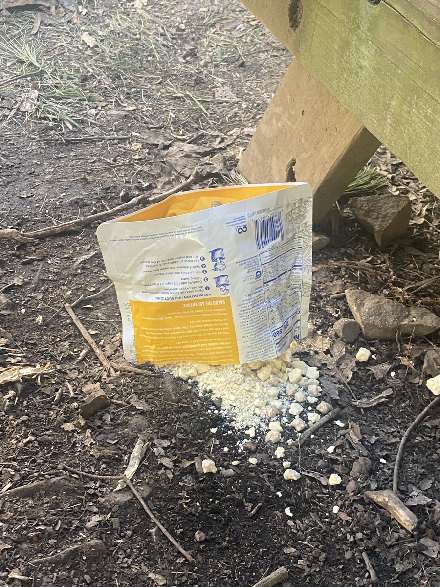
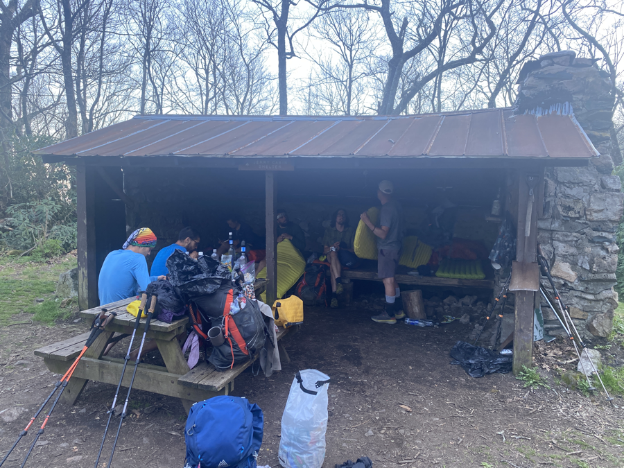

| Miles hiked | Elevation gain (ft.) | AT mile |
| ----------- | -------------- | -------- |
| 15.21 | 4,113 | 301.8 |

## Memorable moments from today 
- There was trail magic a few miles into the day. A trail angel left cookies and brownies in a parking lot. Most importantly, there was a trash can so I could get rid of the Smirnoff bottle from yesterday. That thing was heavy.
- There was a fork in the trail for a bad weather bypass. The AT runs along a ridge line for about a mile. During bad weather it can be dangerous to walk along it. Thankfully the weather was good today, so I was able to take it. I was immediately met with rocks. Lots and lots of rocks. I had to put my trekking poles away and scramble some of them with my hands.
- Right after the bypass merges back into the AT, I hit the 300 mile marker. Which was marked with a bunch of stones set up as the number.
- Lumberjack spilled his freeze dried biscuits and gravy on the ground. In true hiker trash fashion, he scooped up the part that didn't hit the ground and cooked it.
- Smokey, Kris, Banquet, and I chose to sleep in the shelter. We were able to sprawl our stuff out. When I went out to pee in the middle of the night, I saw a great view of the stars in the night sky.

<figcaption>Rocks rocks rocks</figcaption>

<figcaption>300 miles!</figcaption>

<figcaption>Sad scene of lost food</figcaption>

<figcaption>Jerry's Cabin Shelter. I figured there was a guy named Jerry that had a cabin here?</figcaption>
