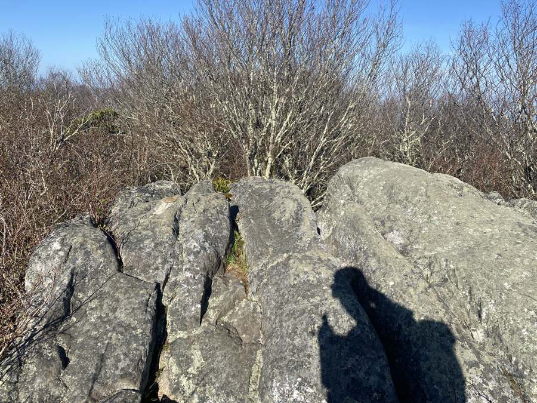
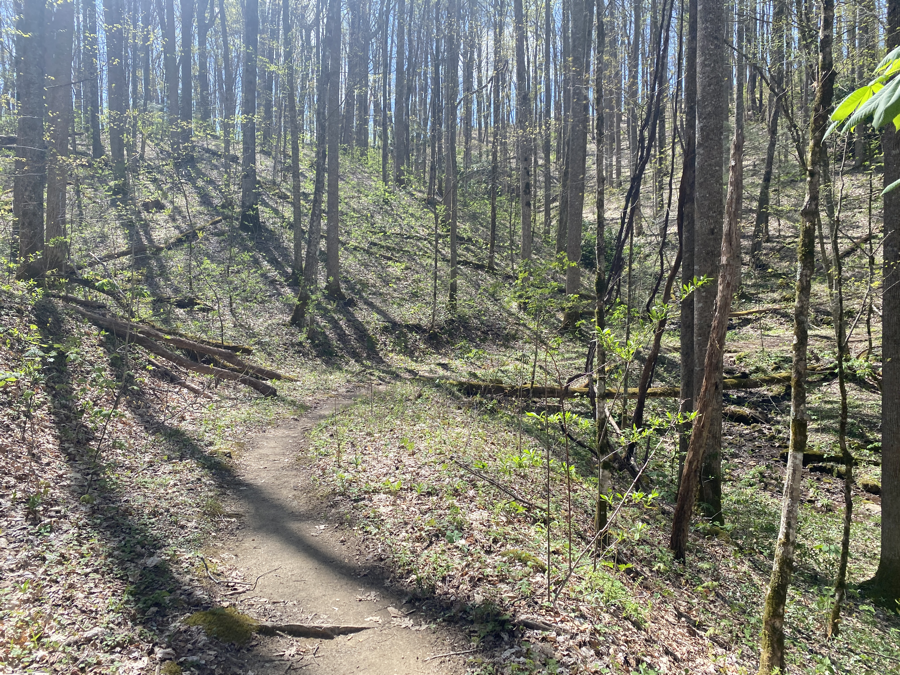
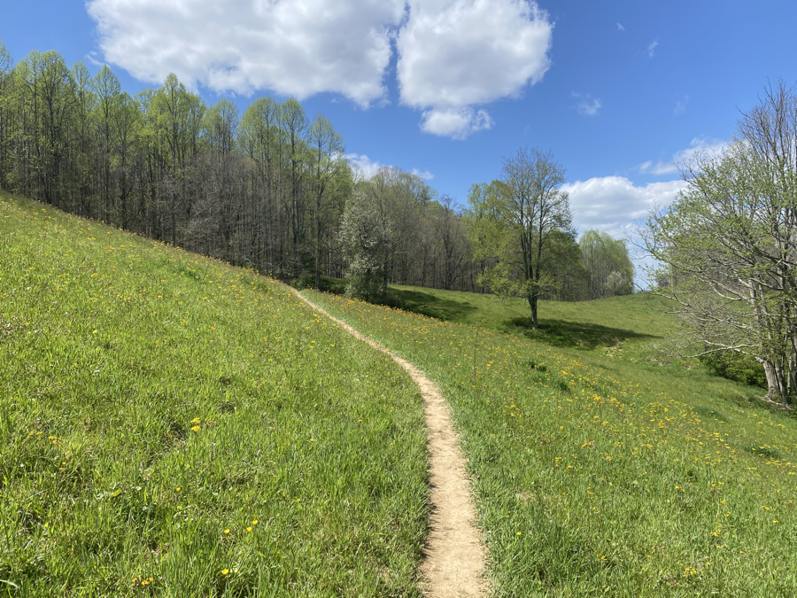
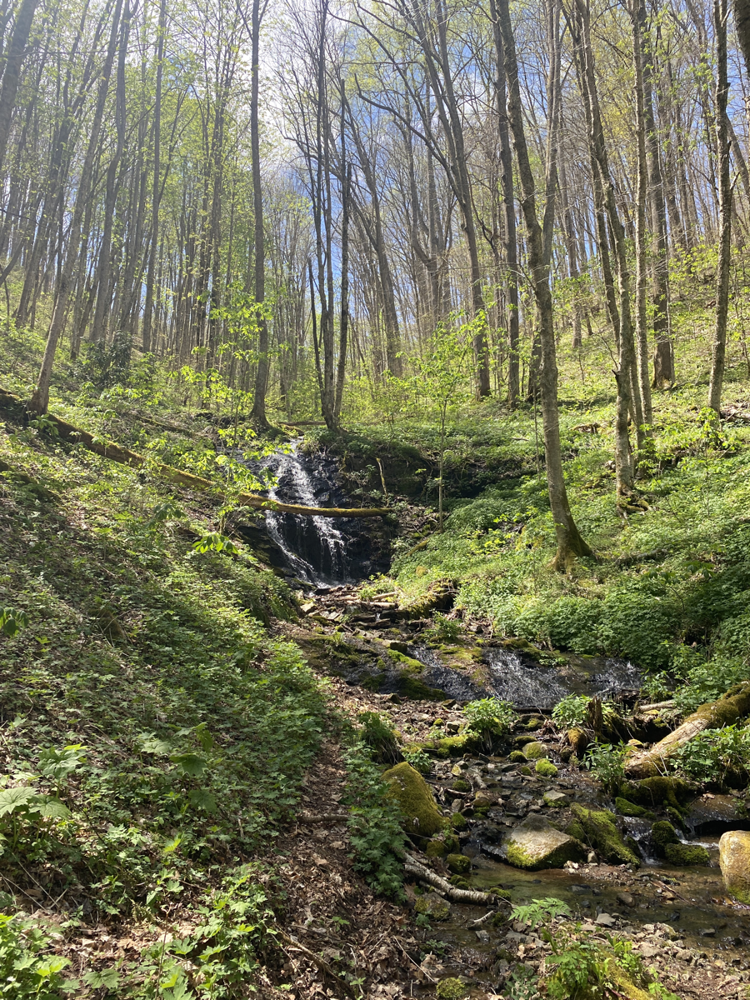
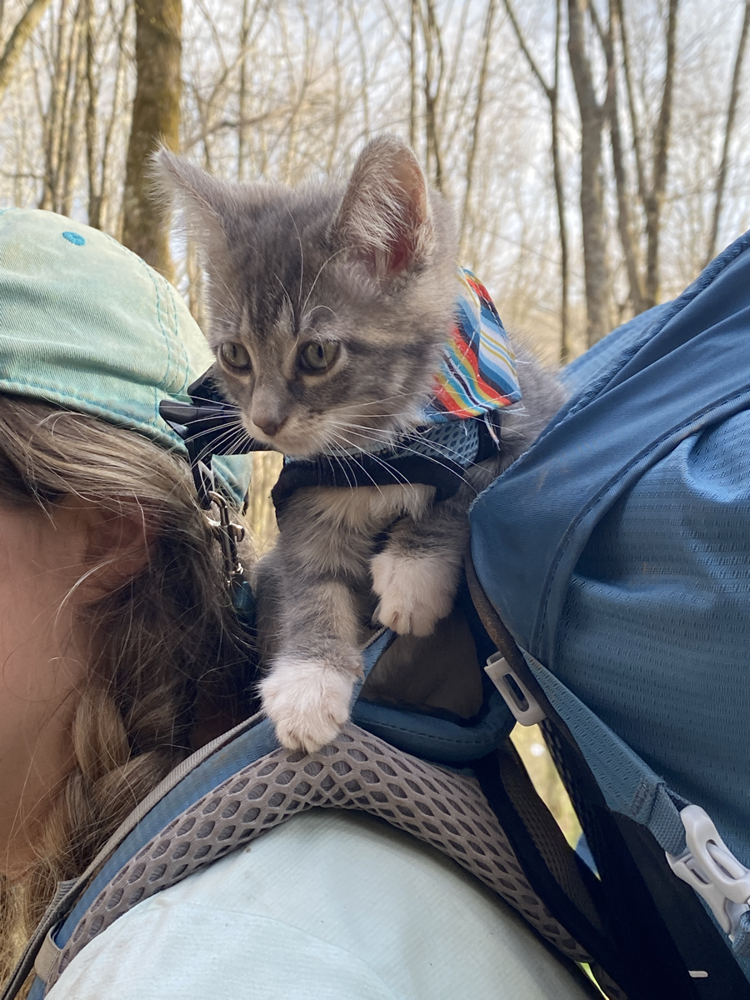

| Miles hiked | Elevation gain (ft.) | AT mile |
| ----------- | -------------- | -------- |
| 16.14 | 3,734 | 317.3 |

## Memorable moments from today
- Started the day off by climbing up Big Butt Mountain. Yes, that's the actual name. A bit underwhelming at the peak.
- The terrain was beautiful and easy today. A nice downhill for the first 8 or so miles down a flat, clear trail.
- I met a trail maintainer who goes by the name Lord Willing. Super nice guy. He left some trail magic of soda and snack cakes down the trail. I got a Mountain Dew and a chocolate cookie to eat with my lunch.
- Beautiful climb after lunch that started with a meadow, and then ran along a stream.
- I met a couple who was hiking with a kitten. Her name is Goose and she was super tiny (and adorable)!

<figcaption>Peak of Big Butt Mountain</figcaption>

<figcaption>Nice, easy downhills</figcaption>

<figcaption>Post lunch meadow</figcaption>

<figcaption>Stream that AT runs along</figcaption>

<figcaption>Goose the kitten</figcaption>
