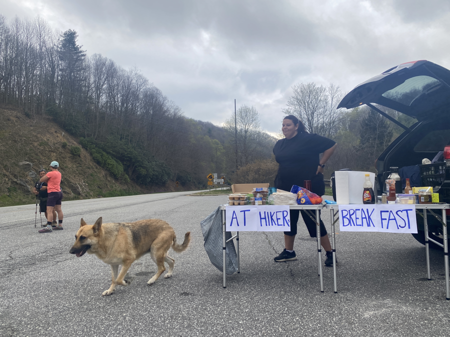
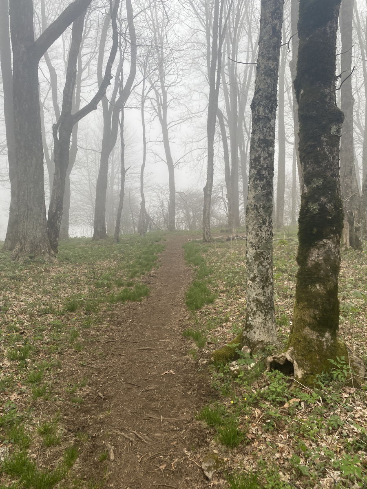
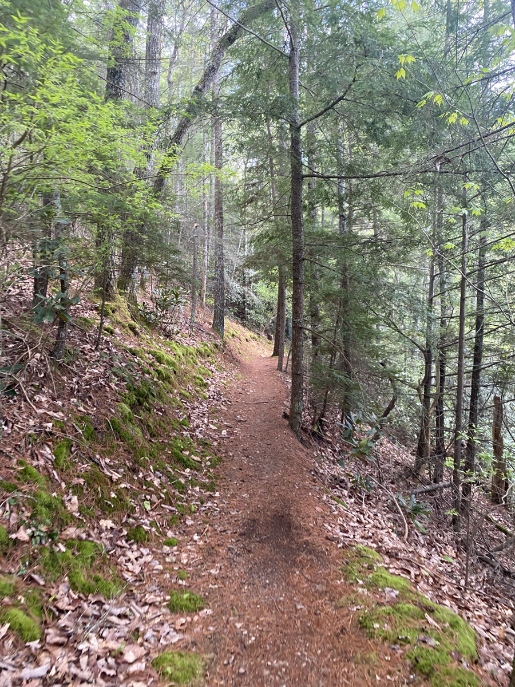
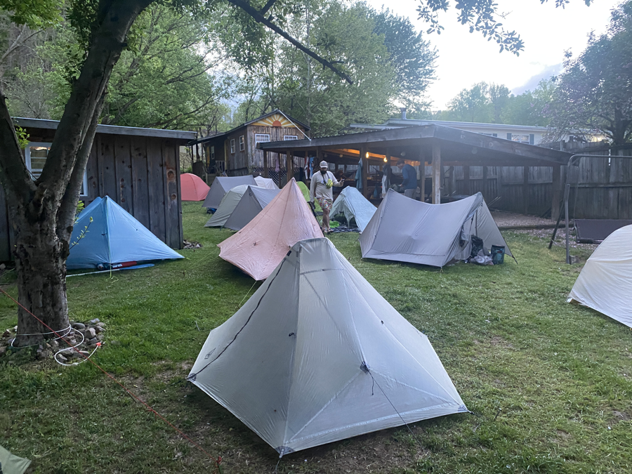

| Miles hiked | Elevation gain (ft.) | AT mile |
| ----------- | -------------- | -------- |
| 26.56 | 5,505 | 344.3 |

## Memorable moments from today
- I made a joke while leaving the shelter this morning about hiking all 27 miles to Erwin.
- A few miles in, I came across a trail magic that had a full breakfast. I had pancakes, bacon, eggs, and coffee.
- There was rain coming in, but the caffeine from the coffee was hitting me. I normally don't consume caffeine all that often, so when I do it's really effective. I was feeling on top of the world. Thoughts of hiking all the way into Erwin came into my mind. There would be a nice shower at the end if I made it.
- I caught up to Lumberjack, and we hiked together. It started raining and we crossed over Big Bald in the wind and rain. It was raining sideways, so we basically ran across it.
- We reached Bald Mountain Shelter and had a lunch break there. We talked about hiking 27 miles to Erwin. We were about 10 miles into the day and felt good so far, so we decided to try and go for it.
- Lumberjack texted the group that we were going to Erwin, so we basically committed ourselves to it.
- Motivated by the idea of getting to Erwin, we made it to No Business Shelter and had a dinner break there. We then hiked the last six miles into Erwin. It was a nice downhill with a bunch of switchbacks with pine needles to soften the trail.
- We made our way to Uncle Johnny's Hostel. It was pretty packed when we got there, but we were able to squeeze our tents in the tent city. 
- Uncle Johnny's had some bikes for us to use. We biked a mile out to a nearby gas station. I bought two pints of chocolate milk and drank it in the parking lot as a victory drink.

<figcaption>Trail magic breakfast</figcaption>

<figcaption>Fog and rain</figcaption>

<figcaption>Nice descent into Erwin</figcaption>

<figcaption>Tent city at Uncle Johnny's</figcaption>
