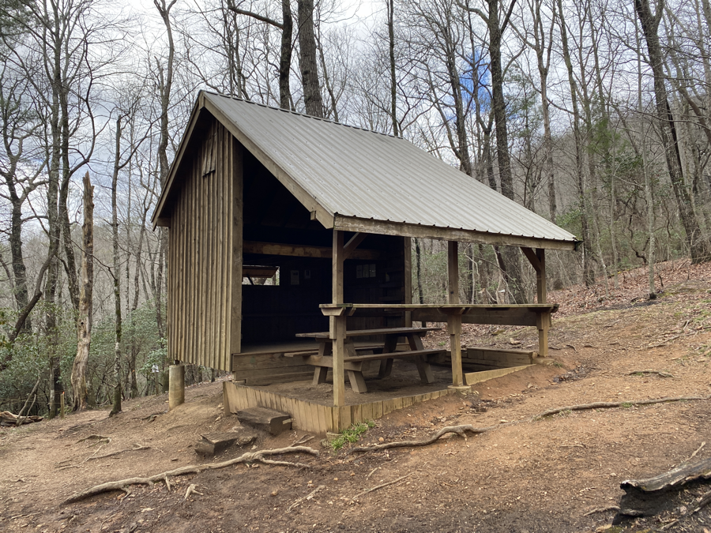
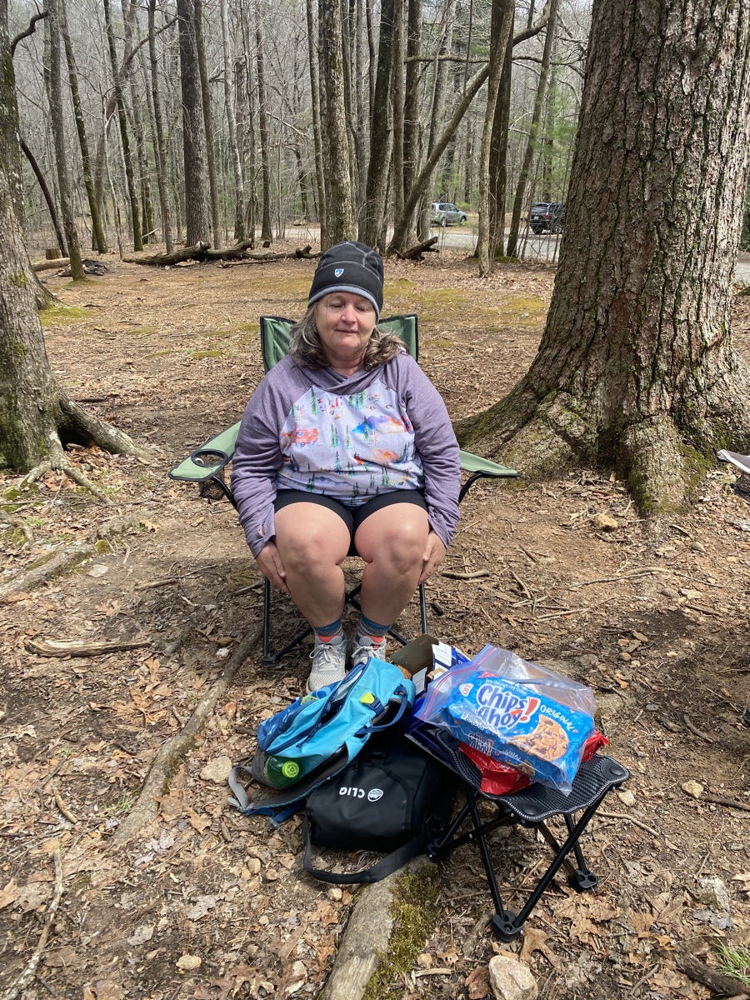
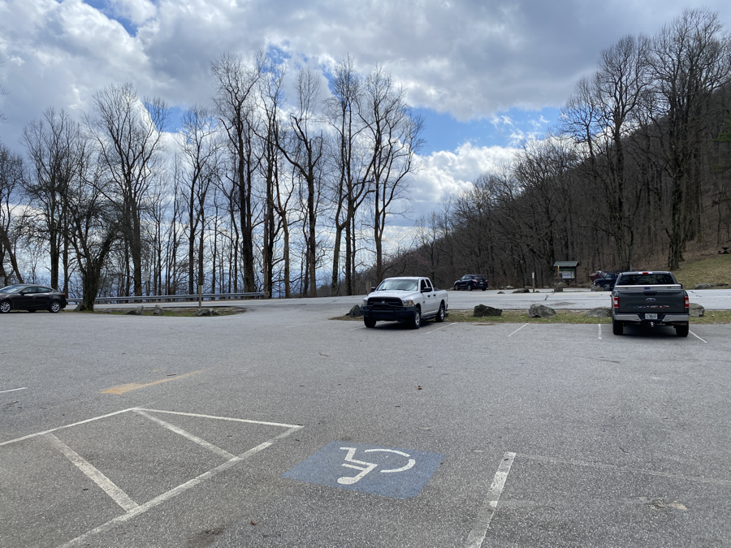
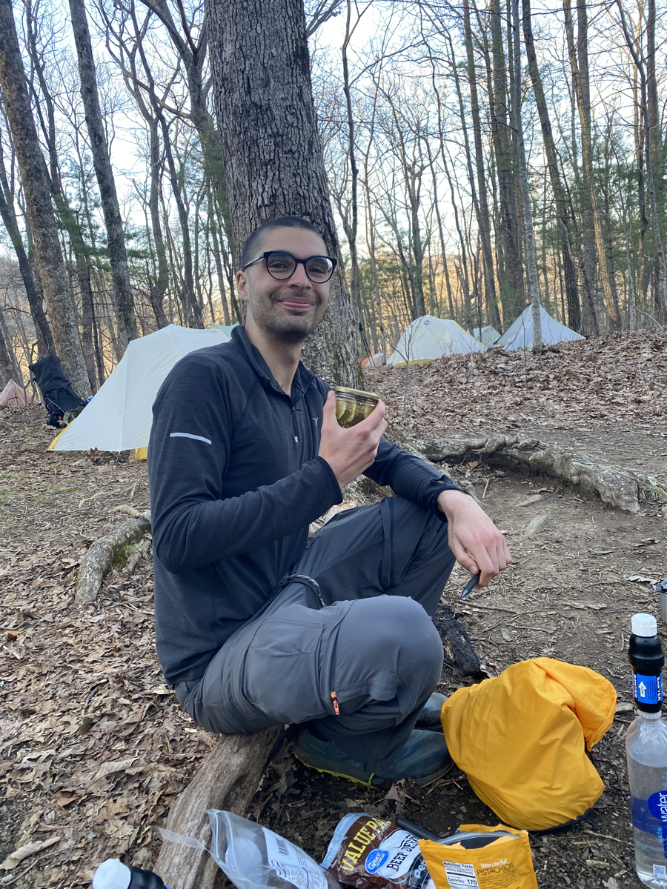

| Miles hiked | Elevation gain (ft.) | AT mile |
| ----------- | -------------- | -------- |
|  15.33 | 3,572 | 23.4 |

Choosing to sleep in the shelter was an amazing idea. I woke up around 4am to the sound of heavy rain hitting the roof. It felt great knowing that I didn't have to deal with a wet tent and gear in the morning. I know I'll have to deal with that stuff eventually and often, but if the option to stay dry comes to me, I'll take it.

When I woke up again at 7:30, the rain had gone down to a slight drizzle. I was able to walk over and get my food bag and eat my breakfast in the shelter. 

As I was packing up for the day, another guy in the shelter pulled out a jar of pickles. I was dumbfounded. Here I was trying to maximize the calories per ounce of the food I carry, and this guy brought pickles in a glass jar, which had to be at most 20 calories. Everyone else and I thought it was pretty funny, and we decided that was his trail name: Pickles.

For those that don't know, a trail name is what other hikers call each other instead of their real names. Someone else typically gives you your trail name, often after funny situations like the one this morning.

I got going from the shelter around 9am. My plan was to first get to Gooch Mountain shelter, around 7 miles away. When I got there I would see how my body felt, and if I felt good enough I would keep going another 9 miles to Lance Creek campground.

The weather was amazing. It was a little foggy and rainy when I first started, but it quickly cleared out into a nice sunny day. I felt a bit spoiled, knowing how often it rains on the AT. I made good progress and got to Gooch Mountain shelter around noon.

I met a guy there, Dave, that didn't have a cable to charge his phone. I let him use my battery pack to charge his phone for a bit, as I had more than enough. In return he gave me a Snickers bar, a big Slim Jim, a Clif bar, and some Propel packets. A great trade in my opinion.

As I was eating lunch, some friends from the shelter yesterday came in. We all felt pretty good physically and agreed to continue on and meet at Lance Creek.

I was the first to head out since I got there first, and continued on to Gooch Gap. There was a lady sitting there with some Chips Ahoy and beers. My first trail magic experience! I had some Chips Ahoy and wasn't really feeling the beer, so I decided to leave it to my friends who would be coming through soon.

<figcaption>I only took one photo and the trail magic lady had her eyes closed. Sorry about that!!</figcaption>

There was a small section of the trail where I got decent enough service to finally send out the blog posts for day 1 and 2. I should really look into further compressing the photos I upload. Each one is around 2MB and trying to send 30MB of data through a Git push on my phone with spotty coverage is a bad idea.

As I continued on, I realized I wasn't passing nearly as many hikers as yesterday. What I think is the case is that each shelter has a "bubble" of hikers, since most hikers are going from one shelter to the next one in a day, about 8 or so miles. Because I skipped one and kept going, I was now in front of the hikers that stayed at Hawk Mountain shelter yesterday, and was approaching the tail end of the Gooch Mountain shelter hikers.

I crossed Woody Gap, a road crossing known for its trail magic. Unfortunately I think I got there too late in the day and there was nothing set up. Bummer.

I had about 3 miles to go after Woody, and I started passing some hikers at the tail end of the Gooch shelter bubble. They told me that Gooch was _packed_ last night, at least 60 hikers. Knowing that Lance Creek was probably a hotbed for giardia and norovirus, I started looking for other campsites that I could stop at beforehand.

About a mile before Lance, I saw a campsite with about 12 tents set up. I was pretty tired at this point so I called it a day and walked over. I was able to get a spot for my tent.

As I was eating dinner, Pickles and his hiking buddy came on into the campsite. I advised them to camp here to avoid the tent city at Lance Creek. Jack and Wesley, another two friends I met yesterday, came in a short while later. I was finally able to get a picture of Pickles with his infamous jar:

He opened the jar and offered them around. I had a couple. They were damn good! Some friend made it for him before he left for the trail and he so kindly brought them.

After that the five of us went through the process of hanging our food bags so that the bears wouldn't be able to get to them. We've been spoiled the past two nights at shelters since they have bear boxes you can just throw your food bags into. It took us a while, but we eventually got our bags up, with a slightly questionable quality of hang.

After that the sun set and everyone else in the campsite was already in their tents, so we called it a night and headed off to our tents. They call 9pm "hiker midnight" cause that's when everyone's asleep.

Tomorrow I'll go over Blood Mountain and make it to Neels Gap, where I'll be able to take a shower, do laundry, resupply, and eat real food. I'll be dreaming about that pizza tonight...