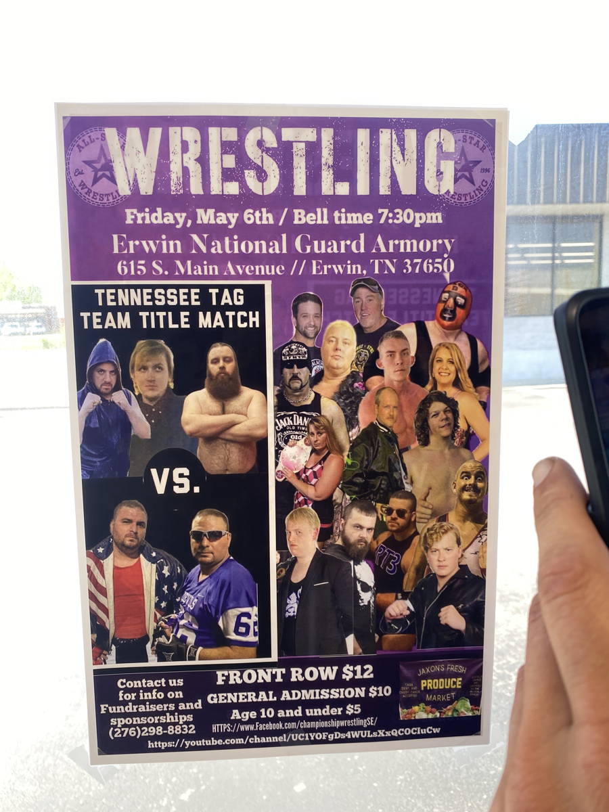
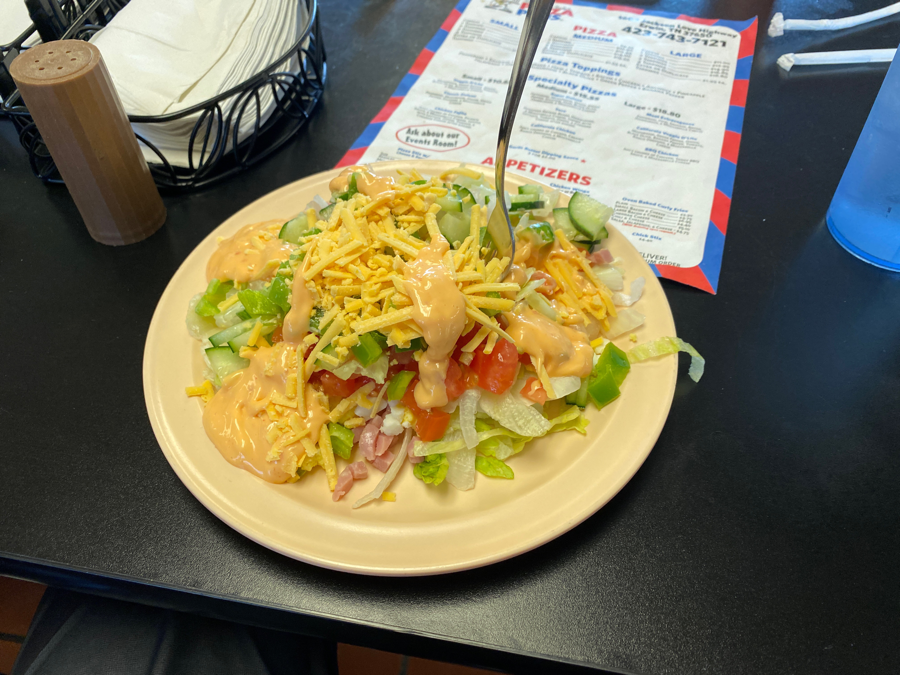
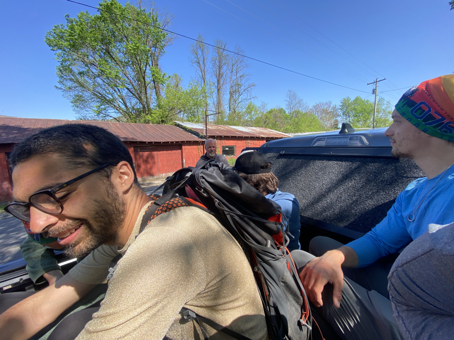
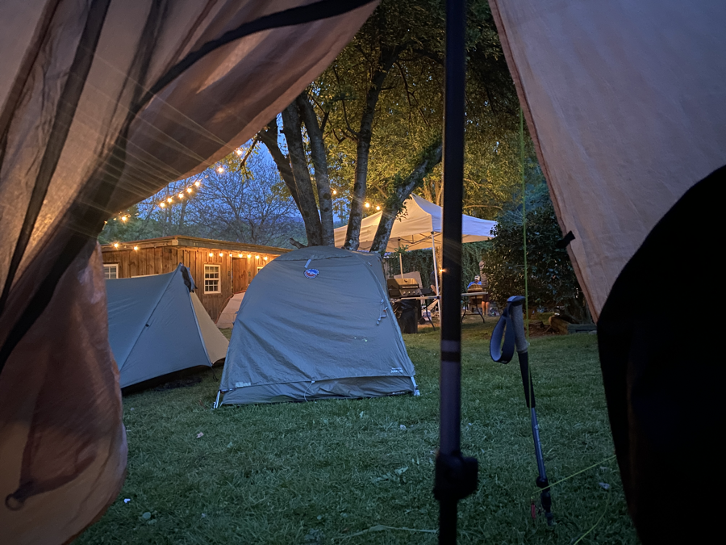

| Miles hiked | Elevation gain (ft.) | AT mile |
| ----------- | -------------- | -------- |
| 0 | 0 | 344.3 |

## Memorable moments from today
- Everyone else in the group did 20 miles yesterday. They did the 7 miles in the morning and rolled in right before lunch time.
- Crocka, Lumberjack, Banquet, and Pickles and I started walking to Pizza Plus, which had an all-you-can-eat lunch. A guy in a pickup stopped on the road and offered us a ride there! We all hopped in the bed of the truck and rode over.
- We got to Pizza Plus right as it opened. I got a huge salad to start with as the pizzas started coming out of the oven. I didn't count how many slices I had, but it was a lot. Better quality than Cici's Pizza.
- We started walking towards downtown Erwin and got another hitch! The driver dropped us off by a McDonalds, Taco Bell, Bojangles, and Food City. We made our rounds through the fast food restaurants and resupplied at the Food City.
- I bought a bunch of McDoubles to pack out of Erwin. Yet another person offered us a ride back to the hostel! We hopped into his car and he brought us back.
- We chilled at the hostel for the rest of the day. I got my laundry done and took it easy for the rest of the day.

<figcaption>Best designed wrestling poster I've seen</figcaption>

<figcaption>Requisite salad so I don't get scurvy</figcaption>

<figcaption>First hitch of the day</figcaption>

<figcaption>Tent city at night</figcaption>

