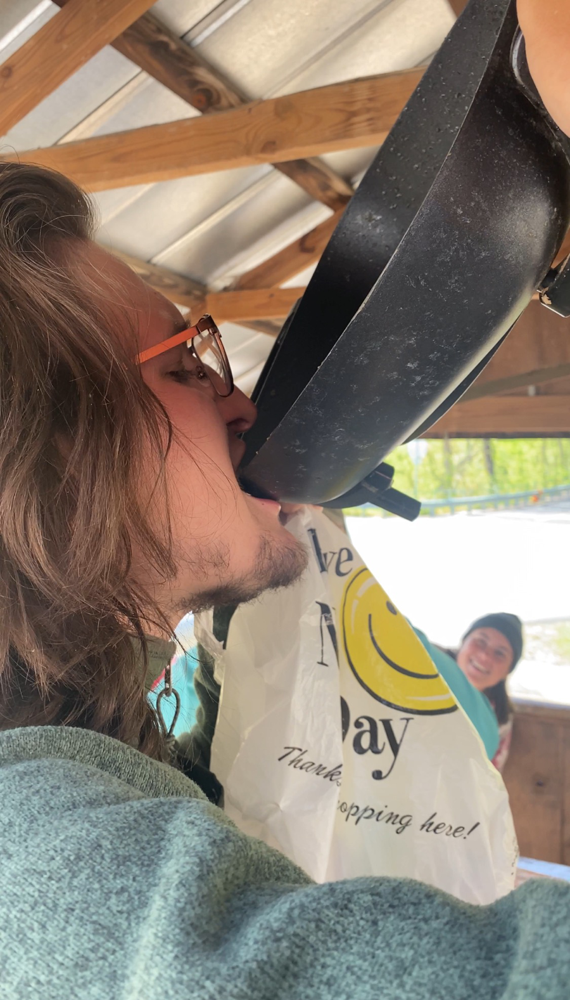
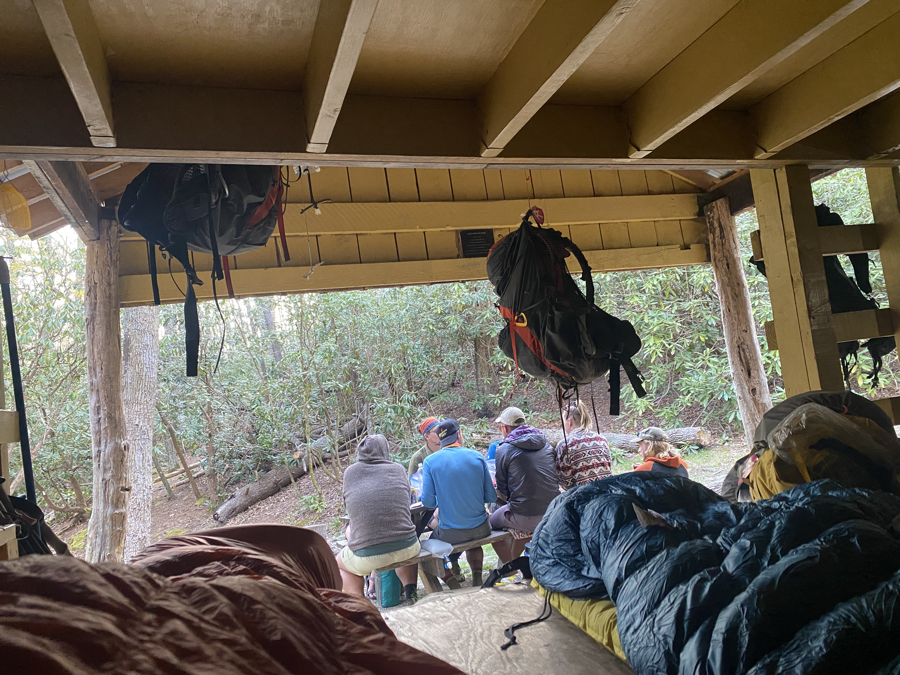

| Miles hiked | Elevation gain (ft.) | AT mile |
| ----------- | -------------- | -------- |
| 4.00 | 1,499 | 438.5 |

## Memorable moments from today
- I woke up around 8 and thought I was late. I got my stuff packed up and headed to the front of the hostel. Turns out that everyone else was cooking brunch and wanted to stay for the morning.
- We had eggs and bacon, as well as whatever leftover food we had from yesterday. We passed around day old McDoubles and ate them. Banquet drank the bacon grease from the pan (for the calories of course).
- I'm not sure on who brought up the idea, but we ended up somehow deciding that we were only doing four miles to the nearest shelter. The phrase "four after four" kept coming up, first as a joke, but it eventually became our plan for the day.
- At 4pm on the dot, we left Uncle Johnny's. Less than a mile in, I crossed a railroad track. About 20 seconds later a train came by and blocked everyone else off. The train looked long and I wanted my time alone in the woods, so I continued along.
- I made it to Curley Maple Gap Shelter in a bit over an hour. I didn't sleep well last night, so I decided to call it early and head off to sleep.

<figcaption>Banquet drinking bacon grease</figcaption>

<figcaption>Shelter for the night</figcaption>