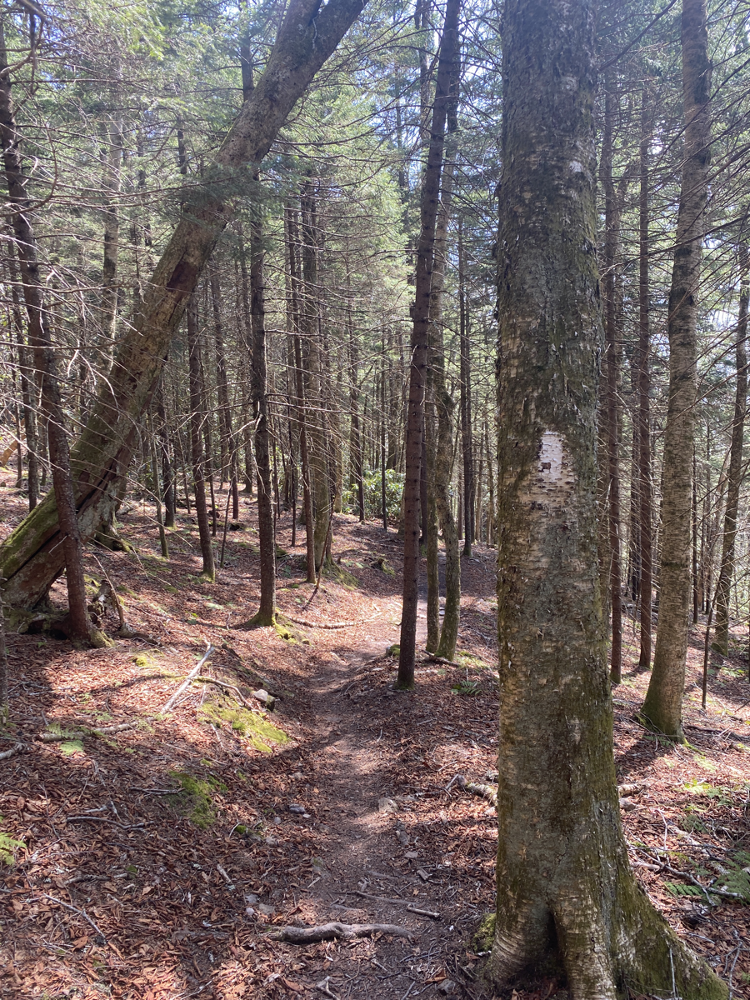
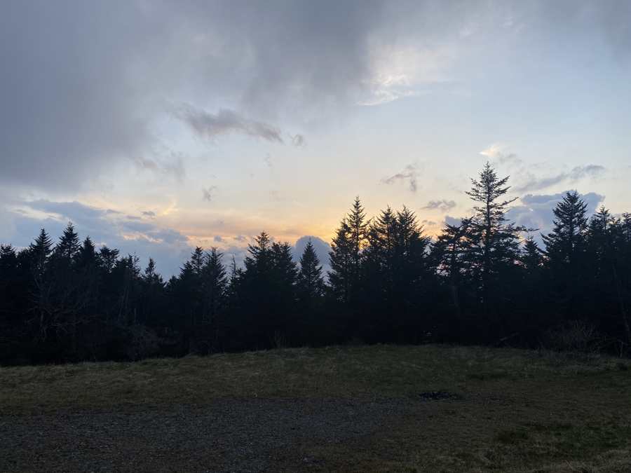
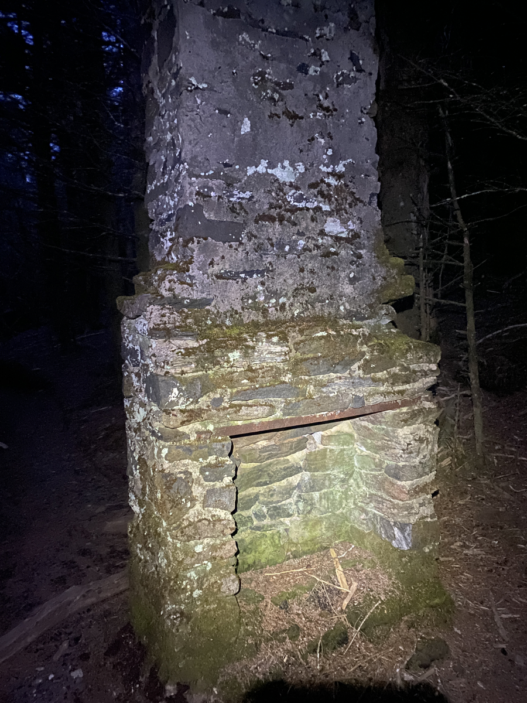
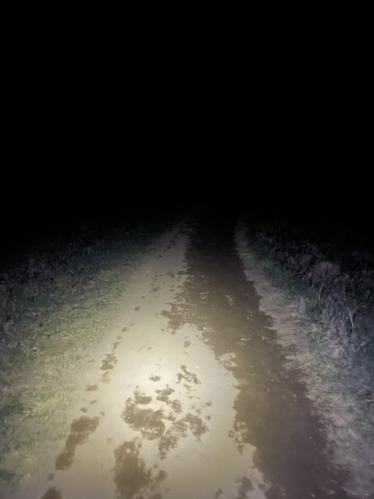

| Miles hiked | Elevation gain (ft.) | AT mile |
| ----------- | -------------- | -------- |
| 30.08 | 8,917 | 382.4 |

## Memorable moments from today
- Will fill in later

<figcaption>Pine needles make a nice trail surface</figcaption>

<figcaption>Top of Roan Mountain</figcaption>

<figcaption>Ruins of old hotel at top of Roan Mountain</figcaption>

<figcaption>Night hiking through Roan Balds</figcaption>