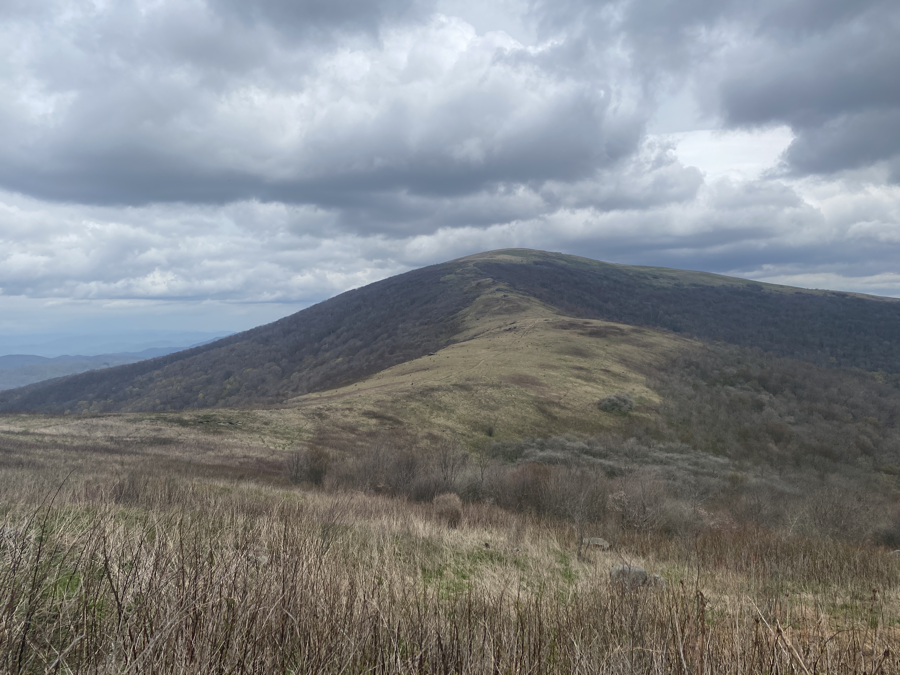

| Miles hiked | Elevation gain (ft.) | AT mile |
| ----------- | -------------- | -------- |
| 13.66 | 1,837 | 395.3 |

## Memorable moments from today
- Will fill in later

<figcaption>White flowers along trail</figcaption>

<figcaption>Hump Mountain</figcaption>
