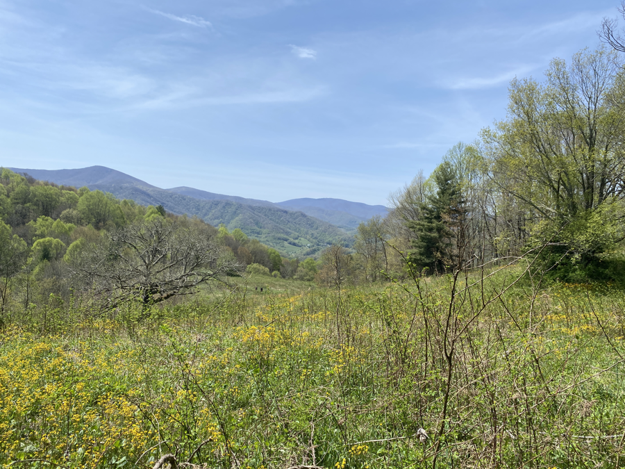
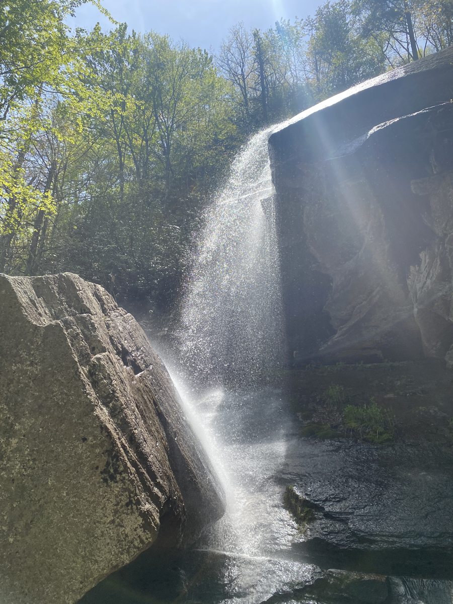
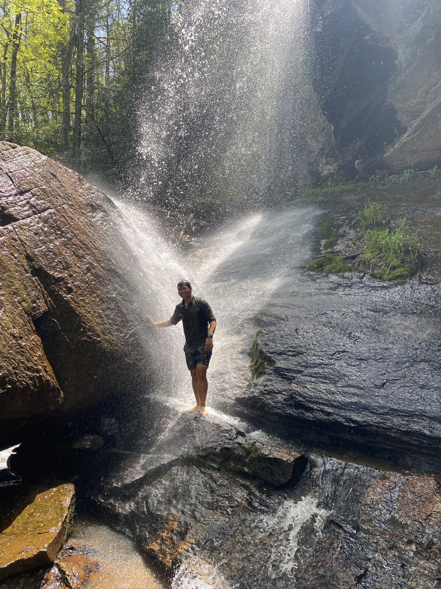

| Miles hiked | Elevation gain (ft.) | AT mile |
| ----------- | -------------- | -------- |
| 15.07 | 3,645 | 411.3 |

## Memorable moments from today
- Will fill in later

<figcaption>Nice meadow</figcaption>

<figcaption>Jones Falls</figcaption>

<figcaption>Me taking a nice, cold shower in the falls</figcaption>
