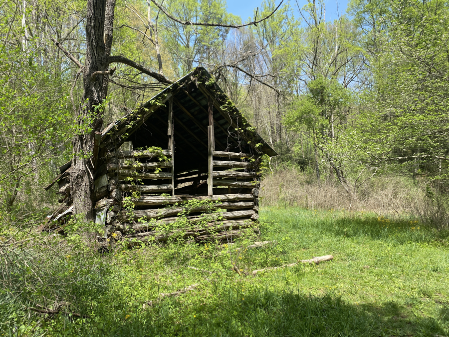
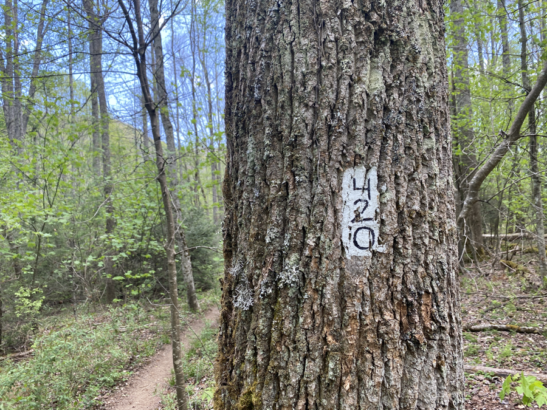
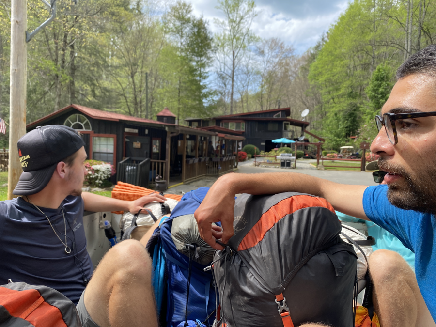
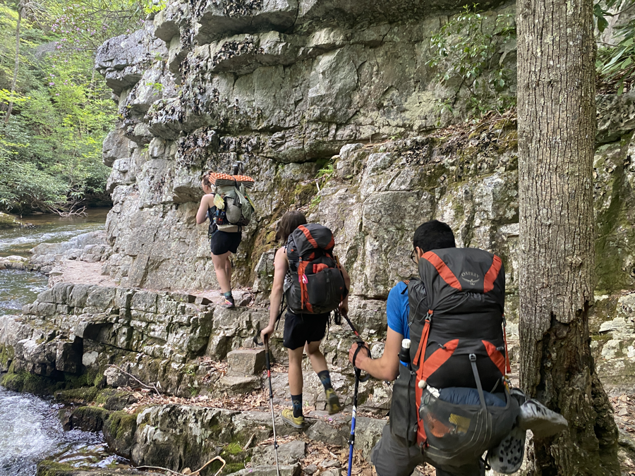
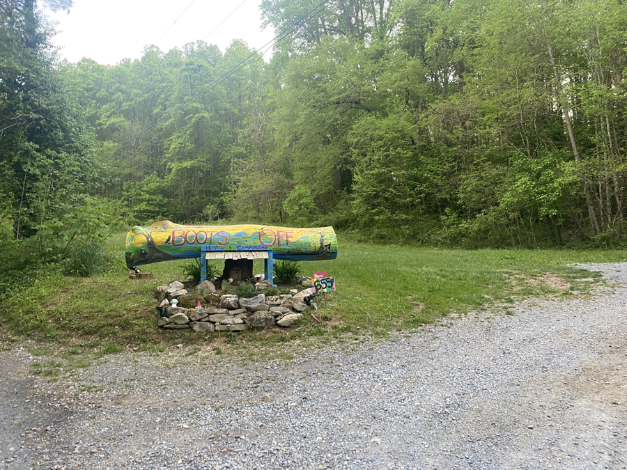

| Miles hiked | Elevation gain (ft.) | AT mile |
| ----------- | -------------- | -------- |
| 16.97 | 3,658 | 428.5 |

## Memorable moments from today
- Will fill in later

<figcaption>Abandoned shack</figcaption>

<figcaption>420 mile marker</figcaption>

<figcaption>Frozen pizza from Black Bear Resort</figcaption>

<figcaption>Riding out of Black Bear Resort</figcaption>

<figcaption>Rocky ledge along river</figcaption>

<figcaption>Entrance to Boots Off Hostel</figcaption>
