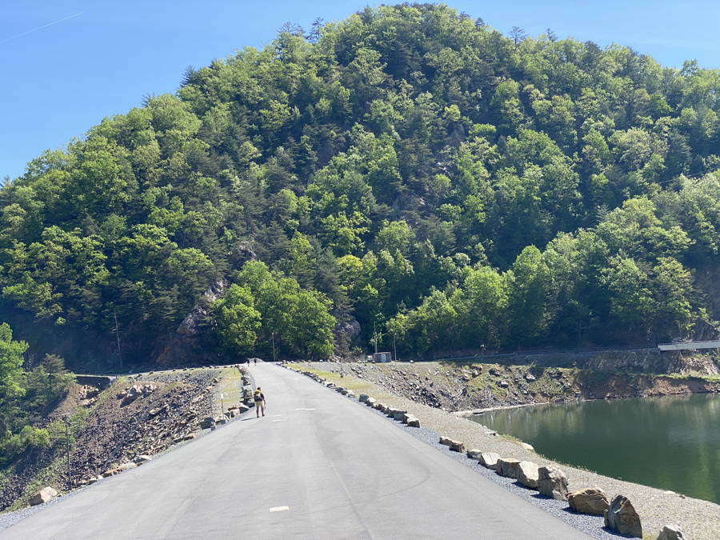
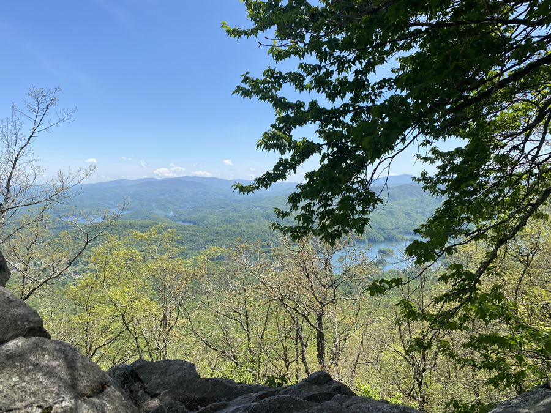
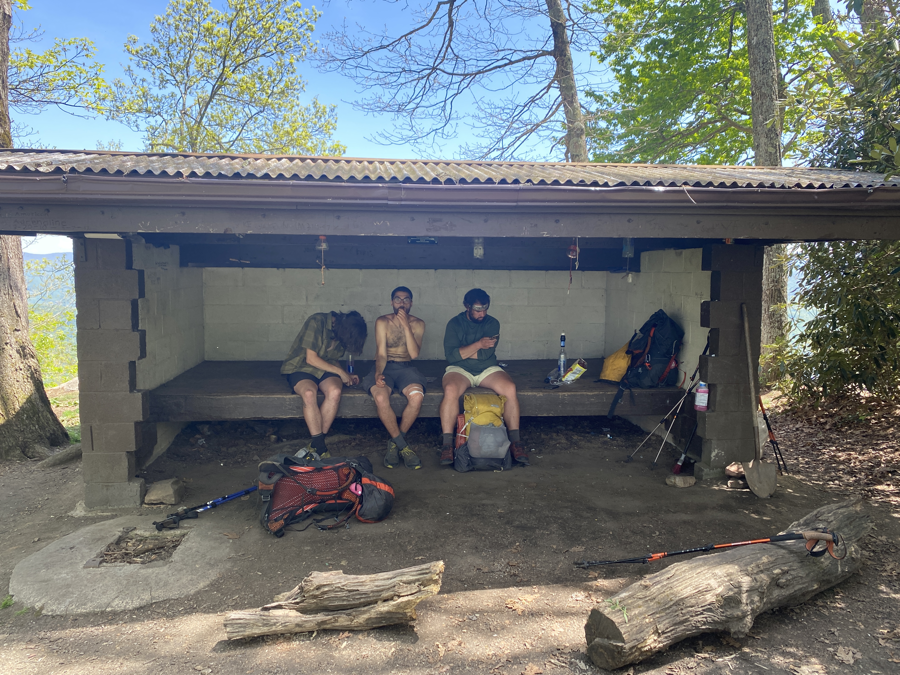
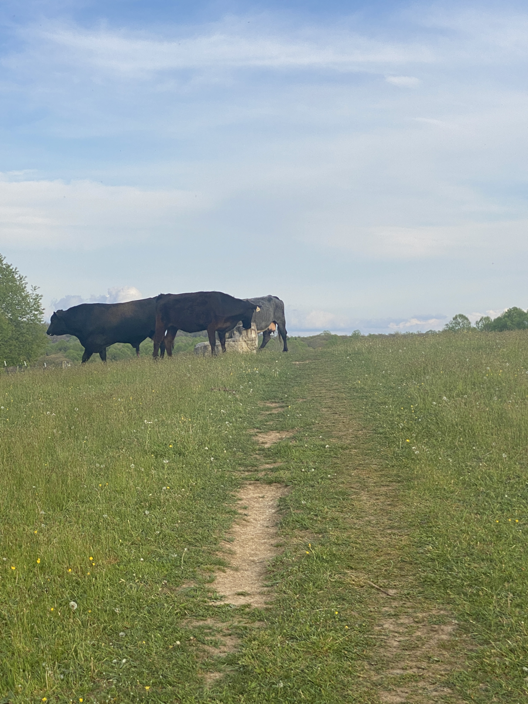

| Miles hiked | Elevation gain (ft.) | AT mile |
| ----------- | -------------- | -------- |
| 23.22 | 5,653 | 452.2 |

## Memorable moments from today
- Will fill in later

<figcaption>Walking across Wilbur Dam</figcaption>

<figcaption>View behind Vandeventer Shelter</figcaption>

<figcaption>Taking a lunch break at Vandeventer Shelter</figcaption>

<figcaption>Cows blocking the trail</figcaption>