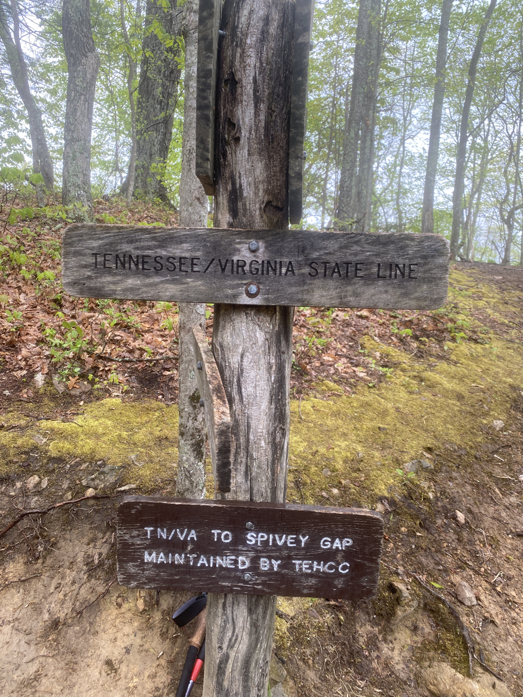
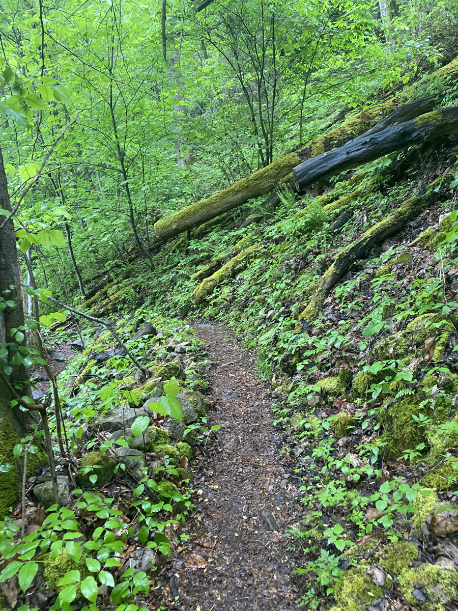
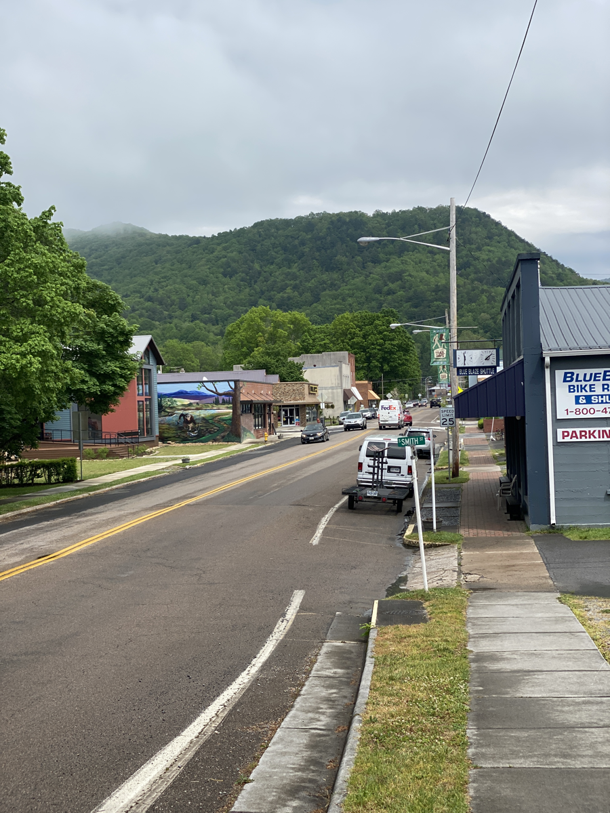

| Miles hiked | Elevation gain (ft.) | AT mile |
| ----------- | -------------- | -------- |
| 17.93 | 2,274 | 470.7 |

## Memorable moments from today
- Will fill in later

<figcaption>Tennessee/Virginia border</figcaption>

<figcaption>Trail descending into Damascus</figcaption>

<figcaption>Main street of Damascus. The AT runs along it</figcaption>

<figcaption>Eating lunch at the diner</figcaption>