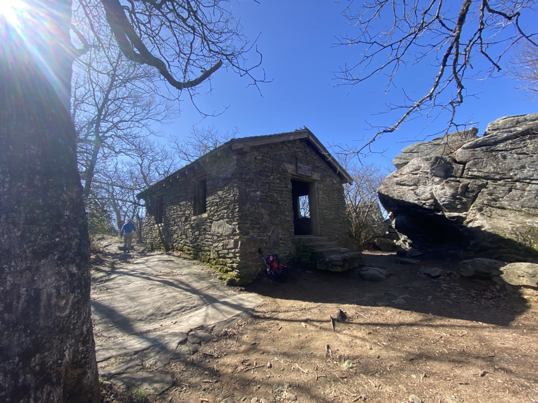
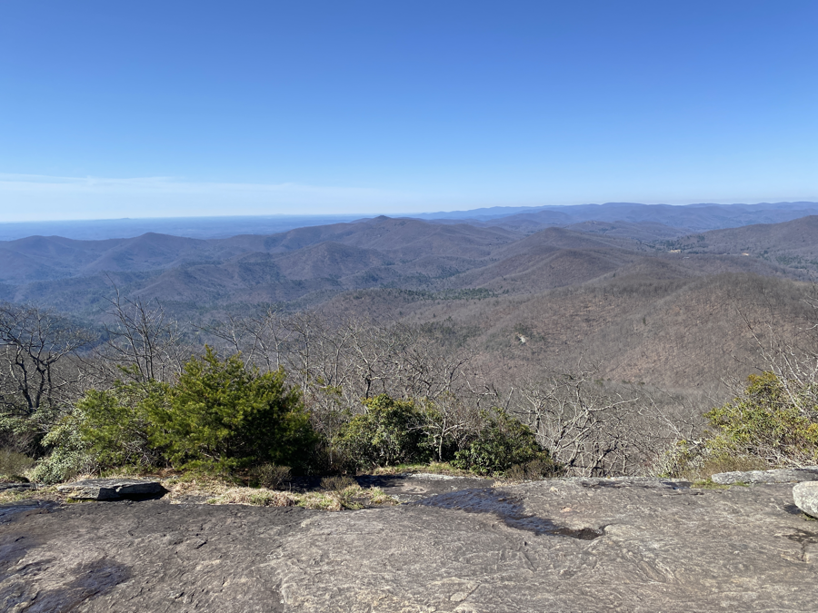
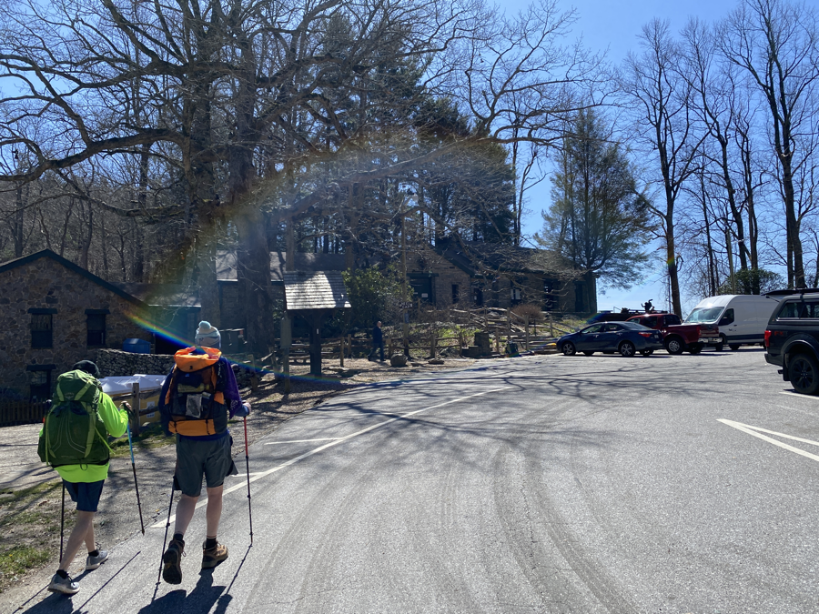
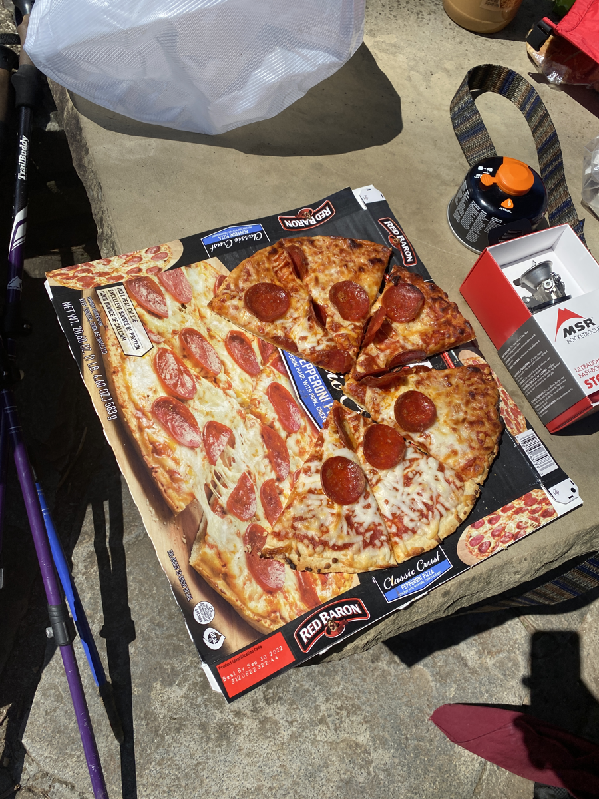
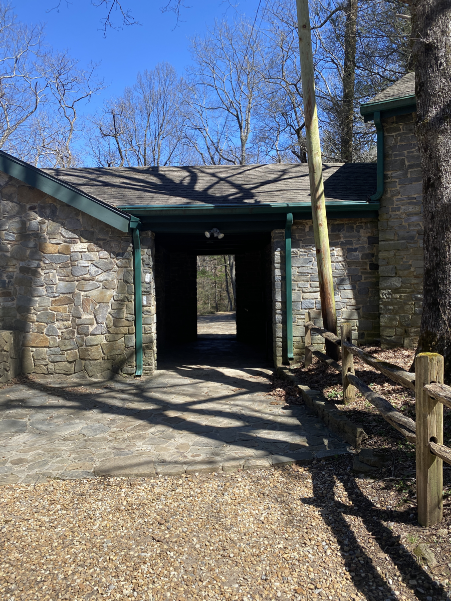
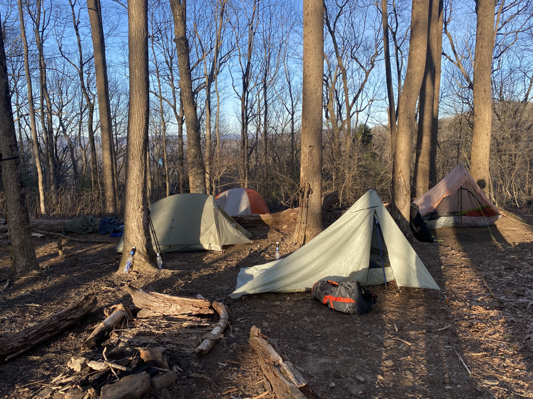

| Miles hiked | Elevation gain (ft.) | AT mile |
| ----------- | -------------- | -------- |
| 9.63 | 2,815 | 33.5 |

My tent was pitched on a slight decline, so I spent the night with my sleeping pad slowly drifting to one side. I would have to wake up and readjust it before starting the process again. One more thing to look out for when pitching my tent!

I woke up around sunrise, 7:30am. It was pretty damn cold and windy, but thankfully no rain. Today I just had to cross Blood Mountain and get into Neels Gap, where I can get pizza, a shower, and laundry. There was the bubble of people from Lance Creek that were on their way with the same plan, and I really wanted to shower. That got me to tear down camp and head off on the trail with some vigor.

The climb up Blood Mountain was tough, about 2,000 feet of elevation gain. I focus on my breathing when I do uphill stretches. I typically inhale in my nose over three steps, then exhale through my mouth over four steps.

This helps to prevent my heart rate from shooting up. I have my watch on with a heart rate sensor, and I'm able to keep it around 130 bpm when I'm going uphill. If it shoots higher, I slow my cadence and really try to extend the exhales.

With this system, I'm able to go uphills at a consistent speed without feeling the need to stop and take a break, unless of course there's a view to admire. Coming into this hike with a decent aerobic base has helped me so much in this regard. I find myself passing a good amount of hikers throughout the day. I'm also starting to master the art of eating and drinking while hiking.

I get to the top of Blood Mountain and the shelter on top of it. Blood Mountain shelter is the oldest one on the AT. It's built of heavy brick and has open windows. I wonder how they got all those bricks there back in the day. I signed my name in the shelter journal and thinking about the pizza at Neels Gap, continued on.

The trail became a bit of a labyrinth after the shelter. It was hard to spot the white blazes that marked the AT, and the trail broke off into a bunch of different forks. I had to pull out my phone and constantly check it to make sure I was still on the right path.

I found myself a couple minutes later at an alcove with an absolutely amazing view of the mountains. It was a clear day and I could see for miles and miles. It was the first moment on this hike where I could stand in awe of the scale of the wilderness.

Pizza still on my mind, I powered my way down Blood Mountain. The terrain was steep and rocky, but I made good time. Before I knew it, I found myself looking at the famous Neels Gap from across the road.

Neels Gap is the first resupply spot for all northbound AT hikers. It has a tree with pairs of shoes and boots thrown over it, supposedly from hikers that decided to quit there, but I think that's a bit more fiction than fact. I put my pack down, raced into the store, and ordered a pizza. 

Neels Gap is more of an outfitter with backpacking food available, but they have an oven in the back where they bake frozen pizzas for hikers. 20 minutes later I got my hot Red Baron pizza delivered to me.

It was the best frozen pizza I've tasted in my life.

I quickly scarfed down the pizza, then went back in and got two microwavable Chimichangas. I finished everything off with a packet of Pop Tarts that a friend planned on tossing. I ate around 2,400 calories in 15 minutes. I heard that "hiker hunger" kicks in after a few weeks, I really wonder how much I'll be capable of eating then. At this rate I might be the first person the hike the Appalachian Trail and _gain_ weight.

Turns out that the water to Neels Gap stopped working, so the showers and laundry were unavailable. Bummer, but I planned on stopping in Helen, Georgia two days from now, so it wasn't a huge deal. I'm sure me and the other hikers smell pretty bad to everyone else who has the ability to shower daily.

After resupplying two days worth of food (which I probably overbought), and taking a break, I filled up my water and headed through the arch of Neels Gap, which is part of the AT. Fun fact: this is the only building that the AT goes through!

The thing about gaps is that they lie between two mountains, so every time you leave one, you have to climb uphill. Stuffing my face with all that food and having my pack be at least 10 lbs heavier than when I came in to Neels Gap made the climb absolutely brutal. It must have been the most difficult uphill I've experienced so far.

Fortunately, the campsite I agreed with my friends to meet at was only about 2 miles away. Dave, who I met at Gooch Gap yesterday was also there. He wakes up at 5:30am and is on the trail at 6, and has been doing 15 mile days. His battery pack that he showed me at Gooch had a CrossFit sticker on it, which explains a lot.

Everyone else filed in a bit after I did. We set up camp and were too full from Neels to eat a proper dinner. We went through the ordeal of hanging our food bags then talked and watched the sun go down. After the sun goes down the temperature drops pretty quickly and there not much else to do, so we all headed to our tents, ready to repeat the same thing again tomorrow.

I'm looking forward to that shower in Helen.