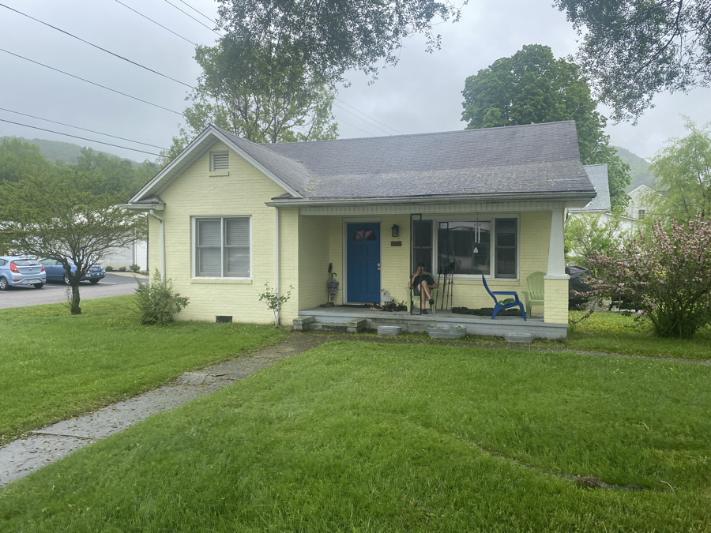
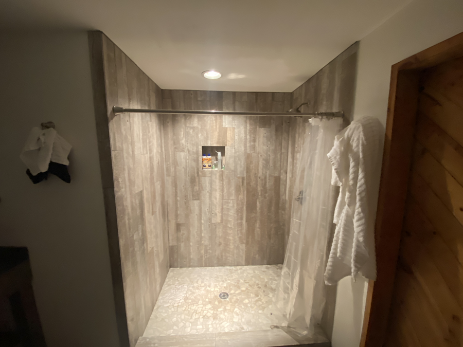
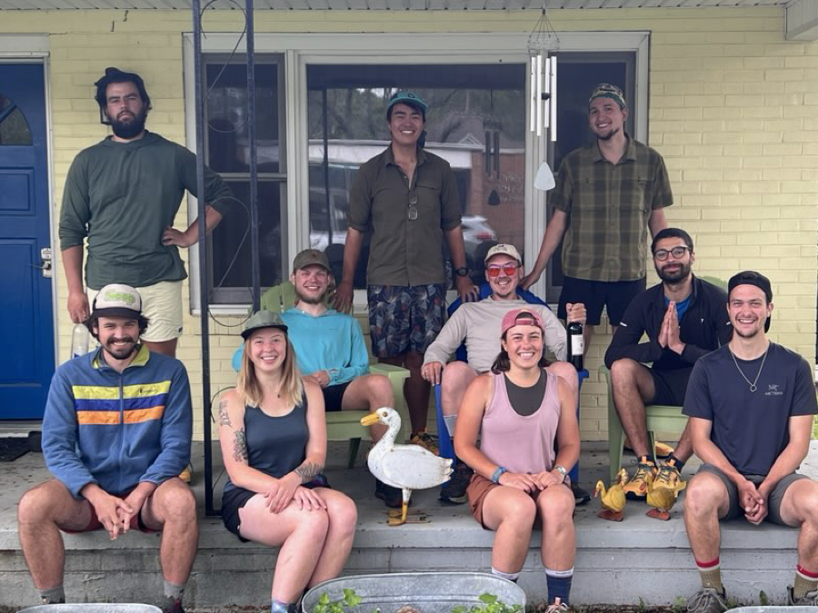
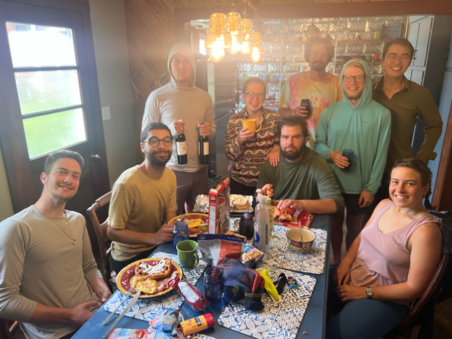

| Miles hiked | Elevation gain (ft.) | AT mile |
| ----------- | -------------- | -------- |
| 0 | 0 | 470.7 |

## Memorable moments from today
- Will fill in later

<figcaption>The Duck House, our AirBnb in Damscus</figcaption>

<figcaption>Luxury shower in the Duck House</figcaption>

<figcaption>Tramily portrait</figcaption>

<figcaption>Breakfast</figcaption>