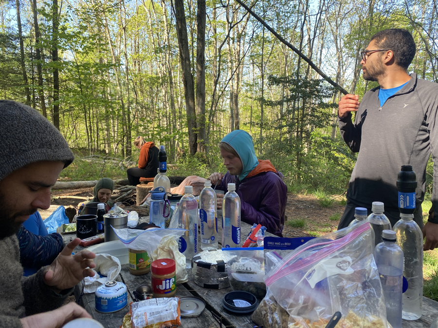

| Miles hiked | Elevation gain (ft.) | AT mile |
| ----------- | -------------- | -------- |
| 9.21 | 2,610 | 480.2 |

## Memorable moments from today
- Will fill in later 

<figcaption>Dinner at Saunders Shelter</figcaption>
