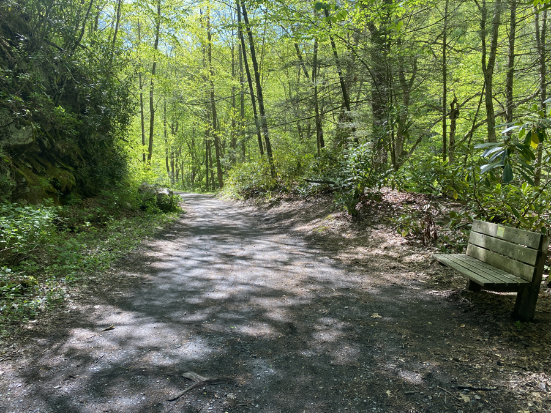
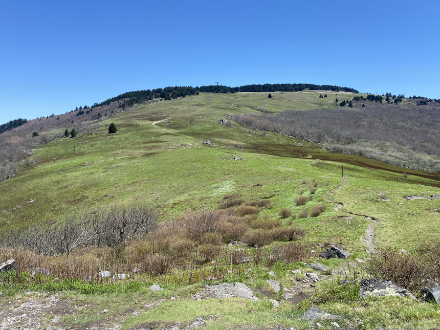
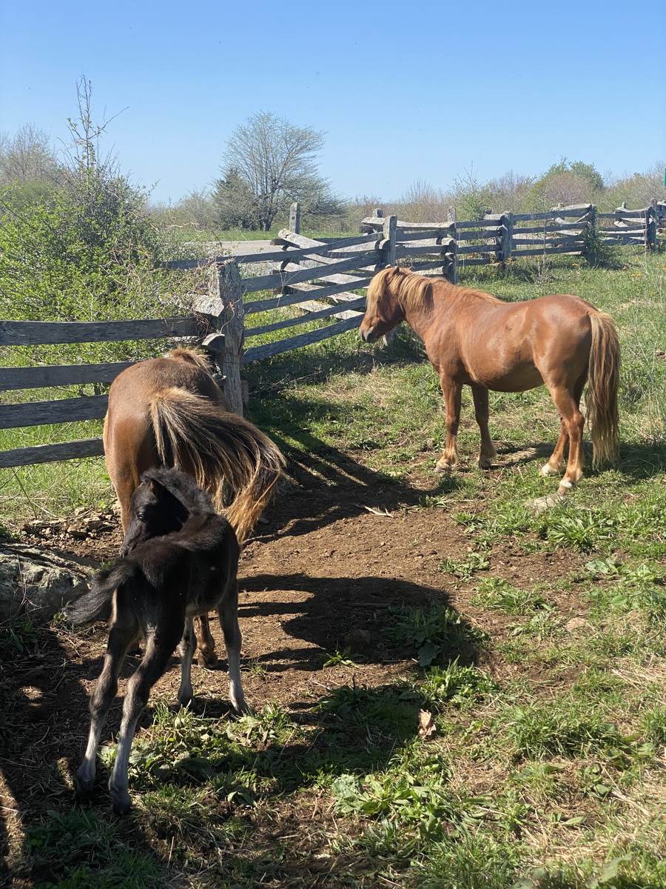
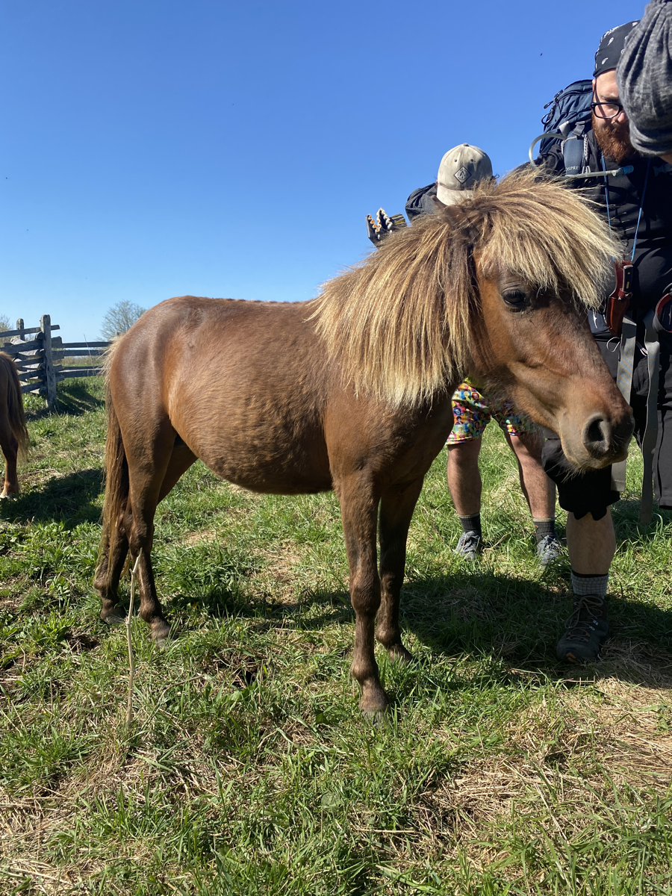
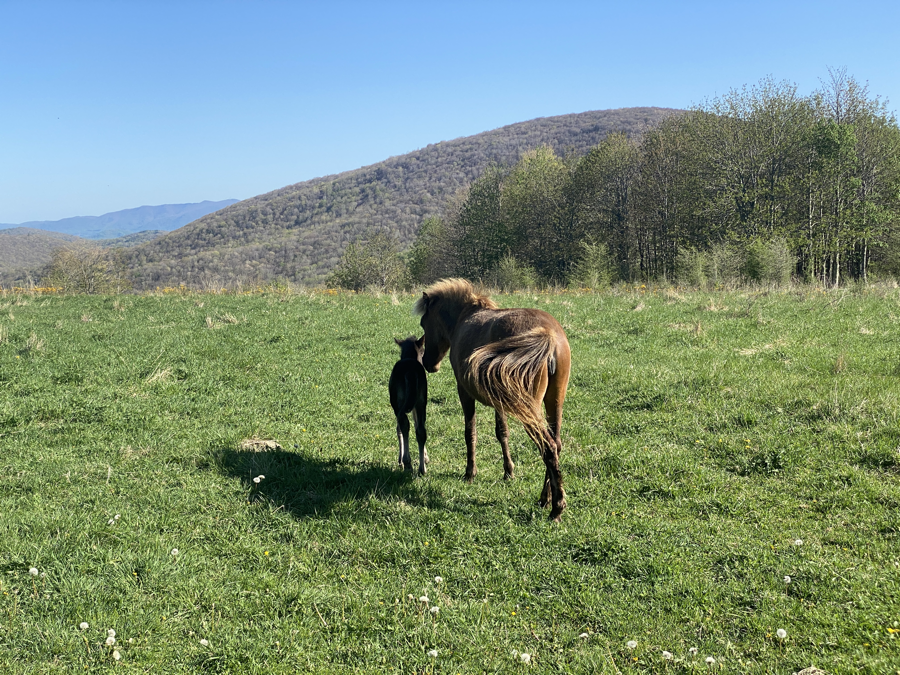

| Miles hiked | Elevation gain (ft.) | AT mile |
| ----------- | -------------- | -------- |
| 18.35 | 5,003 | 499.1 |

## Memorable moments from today
- Will fill in later 

<figcaption>Hiking on the Virginia Creeper Trail</figcaption>

<figcaption>The Grayson Highlands</figcaption>

<figcaption>Wild ponies</figcaption>

<figcaption>Yet another one</figcaption>

<figcaption>Mother and foal</figcaption>
