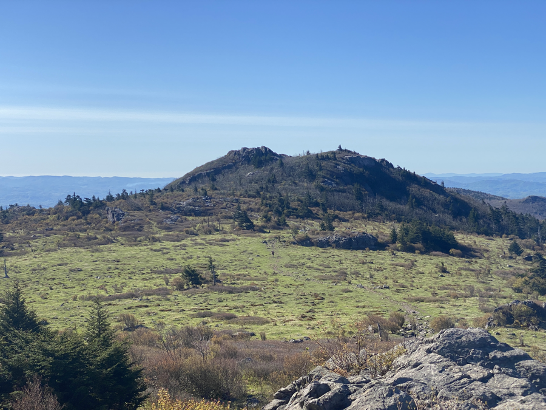
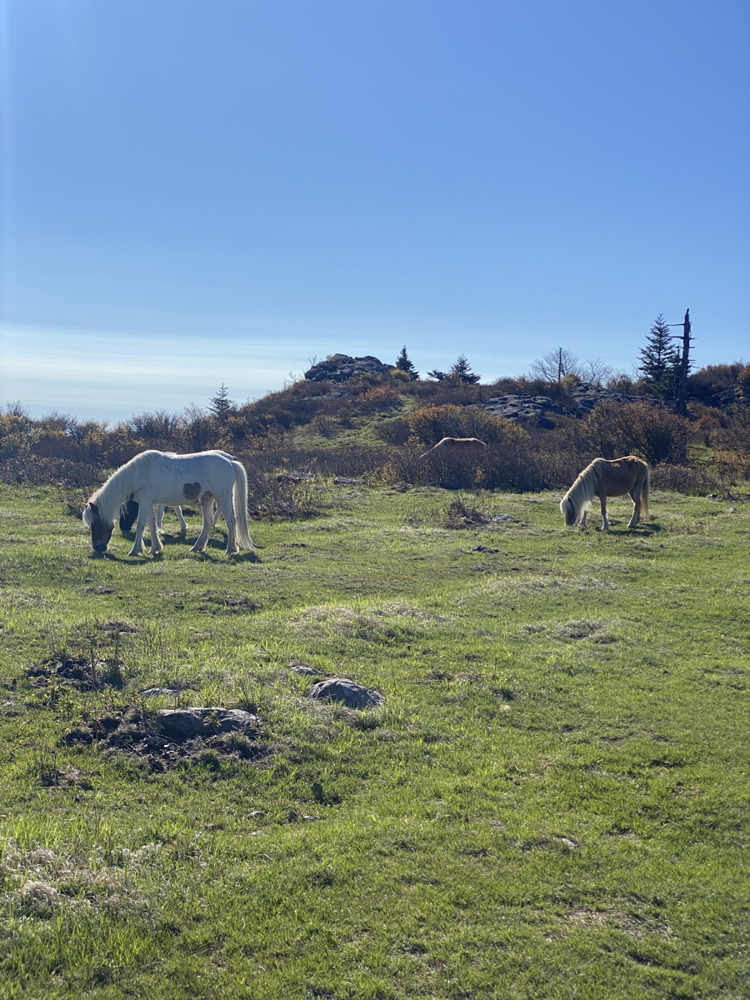
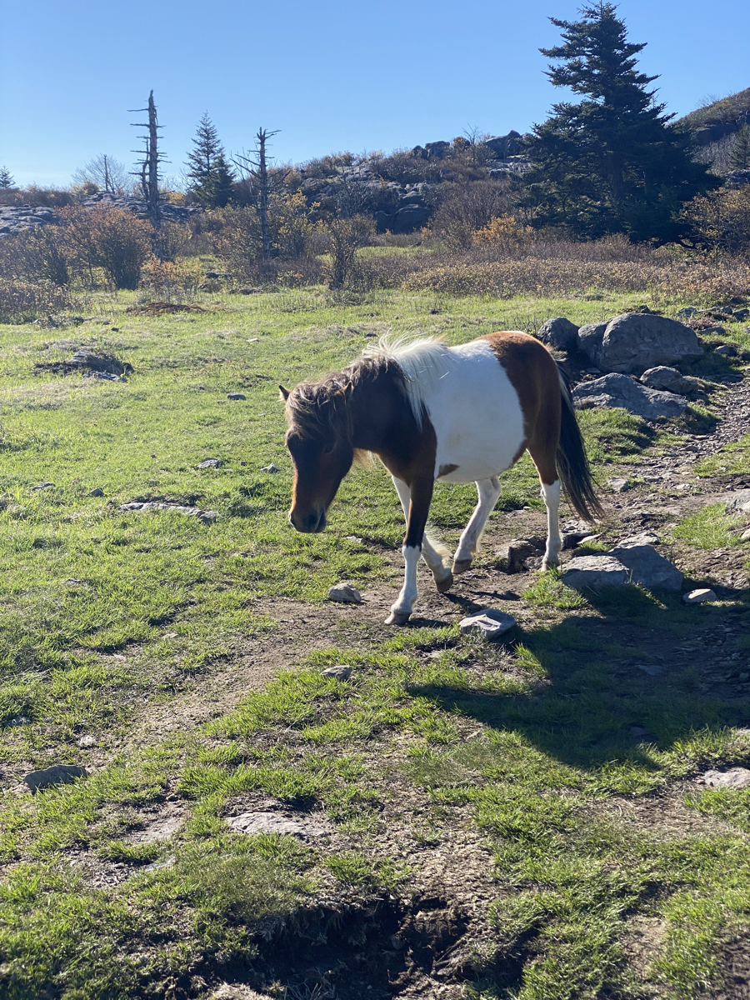
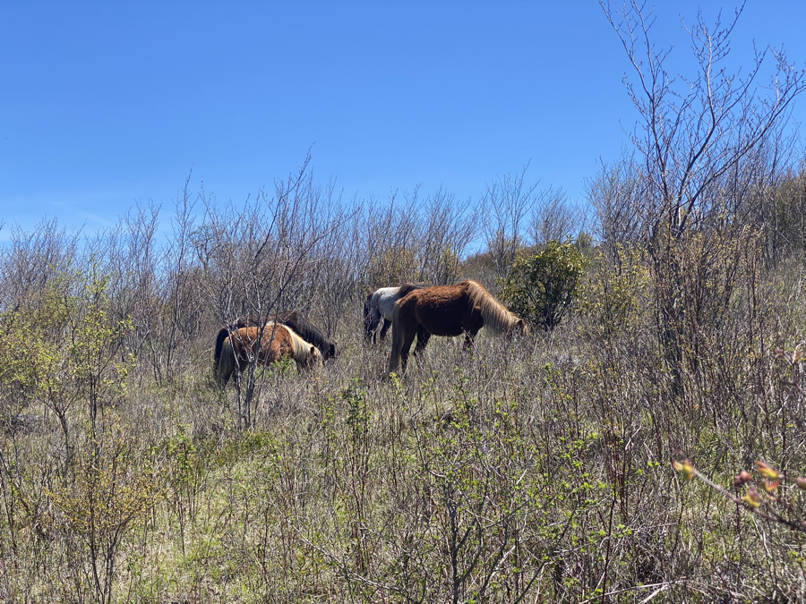

| Miles hiked | Elevation gain (ft.) | AT mile |
| ----------- | -------------- | -------- |
| 15.95 | 2,267 | 515.1 |

## Memorable moments from today
- Will fill in later 

<figcaption>Beautiful views of the Grayson Highlands</figcaption>

<figcaption>More wild ponies</figcaption>

<figcaption>Another wild pony</figcaption>

<figcaption>Fat man's squeeze</figcaption>

<figcaption>Even more wild ponies</figcaption>