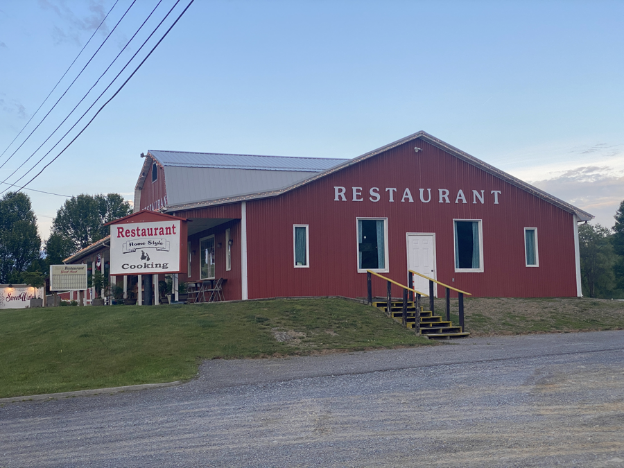
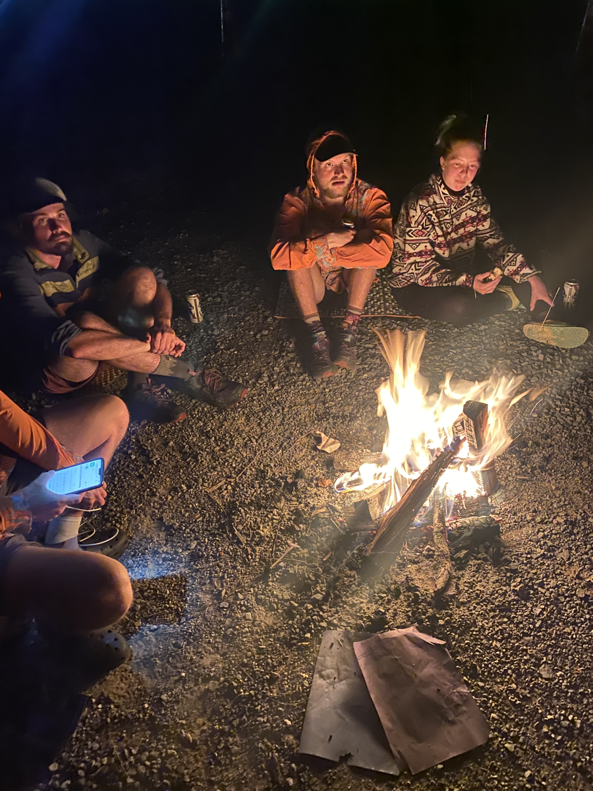

| Miles hiked | Elevation gain (ft.) | AT mile |
| ----------- | -------------- | -------- |
| 11.37 | 2,112 | 545.8 |

## Memorable moments from today
- Will fill in later

<figcaption>Rocky, rocky trail</figcaption>

<figcaption>Sign for trail magic</figcaption>

<figcaption>Trail magic in old schoolhouse</figcaption>

<figcaption>Railroad crossing</figcaption>

<figcaption>Boardwalk right after railroad</figcaption>

<figcaption>Sweetwater Venue</figcaption>

<figcaption>Tenting behind Sweetwater</figcaption>

<figcaption>Campfire</figcaption>