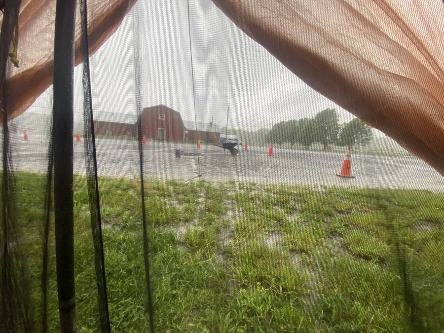
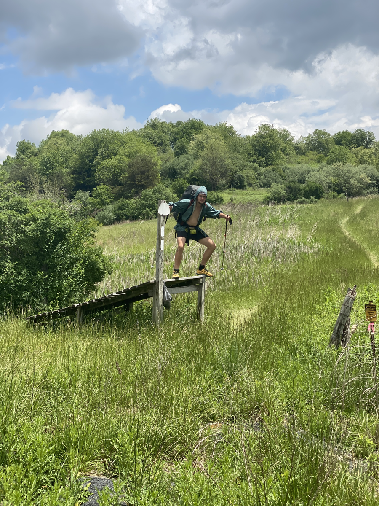
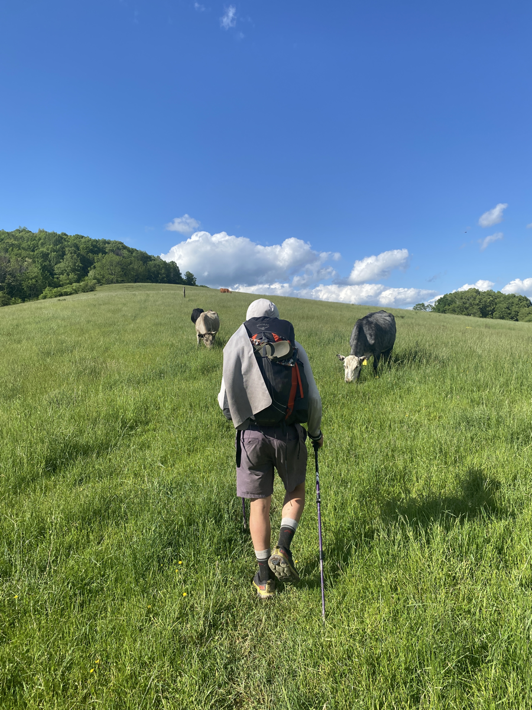
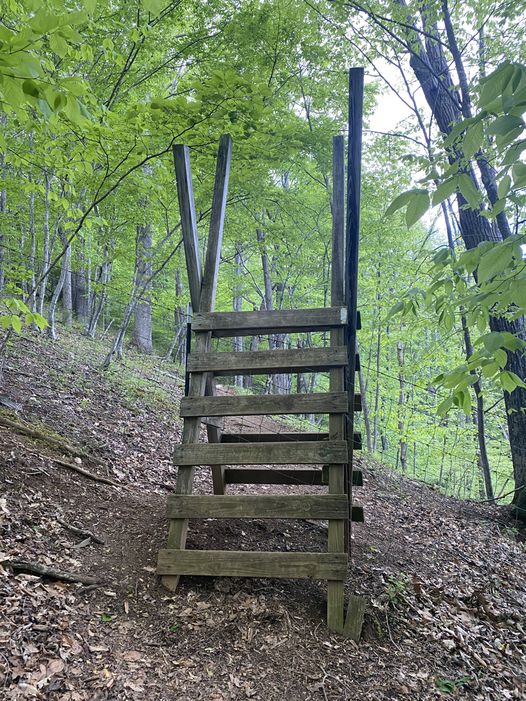
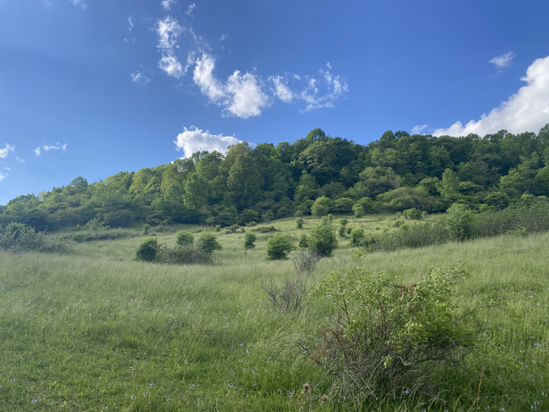

| Miles hiked | Elevation gain (ft.) | AT mile |
| ----------- | -------------- | -------- |
| 14.45 | 3,584 | 560.4 |

## Memorable moments from today
- Will fill in later

<figcaption>Rain in the morning</figcaption>

<figcaption>Banquet posing on some ramp</figcaption>

<figcaption>Walking through cows with Dionysus</figcaption>

<figcaption>Ladder to cross fence</figcaption>

<figcaption>Beautiful pasture</figcaption>