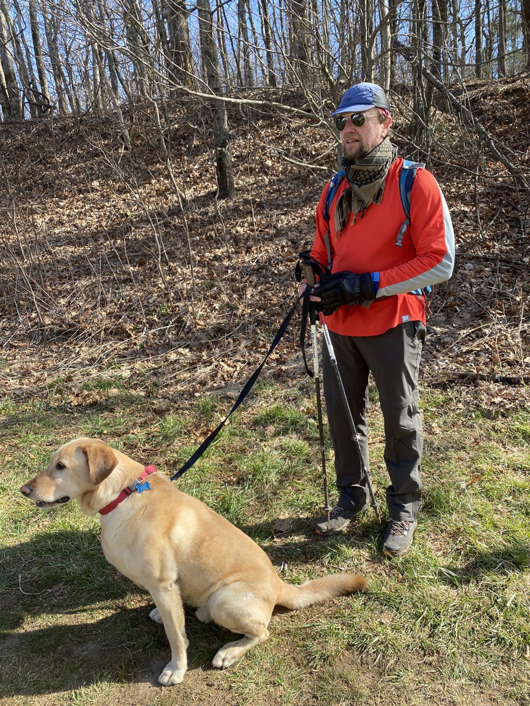
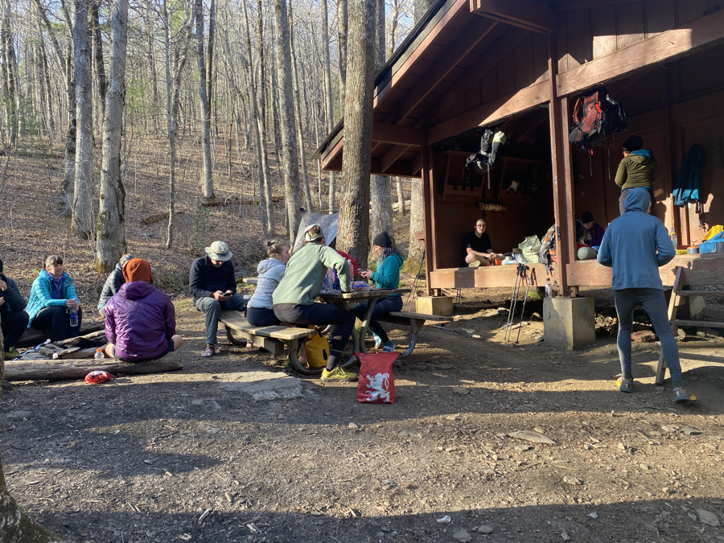

| Miles hiked | Elevation gain (ft.) | AT mile |
| ----------- | -------------- | -------- |
| 9.17 | 2,257 | 42.7 |

I woke up today to cold and windy weather, but a beautiful orange sunrise. I pulled the plug on my air mattress, quickly deflating it with the weight of my body. I want to build the habit of making this the first thing to do in the morning, cause it's so much easier to want to sleep more when my air mattress is nice and inflated.

I quickly ate my cold soaked grits from last night, and packed up all of my gear. My friends and I agreed to meet at Low Gap shelter, about 9 miles away.

About 3 miles into my hike, I took my pack off to get my gloves. As I was doing this a dog ran by me. It's owner came by a couple of seconds later. I got my pack on and continued hiking shortly behind them.

I have a competitive tendency to want to pass hikers I see ahead of me. I sometimes pass them when they take a break while ascending a hill or I just simply overtake them. But this guy was booking it. I had to push myself a little just to keep up with him.

After a minute or two of this, we started talking. I don't remember which of us said something first. He told me his name was Mike and his dog's name was Kody. He was day hiking, started at Neels Gap, and was planning on doing 20 miles today. What amazed me was that he was 59! Him and I were shooting past other hikers on the trail.

We continued to hike and talk. We asked questions about each other's lives and just passed conversation. I found out that he lived in north Atlanta, and was originally from the Midwest. He woke up at 4:10am this morning to get to the trailhead before it got too crowded. It was enjoyable to have someone to talk to while hiking and to push my pace at the same time.

At Hogpen Gap we saw a giant trailer with some awning tents around it, a big trail magic setup! Unfortunately, due to our blistering pace it was only around 10am, so lunch hadn't been cooked yet. Fortunately, I still got a big egg omelette with "everything" when they asked for what fillings I wanted. I ate that omelette in about 2 minutes. I also had an apple, donut, and a half cup of coffee. Kody gave me puppy eyes asking for food, but Mike told me not to give into them.

<figcaption>Mike and Kody</figcaption>

Mike and I continued for another 2 miles or so, before he had to turn back for the day. We said our goodbyes to each other and I continued northward. I love the fact that you can meet so many different people each day on the trail, but it's also bittersweet knowing that many of them will be so short lived like today's was.

I got to Low Gap shelter just after noon. I was the first one there. A couple from Maryland, Skip and Stork, came in just a few minutes after me. We sat around in the shelter, ate lunch, and talked. They asked if I had a trail name yet and I told them no. They said they'll get one for me by the end of the day, considering the fact that we'll be together at the shelter for the next 8 hours til sundown.

Skip and Stork gave me a name a couple of hours later: "Wiki", like in Wikipedia. Because of the random facts and tidbits of knowledge I would bring into a conversation. I liked it, but I told them I needed to think about it. It's always something you have to think about.

More and more people started trickling in. By the mid-afternoon there had to be at least 50 people. The vibe of the shelter went from chill and relaxed to loud and energetic. It literally felt like I was in the middle of a party, with conversations going on all around me.

I guess this was the big bubble of people at Gooch Gap a couple of nights ago. It was honestly too much for me. I feel completely comfortable in social situations with around 5 people or less, but when you add more it starts quickly draining my social battery. It was 5pm and I already wanted to call it for the day and go to my tent. My friends and I from yesterday found ourselves talking a bit further away from the shelter.

I felt so much more comfortable in that low-key, small group setting. I've never really been a big party guy, and that experience at the shelter confirmed that for me. But stuff like that will be inevitable since I'm in the middle of the big bubble of hikers.

We hung out and talked until sunset around 8, and then headed off to our tents for the night. There's a nice sound of a running stream by my tent; that'll help me go to sleep tonight. Tomorrow we plan on going to Unicoi Gap and hitchhiking into the town of Helen. We got a hotel room for the 5 of us. Split five ways it's only $22 a person! I'm really, really looking forward to that shower.