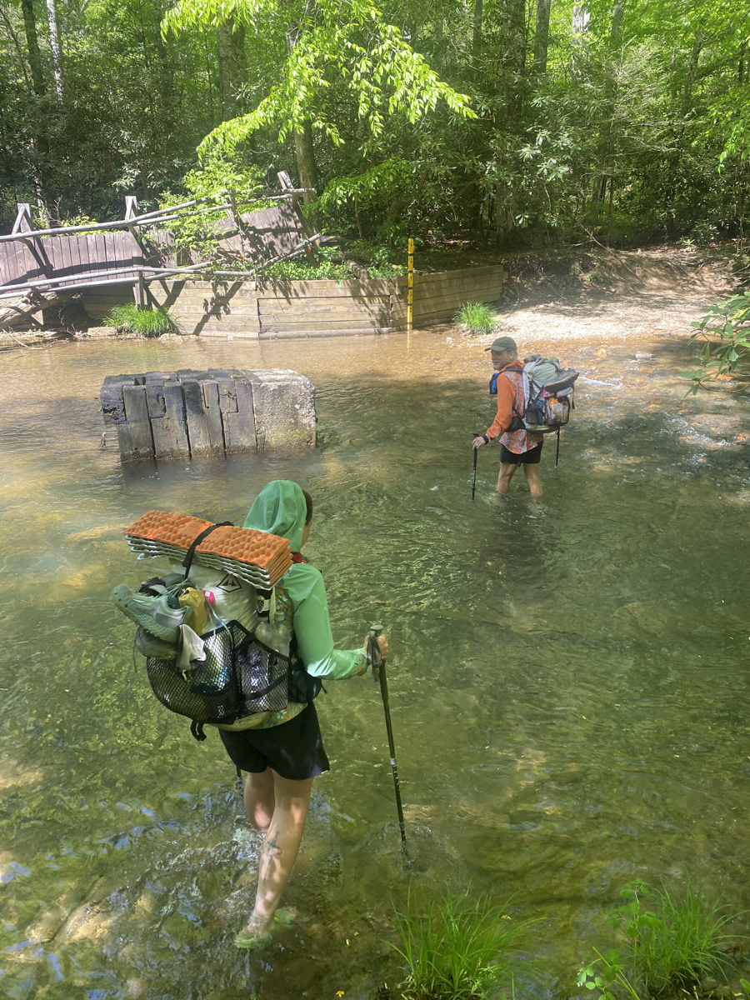
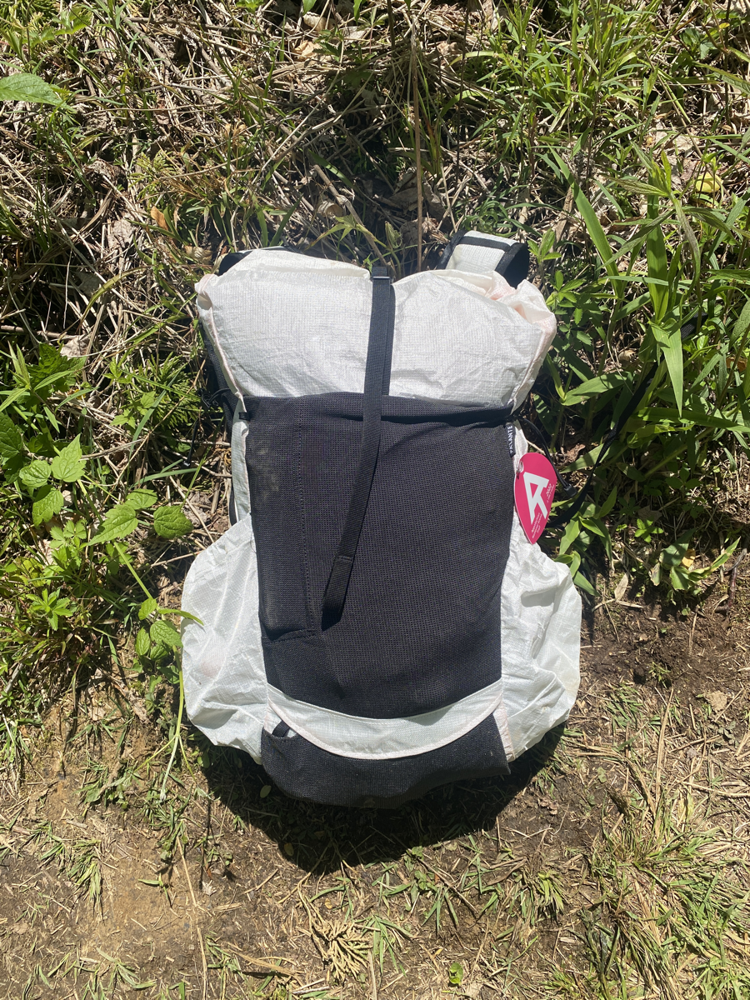

| Miles hiked | Elevation gain (ft.) | AT mile |
| ----------- | -------------- | -------- |
| 19.55 | 4,770 | 580.5 |

## Memorable moments from today
- Will fill in later 

<figcaption>Crossing Lick Creek with Tales and Grapefruit</figcaption>

<figcaption>New backpack (Pa'lante Desert Pack)</figcaption>

<figcaption>Deer</figcaption>