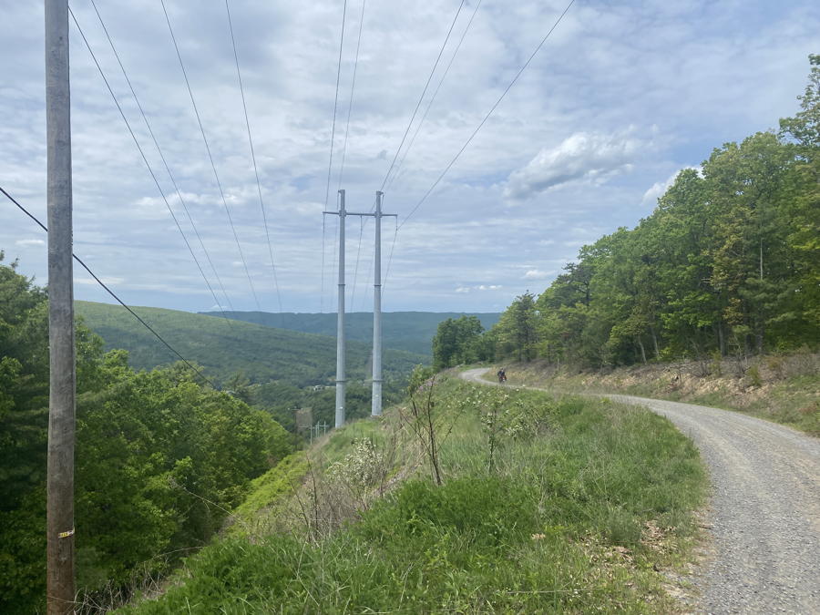
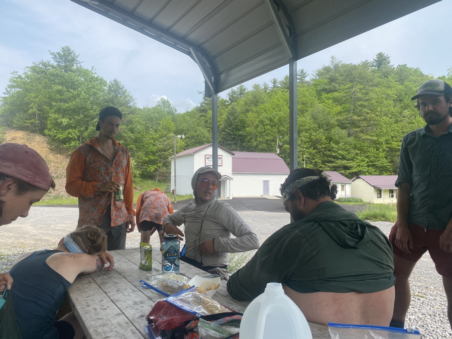
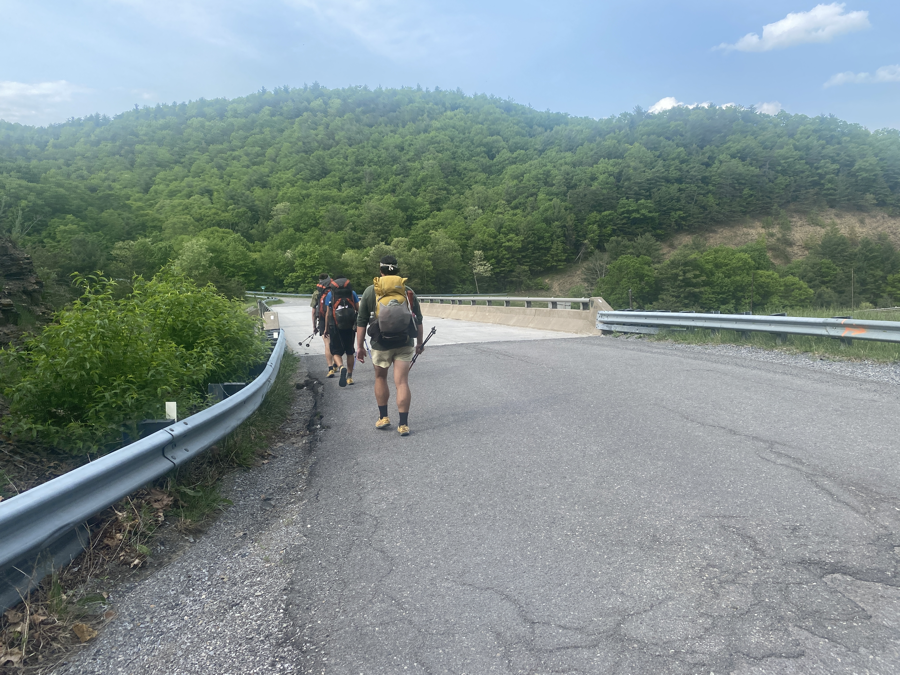

| Miles hiked | Elevation gain (ft.) | AT mile |
| ----------- | -------------- | -------- |
| 13.90 | 3,186 | 594.0 |

## Memorable moments from today
- Will fill in later

<figcaption>AT goes along a dirt road for a bit until Brushy Mountain Outpost</figcaption>

<figcaption>Everyone eating and chilling at Brushy Mountain Outpost</figcaption>

<figcaption>Crossing Interstate 77</figcaption>