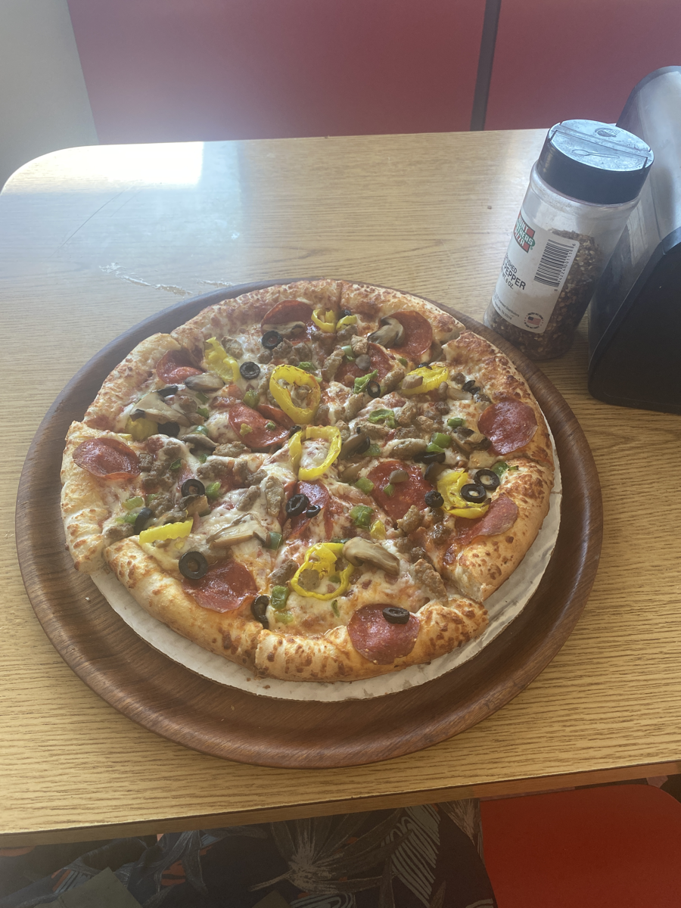
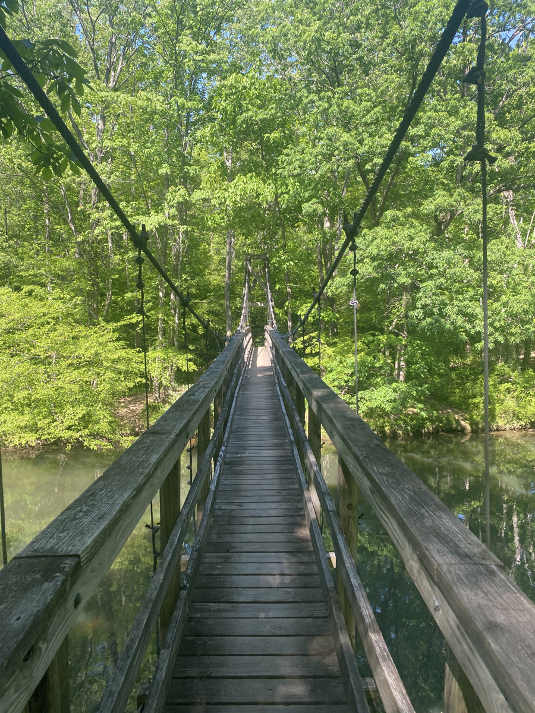

| Miles hiked | Elevation gain (ft.) | AT mile |
| ----------- | -------------- | -------- |
| 19.11 | 3,363 | 612.1 |

## Memorable moments from today
- Will fill in later

<figcaption>Gas station pizza with every topping</figcaption>

<figcaption>Suspension bridge over Kimberling Creek</figcaption>