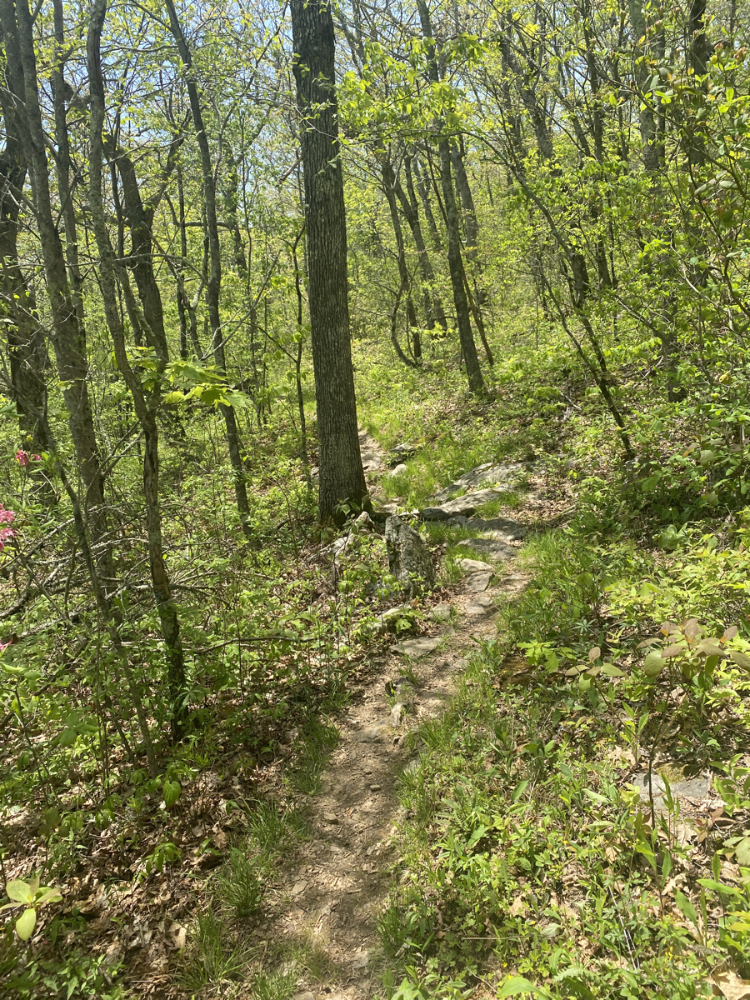
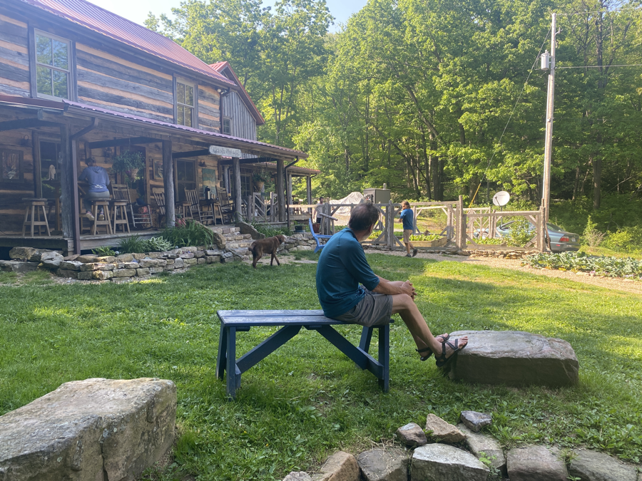
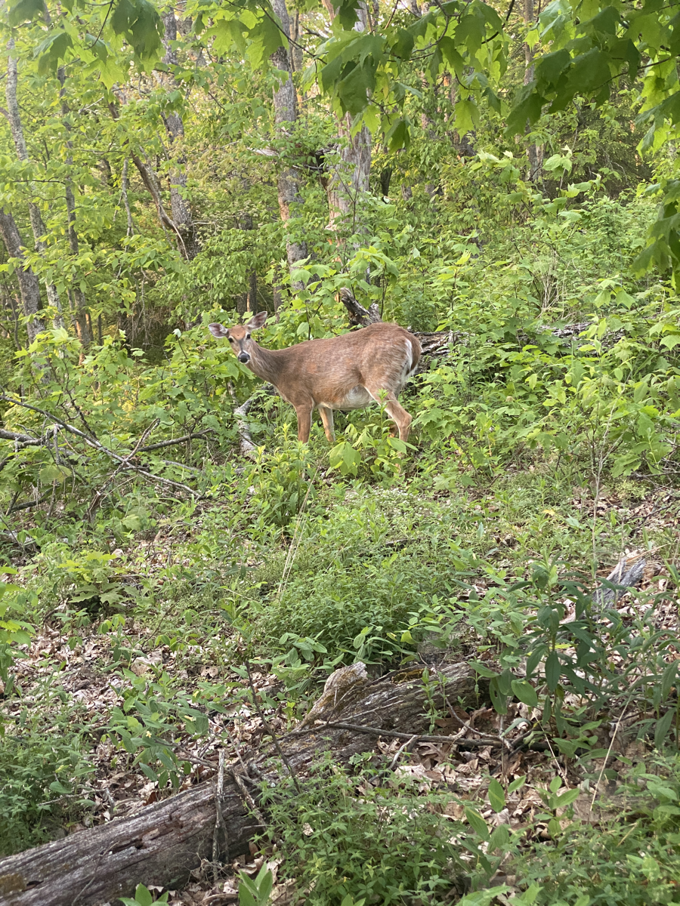

| Miles hiked | Elevation gain (ft.) | AT mile |
| ----------- | -------------- | -------- |
| 22.57 | 4,252 | 633.7 |

## Memorable moments from today
- Will fill in later

<figcaption>Trail got real toasty today</figcaption>

<figcaption>Woods Hole Hostel</figcaption>

<figcaption>Lots of deer in the afternoon and evening</figcaption>
