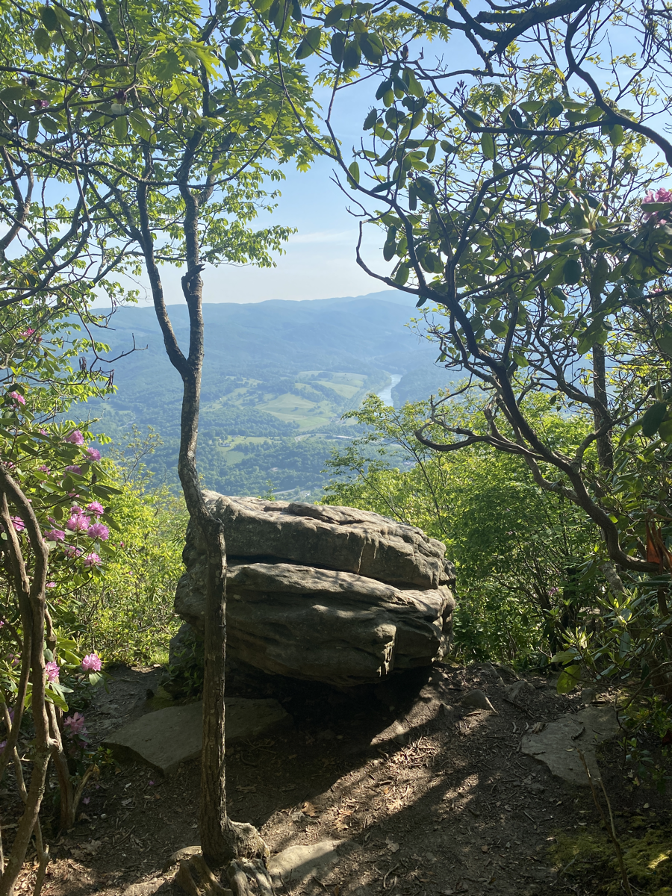
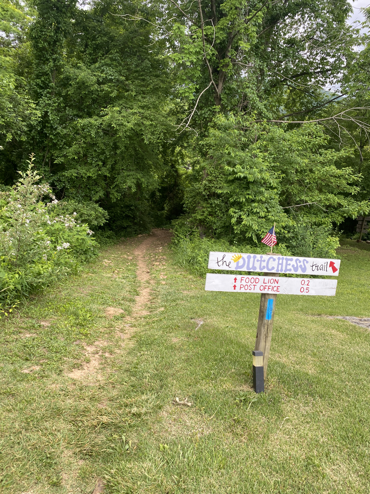
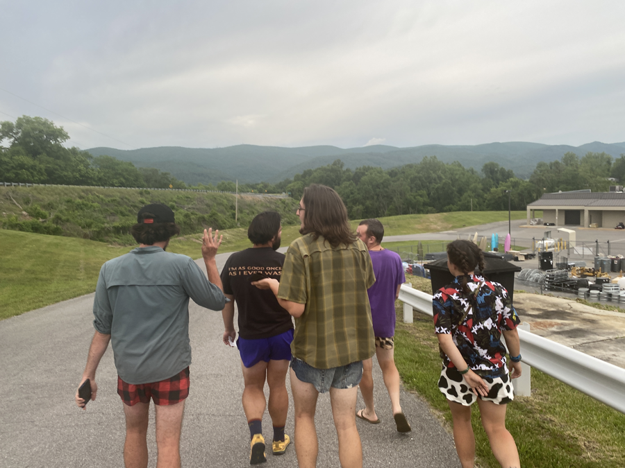

| Miles hiked | Elevation gain (ft.) | AT mile |
| ----------- | -------------- | -------- |
| 3.36 | 226 | 637.0 |

## Memorable moments from today
- Will fill in later

<figcaption>Angel's Rest</figcaption>

<figcaption>Side trail to town 
</figcaption>

<figcaption>Walking back after dinner</figcaption>

