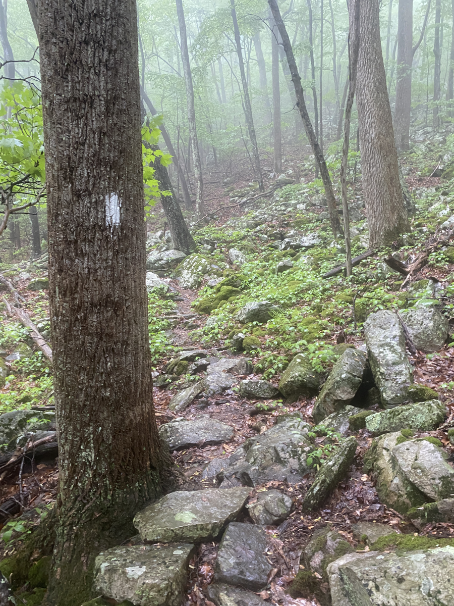
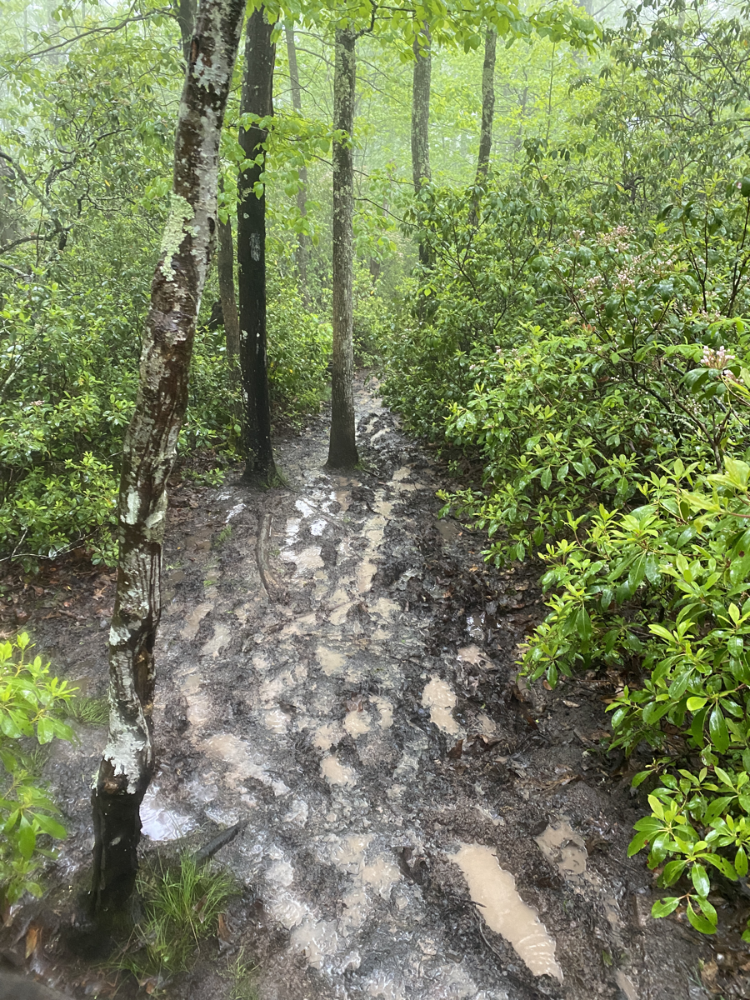

| Miles hiked | Elevation gain (ft.) | AT mile |
| ----------- | -------------- | -------- |
| 11.42 | 2,208 | 675.2 |

## Memorable moments from today
- Will fill in later

<figcaption>Lots of rocks on the trail</figcaption>

<figcaption>Lots of mud on the trail</figcaption>