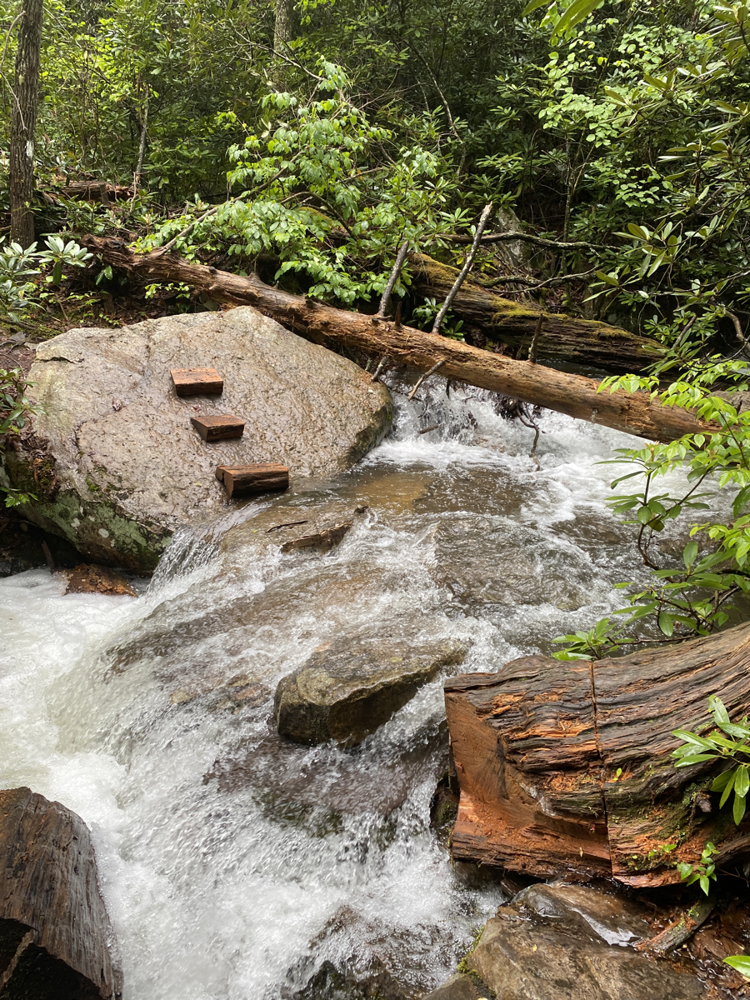
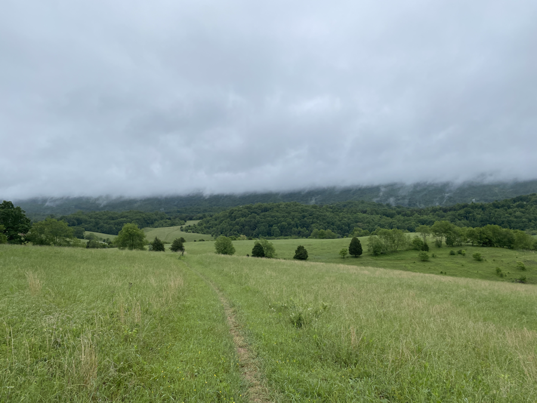
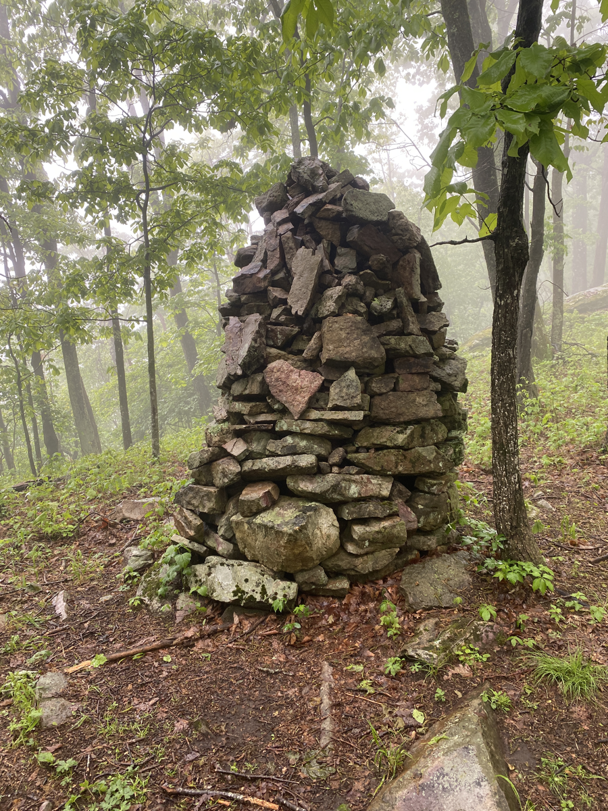
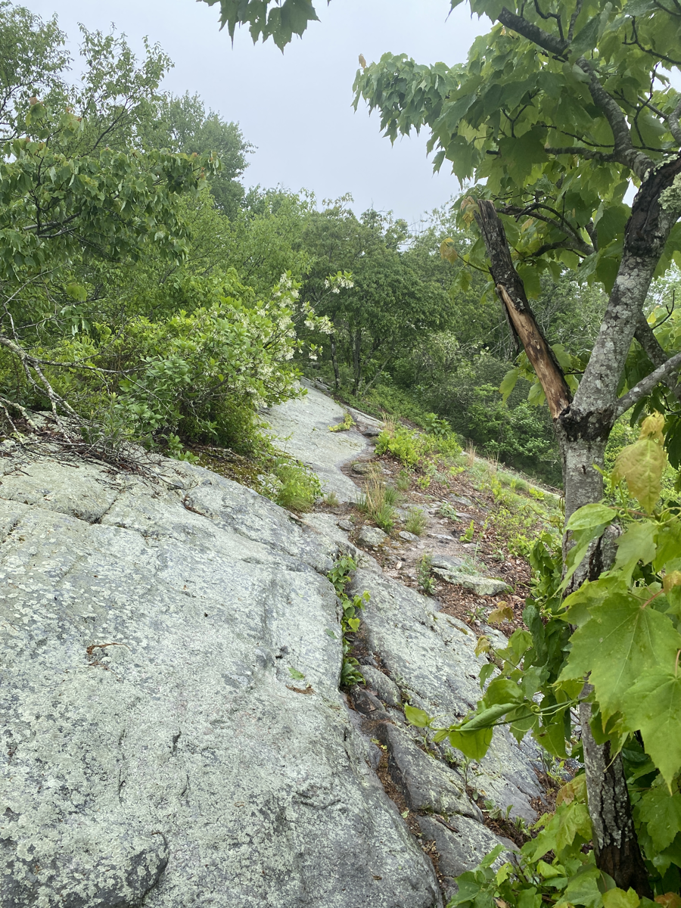
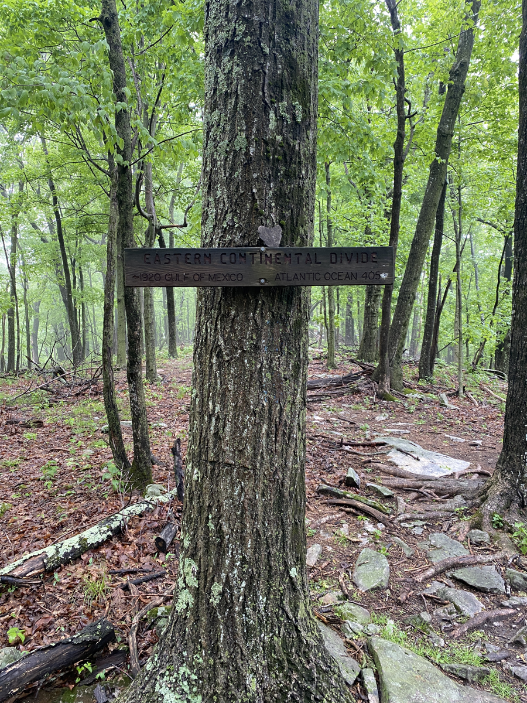
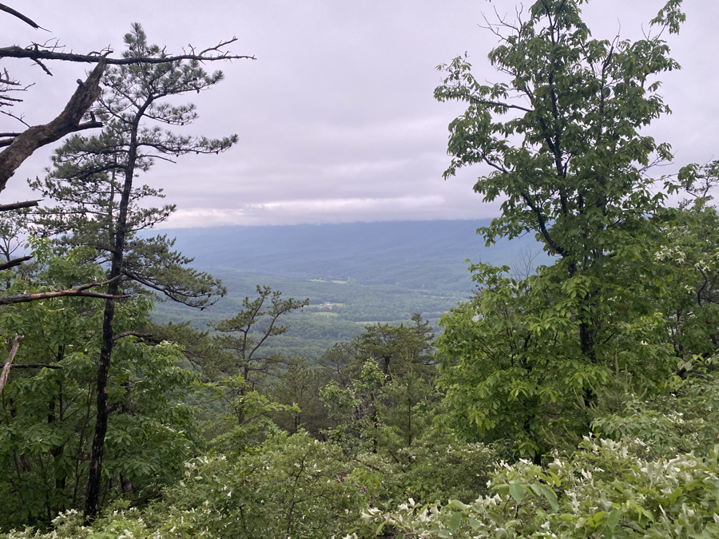

| Miles hiked | Elevation gain (ft.) | AT mile |
| ----------- | -------------- | -------- |
| 22.66 | 4,869 | 697.9 |

## Memorable moments from today
- Will fill in later

<figcaption>Gushing creek after the rain</figcaption>

<figcaption>Pasture</figcaption>

<figcaption>Big rock cairns</figcaption>

<figcaption>Slippery, slippery ledges</figcaption>

<figcaption>Eastern Continental Divide</figcaption>

<figcaption>Fog cleared up for a nice view</figcaption>

