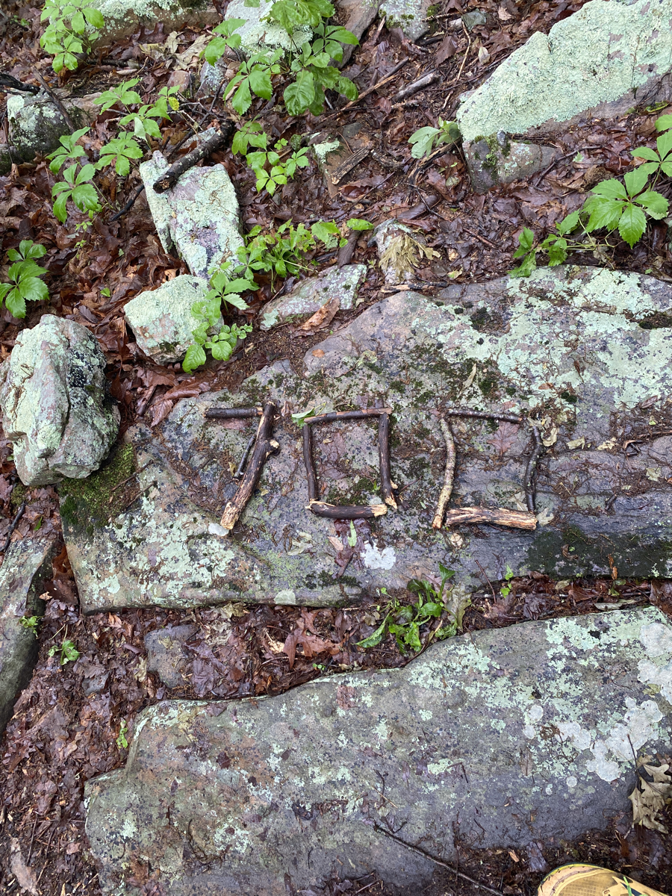
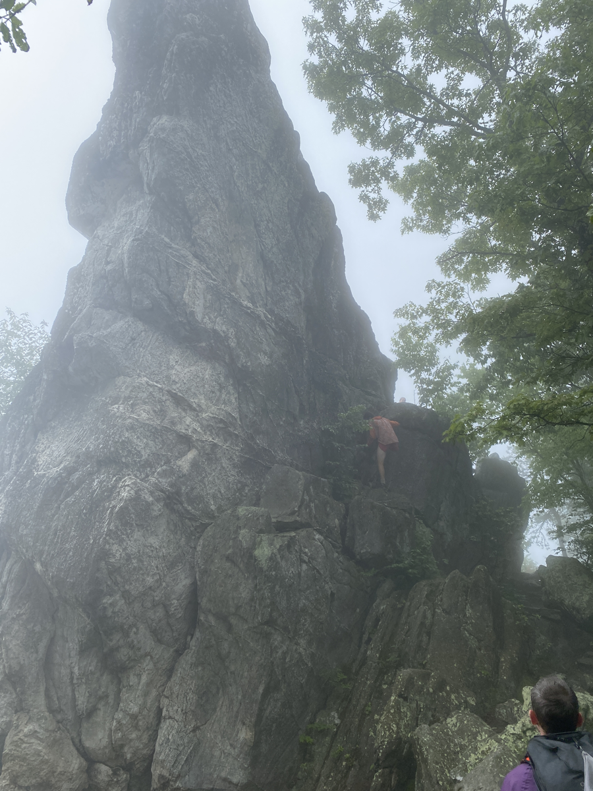
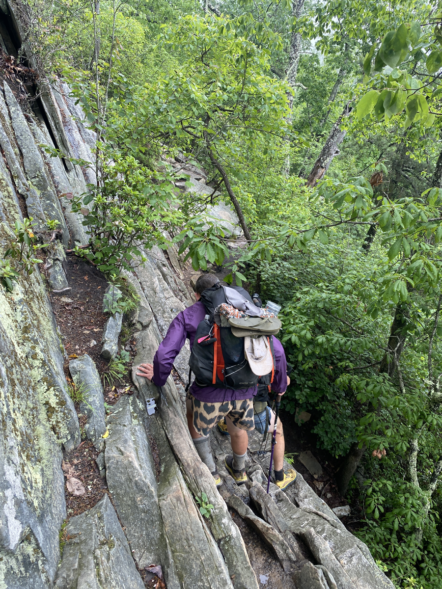

| Miles hiked | Elevation gain (ft.) | AT mile |
| ----------- | -------------- | -------- |
| 18.09 | 5,230 | 714.8 |

## Memorable moments from today
- Will fill in later

<figcaption>700 mile marker</figcaption>

<figcaption>Dragon's Tooth</figcaption>

<figcaption>Climbing down some steep rocks after Dragon's Tooth</figcaption>