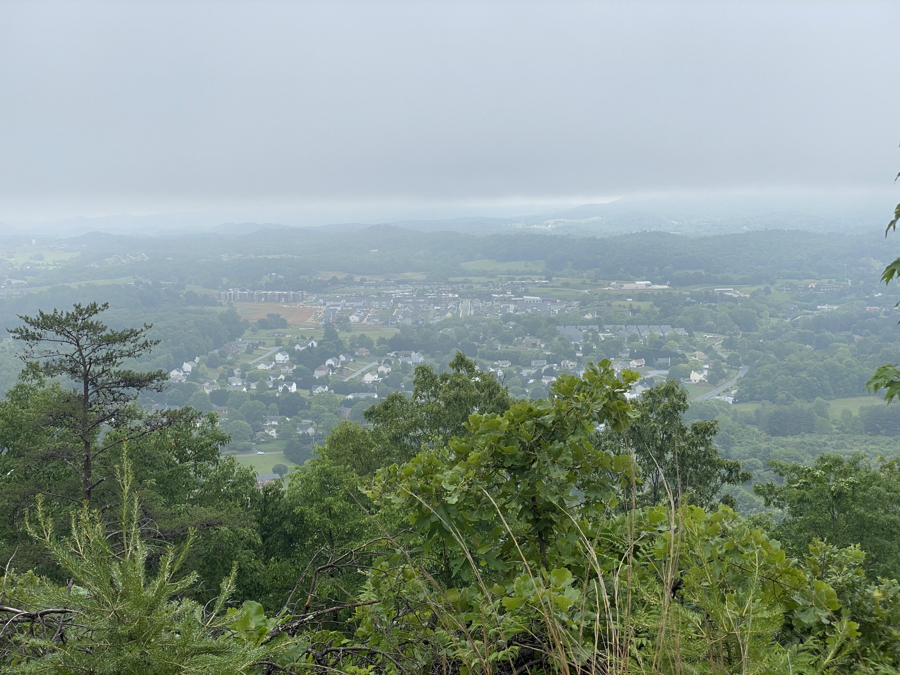
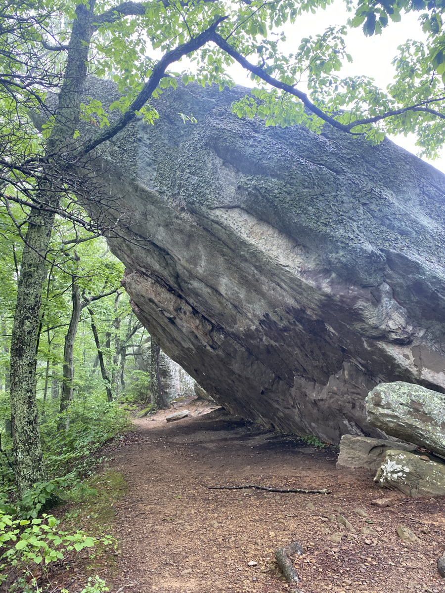

| Miles hiked | Elevation gain (ft.) | AT mile |
| ----------- | -------------- | -------- |
| 15.46 | 2,743 | 730.3 |

## Memorable moments from today
- Will fill in later

<figcaption>View into Pearisburg</figcaption>

<figcaption>Hay Rock</figcaption>