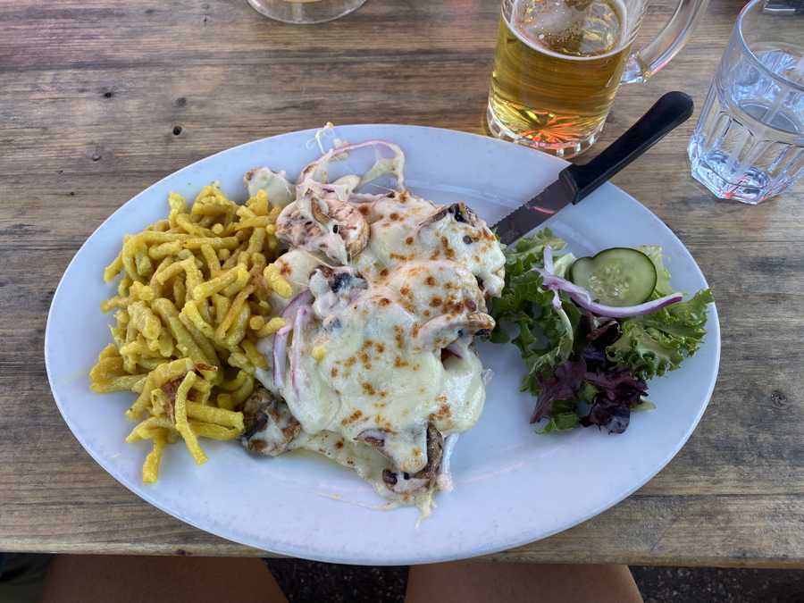

| Miles hiked | Elevation gain (ft.) | AT mile |
| ----------- | -------------- | -------- |
| 9.53 | 1,929 | 52.5 |

I woke up today with my food bag being delivered to my tent. It was around 7:30 and my friends were heading out to Unicoi Gap to get into Helen for the day. Knowing that I was behind, I quickly packed up my stuff, ate some ramen dry, and got on the trail.

Today's hike didn't feel too hard. It was a nice and steady incline up to the peak of Blue Mountain then down into Unicoi Gap. I made a good pace and got into Unicoi around noon.

At Unicoi was another amazing trail magic set up! I ate a burger, hot dog, pulled pork sandwich, and a couple of drinks. Right after I finished, there was a shuttle heading into Helen which my friends and I jumped into. Because I was in such a hurry, I wasn't able to get a pic of the trail magic.

The shuttle into Helen was a nice 15 minutes down some winding two-lane road through the mountains. The first thing you notice in Helen is all the buildings are built in an old fashioned German style.

There were a bunch of tourists in for the day. It was the weekend after all. You kind of lose track of what day of the week it is on the trail because it really doesn't matter. We got to our hotel and found out our room wasn't ready yet. 

We left our packs there and headed to a German restaurant called Bodensee. We got an ice cold pitcher of beer and I ordered a pork schnitzel for myself, I don't normally drink beer that often, but the glass I had was super cold and refreshing. There's something about thru-hiking that makes beer more refreshing. The schnitzel was delicious, but because I ate so much at the trail magic, I found myself taking some as leftovers. If you've eaten with me, you know how rare that is.

We found out from a pamphlet about the town that it didn't even have much German heritage! It was just a bunch of businessmen in the 60s who wanted to boost tourism to their town, and decided that a kitsch-German vibe would do the job. I'm sure any actual Germans who visited the town would be mildly offended by how cheesy it is.

After lunch we were able to check in to the hotel, shower, and do our laundry. For some reason, right after all that I started feeling tired and weak. I laid down in bed and had to curl up under the sheets. For the next few hours I felt completely terrible. It was hard to get up and get a drink of water for myself.

My friends headed out to dinner while I was resting in bed, and brought back some leftover pizza for me. I'm really not sure what I had, but by the time they got back I felt close enough back to normal to where I walked across town with them to resupply food for our two days into Dick's Creek Gap.

After we got back to the hotel, we were all pretty tired for the day. For some reason, my left foot started swelling. It didn't hurt too bad to put weight on it, but there was definitely pressure and a feeling of pins and needles when I took a step. If I had to take a guess I think it was because I tied my laces too tight on my shoes. I set up a pillow at my feet to try and let it drain overnight.

Tomorrow we'll try to get to Deep Gap shelter, around 13 miles in, then take a nice 4 mile day into Hiawassee to avoid the rain on Tuesday. I'll see how my foot holds tomorrow.